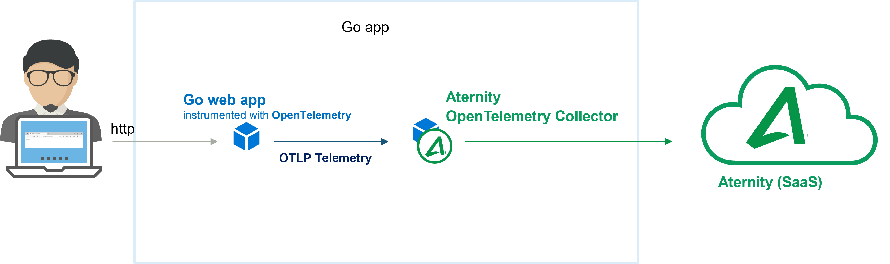

# 105-opentelemetry-go-app

The [Aternity OpenTelemetry Collector](https://hub.docker.com/r/aternity/apm-collector) is part of the [Aternity DEM platform](https://www.aternity.com/application-performance-monitoring/) and can collect OTLP, the OpenTelemetry native telemetry protocols, as well as Jaeger and Zipkin telemetry.

In this cookbook, [Aternity](https://www.aternity.com) collects the telemetry of a **Go** webapp that is instrumented using the [OpenTelemetry](https://opentelemetry.io/) SDK. It can export OpenTelemetry, [Jaeger](https://www.jaegertracing.io/), or [Zipkin](https://zipkin.io/) telemetry. The [Aternity OpenTelemetry Collector](https://hub.docker.com/r/aternity/apm-collector) container is deployed next to the web app. It collects every trace - no sampling.



## Prerequisites

1. an Aternity APM account (SaaS)
2. a Docker host, for example [Docker Desktop](https://www.docker.com/products/docker-desktop)

## Step by Step

### 1. Get your CustomerID & SaaS Analysis Server Host details from the Aternity APM webconsole

Navigate to Aternity APM (for example [https://apm.myaccount.aternity.com](https://apm.myaccount.aternity.com)) > Agents > Install Agents:

1. Find your **CustomerID**, for example *12341234-12341234-13241234*
2. Grab **SaaS Analysis Server Host**, for example *agents.apm.myaccount.aternity.com*

This information are required to activate the Aternity OpenTelemetry Collector container, passing via the environment variable `SERVER_URL`. 

### 2. Start the containers

1. Clone this repository.

2. Start the containers using the [docker-compose.yaml](docker-compose.yaml), for example with Bash:
    ```bash
    cd Tech-Community/105-opentelemetry-go-app

    # Configure the environment variables for the Aternity OpenTelemetry Collector
    export ATERNITY_SAAS_SERVER_HOST="agents.apm.myaccount.aternity.com"
    export ATERNITY_CUSTOMER_ID="12341234-12341234-13241234"

    docker-compose up
    ```

    or with PowerShell:

    ```PowerShell
    cd Tech-Community/105-opentelemetry-go-app
    
    # Configure the environement variable for the Aternity OpenTelemetry Collector
    $env:ATERNITY_SAAS_SERVER_HOST="agents.apm.myaccount.aternity.com"
    $env:ATERNITY_CUSTOMER_ID="12341234-12341234-13241234"
    
    docker-compose up
    ```

### 3. Use the app to generate some telemetry (optional)

There is an in-built load generator in the `docker-compose` startup. If you want to manually add traffic, http://localhost:8081/ from a browser or call the url from a command line.
```bash
curl http://localhost:8081/
```

### 4. Open the Aternity APM webconsole to visualize and analyze the traces collected for every transactions

Search transaction, browse the spans for the selected transaction :


View details of a specific transaction as a waterfall chart :


## Notes 

### Stop the app and all the containers

Press CTRL + C in the shell where it is running.

Or in a shell, go to the folder where you keep the [docker-compose.yaml](docker-compose.yaml) and run:

```shell
docker-compose down
```

### More details

The cookbook contains few files:
- [main.go](cmd/opentelemetry-go-example/main.go) is the common start to the 2 distributed services - `frontend` & `backend`. 
- [tracer.go](internal/tracer/tracer.go) is the OpenTelemetry SDK setup for multiple exporters (OpenTelemetry, Jaeger, Zipkin, file), and the [B3 context propagation](https://github.com/openzipkin/b3-propagation).
- [Dockerfile](Dockerfile) defines the docker image to build
- [docker-compose.yaml](docker-compose.yaml) is the main file that defines the multi-tier app with 4 services:
  - the instrumented 2-tier Go `frontend` web app 
  - the instrumented 2-tier Go `backend` web app
  - the Aternity OpenTelemetry Collector
  - the load generator
    
### Kubernetes

This example can also be executed on a K8s cluster.

Steps:
```shell
% <edit kubernetes/aternity-collector.yml
   with your Aternity SaaS Analysis Server host & customer id>
% kubectl apply -f kubernetes/
```

#### License

Copyright (c) 2022 Aternity. The contents provided here are licensed under the terms and conditions of the MIT License accompanying the software ("License"). The scripts are distributed "AS IS" as set forth in the License. The script also include certain third party code. All such third party code is also distributed "AS IS" and is licensed by the respective copyright holders under the applicable terms and conditions (including, without limitation, warranty and liability disclaimers) identified in the license notices accompanying the software.
