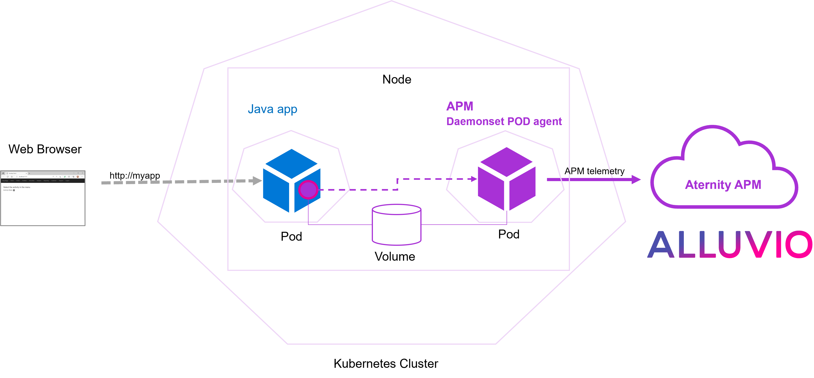

# 238-instrument-java-app-with-apm-daemonset-pod-agent-on-gke

In this cookbook a Java web-application deployed with multiple replicas on a Kubernetes cluster, is  instrumented with APM using a custom Daemonset POD agent



In details:

A custom image of the APM agent is built and deployed as a **Daemonset POD agent** on a Kubernetes cluster. So that the agent will be running on every node and exposing the APM services to the hosted PODs listening on NodePorts (e.g. DSA on port 2111)

The [manifest of the Daemonset POD agent](apm-daemonset-pod-agent.yaml) must be customized with the APM account information.

Multiple replicas of a Java web-application, containerized from [sources](app) with a usual [Dockerfile](app-Dockerfile), are then deployed with APM instrumentation. The instrumentation of the app is set up in the deployment manifest of the app ([app-k8s.yaml](app-k8s.yaml)). It mounts a shared volume to give access to some agent files (e.g. the Java agent library).

> [!NOTE]
> This cookbook uses a GKE cluster, a managed Kubernetes cluster hosted in GCP. Minor adaptations might be required to use the artifacts in different environment.

## Prerequisites

1. a SaaS account for [ALLUVIO Aternity APM](https://www.riverbed.com/products/application-performance-monitoring)

2. a project in [Google Cloud](https://console.cloud.google.com) with a Kubernetes infrastructure setup ready to use: GKE cluster Standard mode with a Linux node pool, a Bucket Storage and Artifact registry

> [!WARNING]
> The GKE cluster must be created in Standard mode (not Autopilot mode)

3. Click on the button to open the cookbook in the Google Cloud Shell

[](https://console.cloud.google.com/cloudshell/open?git_repo=https://github.com/Aternity/Tech-Community&tutorial=238-instrument-java-app-with-apm-daemonset-pod-agent-on-gke/README.md)

## Step 1. Get details in ALLUVIO Aternity APM

In the APM webconsole, navigate to CONFIGURE > AGENTS > Install Agents and in the Agent Installation Steps section,

1. Find your **Customer Id**, for example *12341234-12341234-13241234*
2. Find the **SaaS Analysis Server Host**, for example *agents.apm.my_environment.aternity.com*
3. Download the latest **ALLUVIO Aternity APM agent for Linux** package (also available on [Riverbed support](https://support.riverbed.com/content/support/software/aternity-dem/aternity-apm.html)), *appinternals_agent_latest_linux.gz*

Then in CONFIGURE > AGENTS > Configurations, 

4. Define a configuration for the app and download the .json file. For example create a new configuration and name it "configuration", configure Data Collection Settings to enable End-User Experience Data collection, Save and Download the file **configuration.json**

## Step 2. Collect resources info in your Google Cloud project

In the [Google Cloud Console](https://console.cloud.google.com) retrieve the details of the project and resources ready to use:

1. Project id, for example: *aternity-cookbooks*
2. Kubernetes Engine cluster name, for example: *standard-cluster-1*

> [!WARNING]
> The GKE cluster must be created in Standard mode

3. Region, for example: *europe-west9*
4. Artifact Registry repository name, for example: *apm*
5. Bucket name, for example: *my_bucket*

> [!WARNING]
> The repository must be created with Docker format and preferably in the same region as the GKE cluster

## Step 3. Store the APM package in a Bucket Storage

In the [Google Cloud Console](https://console.cloud.google.com), navigate to [Cloud Storage ](https://console.cloud.google.com/storage/browser), then select the GCP project and the Bucket.

There, upload the package of the ALLUVIO Aternity APM agent for Linux (.gz file) and grab the **gsutil URI** for the next steps, for example *gs://my_bucket/appinternals_agent_latest_linux.gz*

## Step 4. Prepare the shell

In the Cloud Shell terminal, run the commands to go to the cookbook folder, select the project and connect to the cluster (replacing {PROJECT_ID},{CLUSTER NAME} and {REGION} with the actual values)

```shell
cd 238-instrument-java-app-with-apm-daemonset-pod-agent-on-gke
gcloud config set project {PROJECT_ID}
gcloud container clusters get-credentials {CLUSTER NAME} --region {REGION} --project {PROJECT_ID}
```

> Example:
>```shell
>cd 238-instrument-java-app-with-apm-daemonset-pod-agent-on-gke
>gcloud config set project aternity-cookbooks
>gcloud container clusters get-credentials standard-cluster-1 --region europe-west9 --project aternity-cookbooks
>```

## Step 5. Build the image of the APM Daemonset POD Agent

1. Copy/Upload the APM configuration file (prepared in Step 1.) to the subfolder apm-customization/config
   
> [!WARNING]
> If the name of the configuration file is not configuration.json then edit the initial-mapping to adapt the startup auto-instrumentation mapping 

2. Run the command to build the image with the [cloudbuild.yaml](cloudbuild.yaml) config, replacing the actual values in the substitutions parameters. Based on this [Dockerfile](Dockerfile), it will build a Docker image that contains the APM agent, and push the image to the registry. 

```shell
gcloud builds submit --config cloudbuild.yaml --substitutions _APM_PACKAGE_GSUTIL_URI={_APM_PACKAGE_GSUTIL_URI},_REGION={_REGION},_REPOSITORY={REPOSITORY}
```
where:

   - **{_APM_PACKAGE_GSUTIL_URI}**: the gsutil URI of the APM agent for Linux package (.gz)
   - **{_REGION}**: the region of the Artifact Registry
   - **{_REPOSITORY}**: the name of the Artifact Registry repository

> Example:
>```shell
>gcloud builds submit --config cloudbuild.yaml --substitutions _APM_PACKAGE_GSUTIL_URI=gs://my_bucket/appinternals_agent_latest_linux.gz,_REGION=europe-west9,_REPOSITORY=apm
>```

3. Grab the container image path

When the build is done, the image will be stored in the repository of an Artifact Registry resource. The image path should be displayed in the shell output, for example *europe-west9-docker.pkg.dev/aternity-cookbooks/apm/alluvio-aternity-apm-daemonset-pod-agent:latest*

## Step 6. Deploy the APM Daemonset POD Agent

1. Configure the manifest

Edit the Kubernetes manifest [apm-daemonset-pod-agent.yaml](apm-daemonset-pod-agent.yaml) to configure the image path and the environment variables for the APM agent:

- replace {{ALLUVIO Aternity APM Daemonset POD agent image path}} with the **container image path** built in the previous step, for example: *europe-west9-docker.pkg.dev/aternity-cookbooks/apm/alluvio-aternity-apm-daemonset-pod-agent:latest*
- replace {{ALLUVIO_ATERNITY_APM_CUSTOMER_ID}} with the **Customer Id**, for example: *12312341234-1234-124356*
- replace {{ALLUVIO_ATERNITY_APM_SAAS_SERVER_HOST}} with the **SaaS Analysis Server Host**, for example: *agents.apm.my-account.aternity.com*

2. Deploy

In the Cloud Shell Terminal, execute the following command to deploy the application on Kubernetes.

```shell
kubectl apply -f apm-daemonset-pod-agent.yaml
```

After few minutes, the agents show up in the APM webconsole in CONFIGURE > AGENTS > Agent List, and then the SERVERS view will start to display the metrics of the node (e.g. CPU).

## Step 7. Deploy a Java web-application on Kubernetes with a manifest configured for APM instrumentation

1. Build the image of the app

Run the build command for the [app-cloudbuild.yaml](app-cloudbuild.yaml) config, replacing the actual values in the substitutions parameters

```shell
gcloud builds submit --config app-cloudbuild.yaml --substitutions _REGION={_REGION},_REPOSITORY={REPOSITORY}
```
where:

   - **{_REGION}**: the region of the Artifact Registry
   - **{_REPOSITORY}**: the name of the Artifact Registry repository

> Example:
>```shell
>gcloud builds submit --config app-cloudbuild.yaml --substitutions _REGION=europe-west9,_REPOSITORY=apm
>```

> :information_source: The build is based on a standard Dockerfile ([app-Dockerfile](app-Dockerfile)).

2. Grab the container image path

When the build is done, the image path should be diplayed in the shell output, for example *europe-west9-docker.pkg.dev/aternity-cookbooks/apm/java-app:latest*

3. Set the image path in the Kubernetes manifest configured for APM instrumentation

With the Cloud Shell Editor, edit the manifest [app-k8s.yaml](app-k8s.yaml) and set the image path replacing {{java-app image}} with the actual value in the container definition, for example: *europe-west9-docker.pkg.dev/aternity-cookbooks/apm/java-app:latest*

> [!NOTE]
> The manifest [app-k8s.yaml](app-k8s.yaml) has been configured for the APM instrumentation, it is based on the initial manifest [app-k8s-without-apm.yaml](app-k8s-without-apm.yaml).

4. Deploy the app

In the Cloud Shell Terminal, execute the following command to deploy the application on Kubernetes

```shell
kubectl apply -f app-k8s.yaml
```

5. Find the external ip address of the app

After few minutes, execute the following command to obtain the external ip address exposing the app.

```shell
kubectl -n cookbook-app get svc
```

## Step 8. Navigate on the app

In your web browser, open the http url using the external IP address, for example http://external-ip-address and refresh multiple time in order to generate some traffic and application transactions.

## Step 9. Monitor in ALLUVIO Aternity APM webconsole 

Go to the APM webconsole to observe the application, every instance and every transaction.

#### License

Copyright (c) 2022 Riverbed

The contents provided here are licensed under the terms and conditions of the MIT License accompanying the software ("License"). The scripts are distributed "AS IS" as set forth in the License. The script also include certain third party code. All such third party code is also distributed "AS IS" and is licensed by the respective copyright holders under the applicable terms and conditions (including, without limitation, warranty and liability disclaimers) identified in the license notices accompanying the software.
