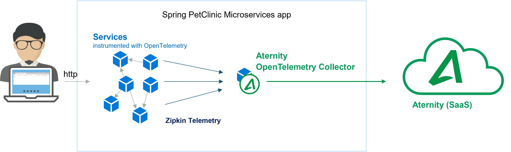
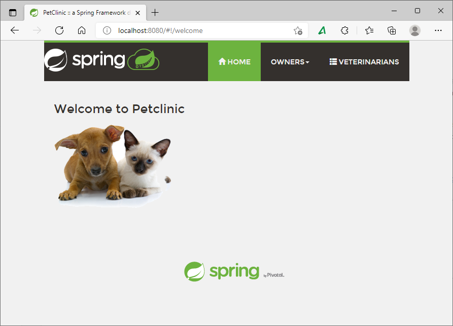
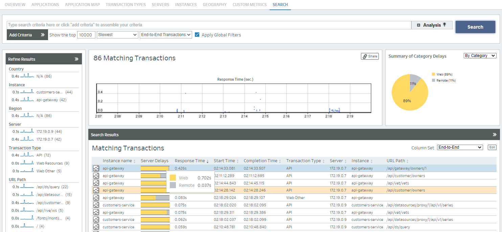
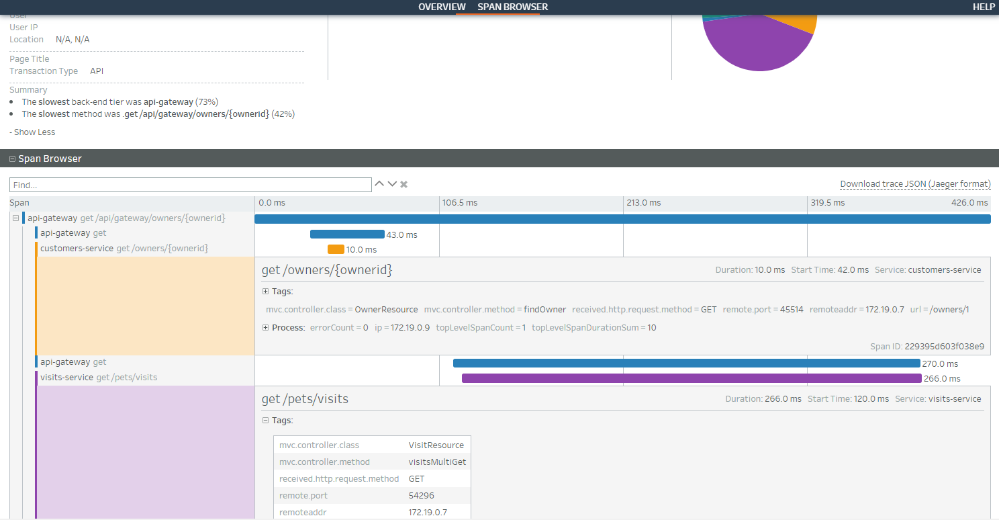

# 102-opentelemetry-spring-demo-app

This cookbook sets up a Java microservices application with the [APM OpenTelemetry collector container](https://hub.docker.com/r/aternity/apm-collector) on a Docker host to start using [APM](https://www.riverbed.com/products/application-performance-monitoring/) and [OpenTelemetry](https://opentelemetry.io/).

The sample app is the famous Java Community application called [Spring PetClinic Microservices](https://github.com/spring-petclinic/spring-petclinic-microservices). Composed of multiple services that run in containers, like Config, Discovery Server, Customers, Vets, Visits and API, it uses [ZipKin](https://zipkin.io/) instrumentation to export some application telemetry (traces for the service calls). The [APM OpenTelemetry collector](https://hub.docker.com/r/aternity/apm-collector) is integrated in the architecture, it also runs in a container, taking the role of the Tracing Server to collect and store the telemetry in the APM backend (SaaS). 

The [APM OpenTelemetry Collector](https://hub.docker.com/r/aternity/apm-collector) keeps 100% of the traces to provide full fidelity for application performance and behavior analysis. There is no data sampling.



## Prerequisites

1. an APM account (SaaS)
2. a Docker host, for example [Docker Desktop](https://www.docker.com/products/docker-desktop)

## Step by step

### Step 1 - Connect to the APM web console

Navigate to the APM web console (for example [https://apm.myaccount.aternity.com](https://apm.myaccount.aternity.com)) > Agents > Install Agents:

1. Find your **CustomerID**, for example *12341234-12341234-13241234*
2. Grab the **SaaS Analysis Server Host** starting with "agents.apm", for example *agents.apm.myaccount.aternity.com*

### Step 2 - Get the docker-compose

Download a local copy of the file [docker-compose.yml](docker-compose.yml), for example  [right-click here to download](https://raw.githubusercontent.com/riverbed/Riverbed-Community-Toolkit/refs/heads/master/APM/102-opentelemetry-spring-demo-app/docker-compose.yml) and save it in the directory `Riverbed-Community-Toolkit/APM/102-opentelemetry-spring-demo-app`

In this YAML file, the *tracing-server* section contains the APM OpenTelemetry Collector definition. There are variables that correspond to the CustomerID and to the SaaS Analysis Server Host. They will be set in the next step. 

```yaml
  tracing-server:
    image: aternity/apm-collector
    container_name: tracing-server
    mem_limit: 128M
    environment:
      - SERVER_URL=wss://${RIVERBED_APM_SAAS_SERVER_HOST}/?RPM_AGENT_CUSTOMER_ID=${ATERNITY_CUSTOMER_ID}
    ports:
     - 9411:9411
```

### Step 3 - Start the `spring-petclinic-microservices` app

In a shell, just go in the folder where you keep the [docker-compose.yml](docker-compose.yml). Configure the APM OpenTelemetry Collector using the environment variable, RIVERBED_APM_SAAS_SERVER_HOST and RIVERBED_APM_CUSTOMER_ID, and starts all the containers with docker-compose.

For example, using Bash:

```bash
# Go to the directory that contains docker-compose.yaml
cd Riverbed-Community-Toolkit/APM/102-opentelemetry-spring-demo-app

# Configure the environment variables for the APM OpenTelemetry Collector
export RIVERBED_APM_SAAS_SERVER_HOST="agents.apm.myaccount.aternity.com"
export RIVERBED_APM_CUSTOMER_ID="12341234-12341234-13241234"

# Start the containers
docker-compose up
```

or else using PowerShell:

```PowerShell
# Go to the directory that contains docker-compose.yaml
cd Riverbed-Community-Toolkit/APM/102-opentelemetry-spring-demo-app

# Configure the environment variable for the APM OpenTelemetry Collector
$env:RIVERBED_APM_SAAS_SERVER_HOST="agents.apm.myaccount.aternity.com"
$env:RIVERBED_APM_CUSTOMER_ID="12341234-12341234-13241234"

# Start the containers
docker-compose up
```

### Step 4 - Exercise the application

Browse http://localhost:8080 and click around to generate some telemetry that will be collected by the APM OpenTelemetry Collector



### Step 5 - Open the APM web console to visualize and analyze the traces collected for every transaction

Search transactions:



Browse the spans for the selected transaction:



## Notes 

### Support

Please visit [Riverbed website](https://www.riverbed.com/products/application-performance-monitoring) if you need [support](https://support.riverbed.com) and learn more about [OpenTelemetry with APM](https://www.riverbed.com/products/application-performance-monitoring)

### Stop the app and all the containers

Press CTRL + C in the shell where it is running.

Or in a shell, go to the folder where you keep the [docker-compose.yml](docker-compose.yml) and run:

```shell
docker-compose down
```

### Configuring APM OpenTelemetry Collector

The CustomerID and the SaaS Analysis Server Host configuration of the APM OpenTelemetry container can be defined directly in the [docker-compose.yml](docker-compose.yml), for example:

```yaml
  tracing-server:
    image: aternity/apm-collector
    container_name: tracing-server
    mem_limit: 128M
    environment:
      - SERVER_URL=wss://agents.apm.myaccount.aternity.com/?RPM_AGENT_CUSTOMER_ID=12341234-12341234-13241234
    ports:
     - 9411:9411
```

#### License

Copyright (c) 2022 Riverbed Technology, Inc. 

The contents provided here are licensed under the terms and conditions of the MIT License accompanying the software ("License"). The scripts are distributed "AS IS" as set forth in the License. The script also include certain third party code. All such third party code is also distributed "AS IS" and is licensed by the respective copyright holders under the applicable terms and conditions (including, without limitation, warranty and liability disclaimers) identified in the license notices accompanying the software.
