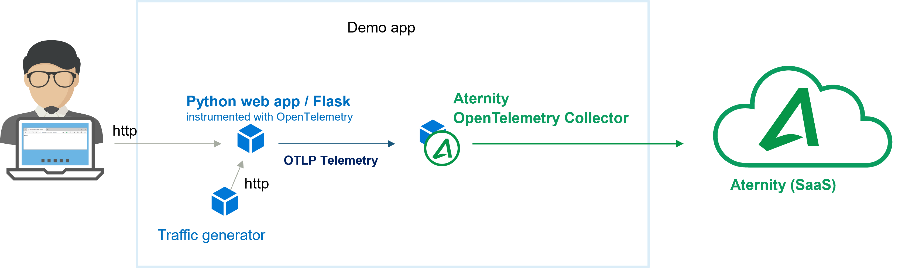

# 103-opentelemetry-otlp-python-app

This cookbook deploys multiple containers using docker-compose: a **python** web app, that is based on Flask and auto-instrumented using [OpenTelemetry](https://opentelemetry.io/) to export OLTP telemetry, a simple traffic generator and the [Aternity OpenTelemetry Collector](https://hub.docker.com/r/aternity/apm-collector) container.

The [Aternity OpenTelemetry Collector](https://hub.docker.com/r/aternity/apm-collector) is a container that collects the telemetry exported by the application whether using OTLP, the OpenTelemetry native telemetry protocols, Jaeger or Zipkin.



## Prerequisites

1. an Aternity APM account (SaaS)
2. a Docker host, for example [Docker Desktop](https://www.docker.com/products/docker-desktop)

## Step by Step

### 1. Get your CustomerID & SaaS Analysis Server Host details from the Aternity APM web console

Navigate to Aternity APM (for example [https://apm.myaccount.aternity.com](https://apm.myaccount.aternity.com)) > Agents > Install Agents:

1. Find your **CustomerID**, for example *12341234-12341234-13241234*
2. Grab **SaaS Analysis Server Host**, for example *agents.apm.myaccount.aternity.com*

Those information are required to activate the Aternity OpenTelemetry Collector container and will be passed via the environment variable `SERVER_URL`. 

### 2. Start the containers

Get a local copy of the [docker-compose.yaml](docker-compose.yaml) file. 

Edit the file if you want to manually configure the `SERVER_URL` variable, replacing *ATERNITY_SAAS_SERVER_HOST* and *ATERNITY_CUSTOMER_ID* with actual values. The remaining is all set to pull the container image from [DockerHub](https://hub.docker.com/r/aternity/apm-collector) and receive telemetry on the OTLP gRPC port (4317 tcp port 4317.

```yaml
services:

  opentelemetry-collector:
    
    image: registry.hub.docker.com/aternity/apm-collector:2022.11.0-4
    
    container_name: apm-collector       
    
    environment:

      SERVER_URL: "wss://agents.apm.myaccount.aternity.com/?RPM_AGENT_CUSTOMER_ID=12341234-12341234-13241234"

    ports:
      - "4317:4317/tcp"
```

Then, start the containers from the shell. The collector can be configured at the same time using environment variables. 

For example using Bash:

```bash
# Go to the directory that contains docker-compose.yaml
cd Tech-Community/103-opentelemetry-otlp-python-app

# Configure the environment variables for the Aternity OpenTelemetry Collector
export ATERNITY_SAAS_SERVER_HOST="agents.apm.myaccount.aternity.com"
export ATERNITY_CUSTOMER_ID="12341234-12341234-13241234"

# Start the containers
docker compose up
```

Using PowerShell:

```PowerShell
# Go to the directory that contains docker-compose.yaml
cd Tech-Community/103-opentelemetry-otlp-python-app

# Configure the environment variable for the Aternity OpenTelemetry Collector
$env:ATERNITY_SAAS_SERVER_HOST="agents.apm.myaccount.aternity.com"
$env:ATERNITY_CUSTOMER_ID="12341234-12341234-13241234"

# Start the containers
docker compose up
```

### 3. Generate traffic and telemetry

The web app should now be running as well as the traffic generator. Every trace will be collected by the Aternity APM OpenTelemetry Collector.

You can also browse the app, navigating to http://localhost:8103/server_request or call the URL from a command line. 


For example using curl:

```bash
curl http://localhost:8103/server_request
```

### 4. Open the Aternity APM web console to visualize and analyze the traces collected for every transaction

Search transaction, browse the spans for the selected transaction :


## Notes 

### Stop the app and all the containers

Press CTRL + C in the shell where it is running.

Or in a shell, go to the folder where you keep the [docker-compose.yaml](docker-compose.yaml) and run:

```shell
docker compose down
```

### OpenTelemetry details

On the application container side, the `OTEL_EXPORTER_OTLP_ENDPOINT` environment variable is used to bind the web app telemetry exporter to the collector container:

```yaml
  service103_python:   
    
    environment:  
    
      OTEL_EXPORTER_OTLP_ENDPOINT: http://apm-collector:4317

      OTEL_SERVICE_NAME: service103_python
```

#### License

Copyright (c) 2022 Riverbed Technology, Inc.

The contents provided here are licensed under the terms and conditions of the MIT License accompanying the software ("License"). The scripts are distributed "AS IS" as set forth in the License. The script also include certain third party code. All such third party code is also distributed "AS IS" and is licensed by the respective copyright holders under the applicable terms and conditions (including, without limitation, warranty and liability disclaimers) identified in the license notices accompanying the software.
