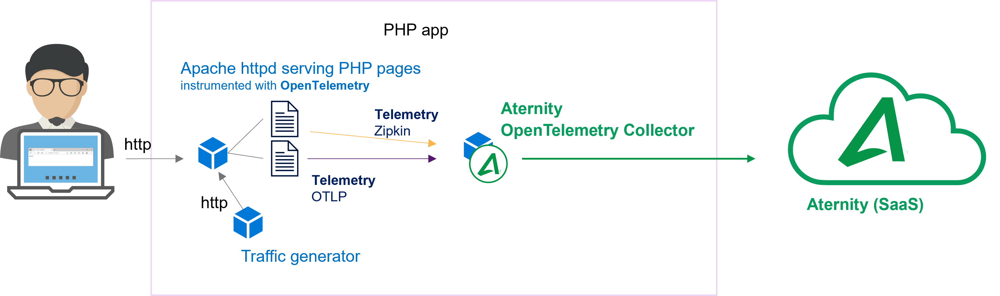

# 110-opentelemetry-php-app

This cookbook runs multiple containers on a Docker host. A container of the Apache http server exposes a web listener to serve some PHP samples and another container continuously connects to it to generate traffic. The PHP samples are manually instrumented with OpenTelemetry and different exporters, OTLP http and also Zipkin. The [APM OpenTelemetry Collector container](https://hub.docker.com/r/aternity/apm-collector) collects all traces, every span without sampling, and sends the spans to the Aternity SaaS backend. 



## Prerequisites

1. an APM account (SaaS)
2. a Docker host, for example [Docker Desktop](https://www.docker.com/products/docker-desktop)

## Step by Step

### Step 1. Get your CustomerID & SaaS Analysis Server Host details from the APM web console

Navigate to APM (for example [https://apm.myaccount.aternity.com](https://apm.myaccount.aternity.com)) > Agents > Install Agents:

1. Find your **CustomerID**, for example *12341234-12341234-13241234*
2. Grab **SaaS Analysis Server Host**, for example *agents.apm.myaccount.aternity.com*

Those information are required to activate the APM OpenTelemetry Collector container, passing via the environment variable `SERVER_URL`. 

### Step 2. Start the containers

Download a local copy of the files of this cookbook, for example store them in the folder *Tech-Community/110-opentelemetry-php-app*

```
|- docker-compose.yaml
|- src
    |- index.php
    |- SampleOTLPhttpExporter.php
    |- SampleZipkinExporter.php
```

Start the containers using the [docker-compose.yaml](docker-compose.yaml), for example with Bash:

```bash
cd Riverbed-Community-Toolkit/APM/110-opentelemetry-php-app

# Configure the environment variables for the APM OpenTelemetry Collector
export RIVERBED_APM_SAAS_SERVER_HOST="agents.apm.myaccount.aternity.com"
export RIVERBED_APM_CUSTOMER_ID="12341234-12341234-13241234"

docker-compose up
```

or with PowerShell:

```PowerShell
cd Riverbed-Community-Toolkit/APM/110-opentelemetry-php-app

# Configure the environement variable for the APM OpenTelemetry Collector
$env:RIVERBED_APM_SAAS_SERVER_HOST="agents.apm.myaccount.aternity.com"
$env:RIVERBED_APM_CUSTOMER_ID="12341234-12341234-13241234"

docker-compose up
```

### Step 3. Try the app

Browse the local urls

- http://localhost:8110
- http://localhost:8110/SampleOTLPhttpExporter.php
- http://localhost:8110/SampleZipkinExporter.php


### Step 4. Open the APM web console to visualize and analyze the traces collected for every transaction


## Notes

### Stop the app and all the containers

Press CTRL + C in the shell where it is running.

Or in a shell, go to the folder where you keep the [docker-compose.yaml](docker-compose.yaml) and run:

```shell
docker-compose down
```

#### License

Copyright (c) 2022-2024 Riverbed Technology, Inc.

The contents provided here are licensed under the terms and conditions of the MIT License accompanying the software ("License"). The scripts are distributed "AS IS" as set forth in the License. The script also include certain third party code. All such third party code is also distributed "AS IS" and is licensed by the respective copyright holders under the applicable terms and conditions (including, without limitation, warranty and liability disclaimers) identified in the license notices accompanying the software.
