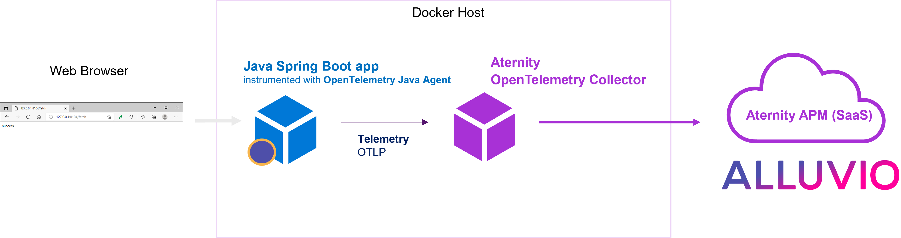
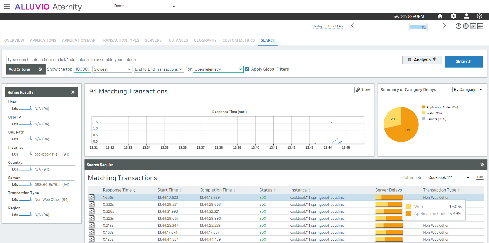

# 111-opentelemetry-autoinstrumentation-spring-demo-app

This cookbook demonstrates how the [Alluvio Aternity DEM](https://www.riverbed.com/products/digital-experience-management) solution provides observability of a Java application using [OpenTelemetry](https://opentelemetry.io/) auto-instrumentation.

To instrument the Java Spring Boot demo app ([Spring PetClinic](https://github.com/spring-projects/spring-petclinic)), the OpenTelemetry Java agent will be containerized with the app (the .jar file is copied into the image) and injected in the app at startup. The agent will be configured to export the tracing to the Alluvio Aternity APM SaaS backend via the [Alluvio Aternity OpenTelemetry Collector](https://hub.docker.com/r/aternity/apm-collector) that will run in an another container.



## Prerequisites

1. an account is Alluvio Aternity APM (SaaS)
2. a Docker host, for example [Docker Desktop](https://www.docker.com/products/docker-desktop)

## Step by step

### Step 1 - Connect to Aternity APM webconsole

Navigate to Aternity APM (for example [https://apm.myaccount.aternity.com](https://apm.myaccount.aternity.com)) > Agents > Install Agents:

1. Find your **CustomerID**, for example *12341234-12341234-13241234*
2. Grab the **SaaS Analysis Server Host**, for example *agents.apm.myaccount.aternity.com*

### Step 2 - Get the files to run the Cookbook

Download the cookbook, for example [right-click here](https://github.com/Aternity/Tech-Community/archive/refs/heads/main.zip) to download the zip archive, and expand it locally.

### Step 3 - Start the containers

Open a shell and go to the Cookbook folder. Configure the Aternity APM OpenTelemetry Collector using the environment variables, ATERNITY_SAAS_SERVER_HOST and ATERNITY_CUSTOMER_ID, and start all the containers with docker-compose.

For example using Bash:

```bash
# Go to the directory that contains the cookbook
cd Tech-Community-main\111-opentelemetry-autoinstrumentation-spring-demo-app

# Configure the environment variables for the Aternity OpenTelemetry Collector
export ATERNITY_SAAS_SERVER_HOST="agents.apm.myaccount.aternity.com"
export ATERNITY_CUSTOMER_ID="12341234-12341234-13241234"

# Start the containers
docker-compose up
```
or else using PowerShell:

```PowerShell
# Go to the directory that contains the cookbook
cd Tech-Community\Tech-Community-main\111-opentelemetry-autoinstrumentation-spring-demo-app

# Configure the environement variable for the Aternity OpenTelemetry Collector
$env:ATERNITY_SAAS_SERVER_HOST="agents.apm.myaccount.aternity.com"
$env:ATERNITY_CUSTOMER_ID="12341234-12341234-13241234"

# Start the containers
docker-compose up
```

### Step 4 - Navigate through the app and monitor

Open the url http://localhost:8080 in the web browser and navigate through the app.

Alluvio Aternity APM collects the telemetry the java agent is sending. Every transaction and every OpenTelemetry span can be found in the Search tab.



## Notes 

### Stop the app and all the containers

Press CTRL + C in the shell where it is running.

Or in a shell, go to the folder where you keep the [docker-compose.yaml](docker-compose.yaml) and run:

```shell
docker-compose down
```

#### License

Copyright (c) 2022 Riverbed Technology, Inc. 

The contents provided here are licensed under the terms and conditions of the MIT License accompanying the software ("License"). The scripts are distributed "AS IS" as set forth in the License. The script also include certain third party code. All such third party code is also distributed "AS IS" and is licensed by the respective copyright holders under the applicable terms and conditions (including, without limitation, warranty and liability disclaimers) identified in the license notices accompanying the software.
