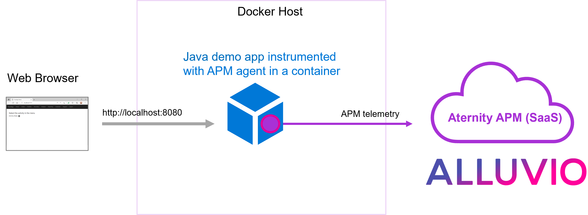

# 203-instrument-java-app-with-apm-agent-in-container

In this cookbook, the full APM agent is installed inside the container image of the application, which is a Java web application based on [Java Spring Boot framework](https://spring.io/). The APM observability features allow to monitor the instance and profile every transaction.



## Prerequisites

1. a SaaS account for [APM](https://www.riverbed.com/products/application-performance-monitoring)
2. a Docker host, for example [Docker Desktop](https://www.docker.com/products/docker-desktop)

## Step 1. Get installation details in APM web console

In the APM webconsole, navigate to CONFIGURE > AGENTS > Install Agents to see the Agent Installation Steps section.

1. Find your **Customer Id**, for example *12341234-12341234-13241234*
2. Find the **SaaS Analysis Server Host**, for example *agents.apm.my_environment.aternity.com*
3. Download the latest **APM agent for Linux** package (also available on [Riverbed support](https://support.riverbed.com/content/support/software/aternity-dem/aternity-apm.html)), *appinternals_agent_latest_linux.gz*

Then in CONFIGURE > AGENTS > Configurations, 

4. Define a configuration for the app and download the .json file. For example create a new configuration and name it "configuration", configure Data Collection Settings to enable End-User Experience Data collection, Save and Download the file configuration.json

## Step 2. Cookbook preparation

1. Download the cookbook. For example download the [zip of the repository](https://github.com/riverbed/Riverbed-Community-Toolkit/archive/refs/heads/main.zip), expand it and go the folder Tech-Community/203-instrument-java-app-with-apm-agent-in-container
2. Copy the agent package appinternals_agent_latest_linux.gz in the subfolder apm-customization.
3. Copy the configuration file (prepared in Step 1.) to the subfolder apm-customization/config.
   
> :warning: if the name of the configuration file is not configuration.json then edit the initial-mapping to adapt the startup autoinstrumentation mapping 

## Step 3. Start the containers

Start the containers using docker-compose, for example with Bash:

```bash
cd Riverbed-Community-Toolkit/APM/203-instrument-java-app-with-apm-agent-in-container

# Configure the environment variables with the SAAS Account details
export ALLUVIO_ATERNITY_APM_SAAS_SERVER_HOST="agents.apm.myaccount.aternity.com"
export ALLUVIO_ATERNITY_APM_CUSTOMER_ID="12341234-12341234-13241234"

docker-compose up
```

or with PowerShell:

```PowerShell
cd Riverbed-Community-Toolkit/APM/203-instrument-java-app-with-apm-agent-in-container

# Configure the environment variables with the SAAS Account details
$env:ALLUVIO_ATERNITY_APM_SAAS_SERVER_HOST="agents.apm.myaccount.aternity.com"
$env:ALLUVIO_ATERNITY_APM_CUSTOMER_ID="12341234-12341234-13241234"

docker-compose up
```

## Step 4. Browse the app

The web application should now be available on [http://localhost:8080](http://localhost:8080).

Open the url in your browser and refresh the page few times to generate some traffic.

## Step 5. APM web console 

Go to the APM webconsole to monitor the instance and observe every transaction.


### License

Copyright (c) 2023 Riverbed

The contents provided here are licensed under the terms and conditions of the MIT License accompanying the software ("License"). The scripts are distributed "AS IS" as set forth in the License. The script also include certain third party code. All such third party code is also distributed "AS IS" and is licensed by the respective copyright holders under the applicable terms and conditions (including, without limitation, warranty and liability disclaimers) identified in the license notices accompanying the software.
