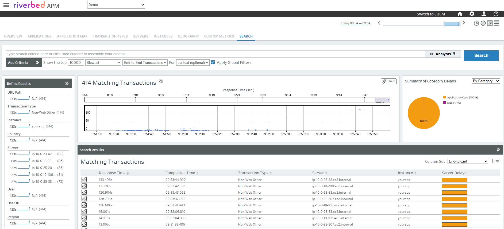

# 285-auto-instrument-app-with-riverbed-apm-on-openshift

> [!WARNING]
> Before starting with this community cookbook, be aware the [Riverbed Operator](https://github.com/riverbed/riverbed-operator) supports OpenShift and it is now fully documented on its own repository. To learn more about it, please follow the link: [Riverbed Operator](https://github.com/riverbed/riverbed-operator)
>
> This community cookbook has been made for the Riverbed Operator version 1.0.0. It shows how to enable Riverbed APM on an app running in a Red Hat OpenShift cluster, using the [Riverbed Operator](https://github.com/riverbed/riverbed-operator) and configuring the automatic instrumentation.

## Prerequisites

1. a SaaS account for [Riverbed APM](https://www.riverbed.com/products/application-performance-monitoring)

2. a Red Hat OpenShift environment: Red Hat console access, OpenShift client CLI (`oc` command), a cluster with Linux machine pools and apps

> [!NOTE]
> This cookbook has been tested with Red Hat OpenShift version 4

## Step 1. Get the details for Riverbed APM

In the Riverbed APM web console, from the Home page, hit "Deploy Collectors" and "Install now" button (or else navigate via the traditional menu: CONFIGURE > AGENTS > Install Agents).

Then in the Linux agent panel, switch to the "Standard Agent Install" to find and grab the values of your:

1. **Customer Id**, for example *12341234-12341234-13241234*

2. **SaaS Analysis Server Host**, for example *agents.apm.your_environment.aternity.com*

## Step 2. Connect to the cluster with `oc`

Start a shell and connect to your cluster using `oc login`, the full command would look like this:

```shell
oc login --token=yourtoken --server=yourserver
```


## Step 3. Deploy the Riverbed Operator on the Cluster

### 3.1 Permissions

Run the following command to configure the required permissions for the Riverbed Operator and APM Agent:

```shell
# Set the permissions
oc apply -f https://raw.githubusercontent.com/riverbed/Riverbed-Community-Toolkit/refs/heads/master/APM/285-auto-instrument-app-with-riverbed-apm-on-openshift/riverbed-operator-permissions-openshift.yaml
```

### 3.2 Riverbed Operator

Execute the scripts below to deploy the Riverbed Operator (using the `oc` command)

```shell
# Install Cert-manager prerequisite
oc apply -f https://github.com/cert-manager/cert-manager/releases/download/v1.14.5/cert-manager.yaml

# Wait at least 2 min for cert-manager to get ready
sleep 120

# Install the Riverbed Operator
oc apply -f https://raw.githubusercontent.com/riverbed/riverbed-operator/1.0.0/riverbed-operator.yaml
```

### 3.3 Riverbed Operator configuration

Download locally the [riverbed operator configuration manifest](https://raw.githubusercontent.com/riverbed/riverbed-operator/1.0.0/riverbed_configuration_v1.0.0.yaml), and edit the file to change the lines `customerId: ""` and `analysisServerHost: "agents.apm.YOUR-ENV.aternity.com"` adding the values of the **Customer Id** and **SaaS Analysis Server Host** obtained in Step 1. 

For example the related lines in the configuration will look like this:

```
...
  analysisServerHost: agents.apm.your_environment.aternity.com
  customerId: 12341234-12341234-13241234
...
```

Then apply the configuration:

```shell
# Apply the Riverbed Operator configuration with your Customer Id and SaaS Analysis Server Host
oc apply -f riverbed_configuration_v1.0.0.yaml
```

> [!TIP]
> The following command can also be used to automatically open the configuration in your editor. The configuration will be applied when you save and close the file from the editor.
> ```shell
> # Configure the Riverbed Operator with your Customer Id and SaaS Analysis Server Host
> oc create -f https://raw.githubusercontent.com/riverbed/riverbed-operator/1.0.0/riverbed_configuration_v1.0.0.yaml --namespace=riverbed-operator --edit
> ```

> [!NOTE]
> Please refer to the [Riverbed Operator](https://github.com/riverbed/riverbed-operator) to learn more details on how to deploy the Riverbed Operator on a Kubernetes cluster.

## Step 4. Check the setup

After few seconds, you can verify the Pods in the `riverbed-operator` namespace are ready.

```shell
oc get pod -n riverbed-operator
```

The output will look like this in a cluster having few nodes

```console
NAME                                                    READY   STATUS    RESTARTS   AGE
riverbed-apm-agent-6l4k8                                1/1     Running   0          43s
riverbed-apm-agent-g5q4m                                1/1     Running   0          43s
...
riverbed-operator-controller-manager-56dd4ddf78-n2t66   2/2     Running   0          4m8s
```


## Step 5. *optional* Install a demo app

<details>
<summary>Details</summary>
  
### 5.1 Deployment

Run the following command to deploy the demo application `yourapp` in the namespace `cookbook-app`. The app uses the docker image of a simple java webapp.

```shell
# Deploy YourApp (version without APM)
oc apply -f https://raw.githubusercontent.com/riverbed/Riverbed-Community-Toolkit/refs/heads/master/APM/285-auto-instrument-app-with-riverbed-apm-on-openshift/app/yourapp.yaml
```

### 5.2 Test the app

In a separate shell, run this command to open a local port that will give access the app. For example on port 8888
 
```shell
# Bind YourApp to a local port
oc port-forward -n cookbook-app service/yourapp --address 127.0.0.1 8888:80
```

Then you can run the pods are up, running the following commands:

```shell
oc get pod -n cookbook-app
oc get service -n cookbook-app
```

And you you should be able to access from your browser to [http://127.0.0.1:8888](http://127.0.0.1:8888) or using CLI:

```shell
# Access YourApp
curl http://127.0.0.1:8888
```

When the app is ready, the CLI output should look like this:

```console
Hello Docker World
```

</details>

## Step 6. Instrument your app

Simply enable the automatic instrumentation adding the annotation. 

For example, with the demo application `yourapp`, which is a java app, the command below patches the app deployment to add the annotation `"instrument.apm.riverbed/inject-java":"true"`:

```shell
oc patch deployment -n cookbook-app yourapp -p '{"spec": {"template":{"metadata":{"annotations":{"instrument.apm.riverbed/inject-java":"true"}}}} }'
```

> [!TIP]
> The APM instrumentation annotation can also be added to the manifest files, and can be defined at the deployment level to instrument a specific app, or at the namespace level to instrument all the applications in the namespace.
>
> For example with the demo app,
>
> In [app/yourapp-with-apm.yaml](app/yourapp-with-apm.yaml) the deployment spec of the app is annotated - the file is based on the original manifest [app/yourapp.yaml](app/yourapp.yaml) without annotation. The manifest can be applied to the cluster as usual:
> ```shell
> # Apply or Deploy YourApp with APM instrumentation
> oc apply -f https://raw.githubusercontent.com/riverbed/Riverbed-Community-Toolkit/refs/heads/master/APM/285-auto-instrument-app-with-riverbed-apm-on-openshift/app/yourapp-with-apm.yaml
> ```
>
> In [app/namespace-with-apm.yaml](app/namespace-with-apm.yaml), the namespace is annotated with the APM Instrumentation and can be applied to the cluster:
> ```shell
> # Annotate the namespace for APM instrumentation
> oc apply -f https://raw.githubusercontent.com/riverbed/Riverbed-Community-Toolkit/refs/heads/master/APM/285-auto-instrument-app-with-riverbed-apm-on-openshift/app/namespace-with-apm.yaml
> ```
>
> If the app was already deployed and running before beeing annotated, it needs a rollout restart that can be triggered for example with:
> ```shell
> # Restart the deployment of all the applications in the namespace (here there is just one single deployment deployment/yourapp)
> oc rollout restart -n cookbook-app deployment
> ```

> [!NOTE]
> For more details about automatic instrumentation, please refer to the readme page of the [Riverbed Operator](https://github.com/riverbed/riverbed-operator).

## Step 7. Monitor in Riverbed APM web console 

When the app is ready, just use the app to generate some transactions.

And then go to the APM web console to observe every transaction of the application. Every Pod on any Node is automatically instrumented, with the Riverbed APM agent deployed on every node.



## Notes

### How to clean-up the demo app

Simply run the following 

```shell
oc delete  -f https://raw.githubusercontent.com/riverbed/Riverbed-Community-Toolkit/refs/heads/master/APM/285-auto-instrument-app-with-riverbed-apm-on-openshift/app/yourapp.yaml
```

### How to clean-up the operator


```shell
oc delete -f https://raw.githubusercontent.com/riverbed/riverbed-operator/1.0.0/riverbed-operator.yaml
```

> [!NOTE]
> Please refer to the [Riverbed Operator](https://github.com/riverbed/riverbed-operator) to learn more details on how to deploy the Riverbed Operator on a Kubernetes cluster.

#### License

Copyright (c) 2024 - 2025 Riverbed

The contents provided here are licensed under the terms and conditions of the MIT License accompanying the software ("License"). The scripts are distributed "AS IS" as set forth in the License. The script also include certain third party code. All such third party code is also distributed "AS IS" and is licensed by the respective copyright holders under the applicable terms and conditions (including, without limitation, warranty and liability disclaimers) identified in the license notices accompanying the software.
