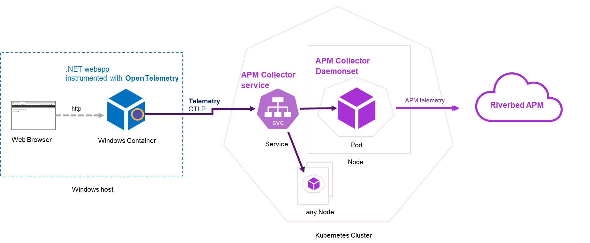
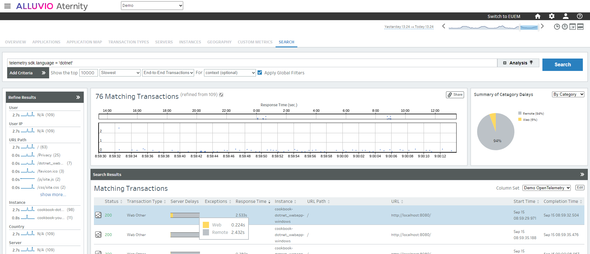

# 322-opentelemetry-on-kubernetes-with-apm-collector-daemonset-service-and-dotnet-app-on-windows

This cookbook shows how the [APM Collector](https://hub.docker.com/r/aternity/apm-collector) of ALLUVIO Aternity can be deployed on a Kubernetes cluster and exposed as a service, so that, workloads that are outside the cluster, like a Windows virtual machine, can be instrumented with [OpenTelemetry](https://opentelemetry.io) and export the telemetry to the APM Collector.

The cookbook requires a Kubernetes cluster. It can be in the Cloud, like Azure AKS, AWS EKS or Google GKE. And it requires a Windows host, that can be in the same network as the cluster. After deploying the APM Collector in the Kubernetes cluster, a simple [.NET](https://dotnet.microsoft.com) webapp that is instrumented with [OpenTelemetry](https://opentelemetry.io) will be containerized as a Windows container to run on the Windows host.



## Prerequisites

1. a SaaS account for [ALLUVIO Aternity APM](https://www.riverbed.com/products/application-performance-monitoring) with a license activated for OpenTelemetry

2. a Kubernetes cluster ready and manageable using kubectl CLI

3. a Windows host enabled with a Docker runtime, for example [Docker Desktop](https://www.docker.com/products/docker-desktop/) on a Windows Server virtual machine

## Step 1. Get the details for ALLUVIO Aternity APM

In the APM webconsole, from the Home page, hit "Deploy Collectors" and "Install now" button (or else navigate via the traditional menu: CONFIGURE > AGENTS > Install Agents).

Then in the Linux agent panel, switch to the "Standard Agent Install" to find:

1. your **Customer Id**, for example *12341234-12341234-13241234*

2. your **SaaS Analysis Server Host**, for example *agents.apm.my_environment.aternity.com*

## Step 2. Deploy the APM Collector on the Kubernetes cluster

1. Download the .yaml files of the cookbook, or ([download the full Tech Community zip archive](https://github.com/Aternity/Tech-Community/archive/refs/heads/main.zip))

2. Configure the .yaml manifest

Edit the Kubernetes manifest [apm-collector-daemonset.yaml](apm-collector-daemonset.yaml) to configure the environment variables for the APM Collector:

- replace {{ALLUVIO_ATERNITY_APM_CUSTOMER_ID}} with the **Customer Id**, for example: *12312341234-1234-124356*

- replace {{ALLUVIO_ATERNITY_APM_SAAS_SERVER_HOST}} with the **SaaS Analysis Server Host**, for example: *agents.apm.my-account.aternity.com*

3. Deploy the resources in the Kubernetes cluster

For example, in a shell go to your directory having the .yaml files and apply them with kubectl

```shell
# Go to the directory having the .yaml files
cd 322-opentelemetry-on-kubernetes-with-apm-collector-daemonset-service-and-dotnet-app-on-windows

# Deploy the daemonset
kubectl apply -f apm-collector-daemonset.yaml

# Deploy the service
kubectl apply -f apm-collector-daemonset-service.yaml
```

4. Wait a bit until the resources are ready, and find the IP Address of the service

For example, run the following command to see the IP Address of the service resource:

```shell
kubectl --namespace alluvio-aternity get service
```

## Step 3. Configure and deploy the instrumented app

On the Windows machine enabled with a Docker runtime,

1. Fetch the cookbook, for example hit the link to [download the full Tech Community zip archive](https://github.com/Aternity/Tech-Community/archive/refs/heads/main.zip) and expand the zip archive

2. Configure the instrumentation with the OTLP endpoint and run the app

In the command below, replace {{ APM Collector - OTLP Endpoint }} with the actual endpoint exposed by the APM Collector, and execute it to run the app

```PowerShell
# Go to the cookbook directory
cd 322-opentelemetry-on-kubernetes-with-apm-collector-daemonset-service-and-dotnet-app-on-windows

# Run the app
$env:OTEL_EXPORTER_OTLP_ENDPOINT="{{ APM Collector - OTLP Endpoint }}"
docker compose up
```

For example, using 10.0.0.80 for the IP Address of the service (obtained in the previous step).

```PowerShell
# Go to the cookbook directory
cd 322-opentelemetry-on-kubernetes-with-apm-collector-daemonset-service-and-dotnet-app-on-windows

# Run the app
$env:OTEL_EXPORTER_OTLP_ENDPOINT="http://10.0.0.80:4317"
docker compose up
```

3. Open a local browser, open the app on http://localhost:8080, and navigate multiple times on the different menus to generate some traces


## Step 4. Observe the traces in ALLUVIO Aternity APM webconsole 

In the APM webconsole, open the menu and go to the "Search" view to find all the OpenTelemetry traces of the app. 

The view allows to filter based on the traces attributes.

For example, the traces of the app can be found with the following query that keeps traces of any applications coded in .NET.

```query
telemetry.sdk.language=dotnet
```



## Notes

### Stop the app

```PowerShell
docker compose down
```

#### License

Copyright (c) 2023 Riverbed

The contents provided here are licensed under the terms and conditions of the MIT License accompanying the software ("License"). The scripts are distributed "AS IS" as set forth in the License. The script also include certain third party code. All such third party code is also distributed "AS IS" and is licensed by the respective copyright holders under the applicable terms and conditions (including, without limitation, warranty and liability disclaimers) identified in the license notices accompanying the software.
