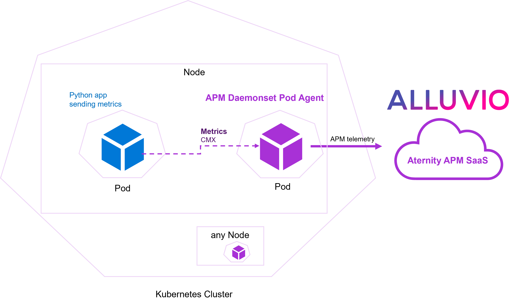
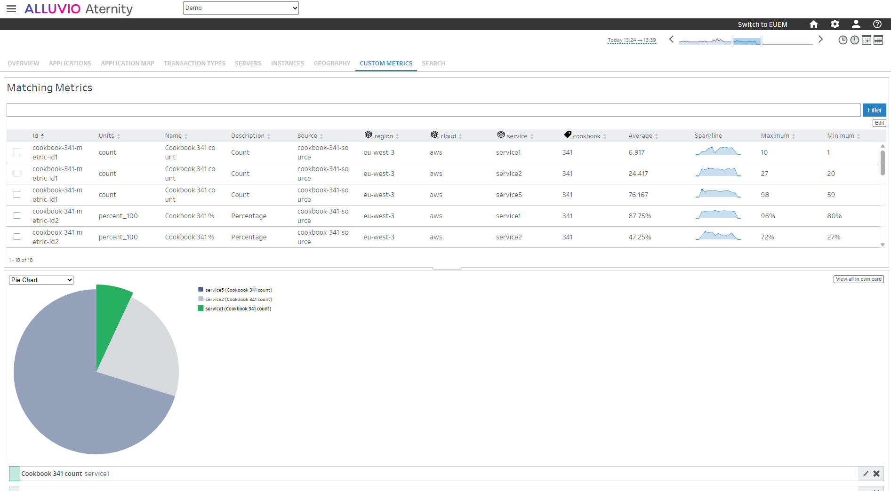

# 341-metrics-with-apm-daemonset-pod-agent-on-eks

> [!WARNING]
> Riverbed recently released the Riverbed Operator for Kubernetes, which is the preferred deployment method for Kubernetes.

In a Kubernetes cluster in AWS Elastic Kubernetes Serivce (EKS), the pods and applications can send their metrics to the Riverbed APM via the CMX endpoint exposed by the APM agent.

With this cookbook, the APM agent container image is built and deployed on the cluster as a **Daemonset POD agent**, so that there is an instance of the agent running on every node and exposing the agent services for instrumented applications (e.g. CMX on port 7074). The [yaml manifest of the Daemonset POD agent](apm-daemonset-pod-agent.yaml) needs to be configured with the information of your Riverbed APM SaaS account.

A simple Python app that generates metrics, is containerized (built from [sources](app)) and deployed on the cluster to run regularly.



## Prerequisites

1. a SaaS account for [Riverbed APM](https://www.riverbed.com/products/application-performance-monitoring)

2. a ready to use Kubernetes environment created in AWS: a console like Cloud9 with CLI tooling installed (git, aws-cli, docker and kubectl), EKS cluster resources with a Node group (Linux x64) and an ECR image registry
   
## Step 1. Get the details for Riverbed APM

In the APM webconsole, from the Home page, hit "Deploy Collectors" and "Install now" button (or else navigate via the traditional menu: CONFIGURE > AGENTS > Install Agents).

Then in the Linux agent panel, switch to the "Standard Agent Install" to:

1. Find your **Customer Id**, for example *12341234-12341234-13241234*

2. Find your **SaaS Analysis Server Host**, for example *agents.apm.my_environment.aternity.com*

3. Download the latest **APM Linux Agent** package (also available on [Riverbed support](https://support.riverbed.com/content/support/software/aternity-dem/aternity-apm.html)), *appinternals_agent_latest_linux.gz*

## Step 2. Open your shell

Run the following CLI in the terminal to download a local copy of the cookbook:

```shell
git clone https://github.com/riverbed/Riverbed-Community-Toolkit.git --depth 1

cd Riverbed-Community-Toolkit/APM/341-metrics-with-apm-daemonset-pod-agent-on-eks
```

## Step 3. Build the image of the APM Daemonset POD Agent

1. Copy the APM Linux Agent package *appinternals_agent_latest_linux.gz* (prepared in Step 1) to the folder *apm-customization/*

2. **optional** instrumentation configuration

It is not required for CMX metric. Any APM instrumentation configuration file (e.g configuration.json exported from the webconsole) must be copied to the subfolder **apm-customization/config/**

3. In the snippet below, replace the token **{{ecr_region}}** and **{{aws_account_id}}** with your own values. Execute the snippet to build the image locally, and then push it to the ECR container registry. The build is based on a [Dockerfile](Dockerfile). 

```shell
ecr_region="{{ecr_region}}"  # replace {{ecr_region}}, for example: eu-west-3
aws_account_id="{{aws_account_id}}"  # replace {{aws_account_id}}, for example: 1234-5678-90

# 1. Connect docker to the ECR repository
aws ecr get-login-password --region $ecr_region | docker login --username AWS --password-stdin $aws_account_id.dkr.ecr.$ecr_region.amazonaws.com

# 2. Create a repository
repository_name="riverbed-apm-daemonset-pod-agent"
aws ecr create-repository --repository-name $repository_name --region $ecr_region

# 3. Build and push the container image
tag="23.8"
apm_agent_image_uri="$aws_account_id.dkr.ecr.$ecr_region.amazonaws.com/$repository_name:$tag"
docker build -t $apm_agent_image_uri .
docker push $apm_agent_image_uri

# 4. Display the URI of the APM agent container image
echo $apm_agent_image_uri
```

4. Grab the URI of the APM agent container image

The URI should be displayed in the terminal from the previous step. 

For example:

```
1234-5678-90.dkr.ecr.eu-west-3.amazonaws.com/riverbed-apm-daemonset-pod-agent:23.8
```

## Step 4. Deploy the APM Daemonset POD Agent on Kubernetes

1. Configure the manifest

Edit the Kubernetes manifest [apm-daemonset-pod-agent.yaml](apm-daemonset-pod-agent.yaml) to set the image path and the environment variables to configure the APM agent with the actual values prepared in previous steps (Step 1 and Step 3):

- replace **{{Riverbed APM Daemonset POD agent image}}** with the **URI of the APM agent container image** built previously (see Step 3.), for example: *1234-5678-90.dkr.ecr.eu-west-3.amazonaws.com/riverbed-apm-daemonset-pod-agent:23.8*

- replace **{{RIVERBED_APM_CUSTOMER_ID}}** with the **Customer Id** (see Step 1.), for example: *12341234-12341234-13241234*

- replace **{{RIVERBED_APM_SAAS_SERVER_HOST}}** with the **SaaS Analysis Server Host** (see Step 1.), for example: *agents.apm.my_environment.aternity.com*


2. Deploy the APM Daemonset POD Agent

Execute the command to deploy the daemonset,

```shell
kubectl apply -f apm-daemonset-pod-agent.yaml
```

When ready, the agents will show up in the APM webconsole: in CONFIGURE > AGENTS > Agent List.

## Step 5. Deploy the app that sends metrics

1. Prepare the image

Same as in Step 3, replace the token **{{ecr_region}}** and **{{aws_account_id}}** with the values of your environment, and execute the snippet to build the image of the app.
The build is based on this [Dockerfile](app/Dockerfile).

```shell
ecr_region="{{ecr_region}}"  # replace {{ecr_region}}, for example: eu-west-3
aws_account_id="{{aws_account_id}}"  # replace {{aws_account_id}}, for example: 1234-5678-90

# 1. Connect docker to the ECR repository
aws ecr get-login-password --region $ecr_region | docker login --username AWS --password-stdin $aws_account_id.dkr.ecr.$ecr_region.amazonaws.com

# 2. Create a repository
repository_name="cookbook-341-app"
aws ecr create-repository --repository-name $repository_name --region $ecr_region

# 3. Build and push the container image of the app
tag="23.8"
cookbook_app_image_uri="$aws_account_id.dkr.ecr.$ecr_region.amazonaws.com/$repository_name:$tag"
docker build -t $cookbook_app_image_uri app/.
docker push $cookbook_app_image_uri

# 4. Display the URI of the app container image
echo $cookbook_app_image_uri
```

2. Grab the URI of the app container image

The URI should be displayed in the terminal from the previous step. For example:

```
1234-5678-90.dkr.ecr.eu-west-3.amazonaws.com/cookbook-341-app:23.8
```

3. Set the image of the app in the manifest

Edit the [YAML manifest of the app](app/cookbook-341-kubernetes-job.yaml).
Find the container definition and set the image replacing **{{ cookbook 341 app image }}** with the URI obtained in the previous step, for example: *1234-5678-90.dkr.ecr.eu-west-3.amazonaws.com/cookbook-341-app:23.8*

4. Deploy the app

In the terminal, execute the following command to deploy the application on Kubernetes

```shell
kubectl apply -f app/cookbook-341-kubernetes-job.yaml
```

## Step 6. Monitor the Custom Metrics in Riverbed APM webconsole 

Go to the APM webconsole to monitor the custom metrics (e.g. dashboards, alerts).



#### License

Copyright (c) 2023 Riverbed

The contents provided here are licensed under the terms and conditions of the MIT License accompanying the software ("License"). The scripts are distributed "AS IS" as set forth in the License. The script also include certain third party code. All such third party code is also distributed "AS IS" and is licensed by the respective copyright holders under the applicable terms and conditions (including, without limitation, warranty and liability disclaimers) identified in the license notices accompanying the software.
