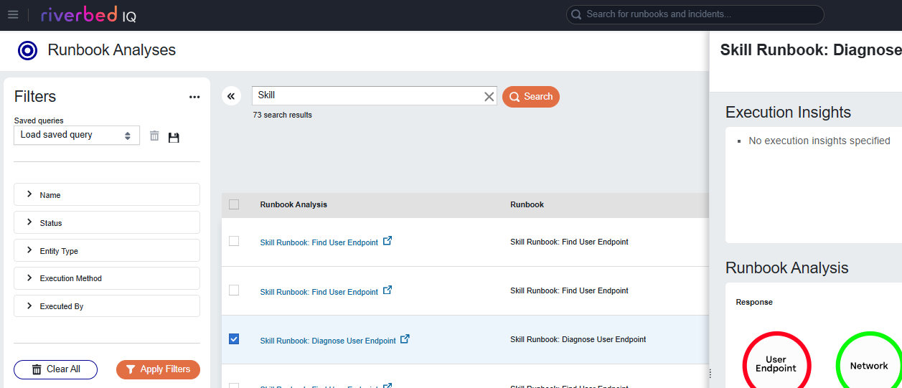

# Riverbed IQ Assist for Copilot - Cookbook Self-Service 101

:alarm_clock: Approximately 30 minutes

## Introduction

This community cookbook offers step-by-step instructions to integrate Riverbed IQ Assist with a Microsoft Copilot Agent.

You will learn to create an agent using Microsoft Copilot Studio and add Riverbed IQ Assist skills as tools via a Custom Connector.

This Employee IT Self-Service agent uses Riverbed Platform's AI Ops and Observability to identify user endpoints and devices, and assist with diagnostics and remediation.

After setting up the agent, you’ll learn to customize and extend it with additional tools for advanced scenarios.

| Prerequisites | Description |
|--------------|-------------|
| Microsoft Copilot Studio | An account is required, it can be a trial account. | 
| Riverbed Unified Agent and modules | Unified agent modules must be deployed on your user endpoints (e.g., laptop, VDI, desktop). To use Riverbed IQ Assist skills for user endpoint remediation, you need the Aternity EUEM module and must enable the remediation feature (see Aternity documentation: Getting Started with Remediation). Other modules, such as NPM+, Unified Communication (UC), and Intel WiFi, are optional. | 
| Riverbed Platform | Enable the Riverbed IQ Assist feature and configure the required connectors and integrations, including Riverbed IQ Assist and Aternity EUEM. Obtain OAuth information and generate credentials to connect in Microsoft Copilot Studio | 

> :grey_question: For tips see the FAQ section at the end of this guide.

## Table of Contents

- [Preparing Riverbed IQ Assist](#preparing-riverbed-iq-assist)
   - [1. Access IQ Ops as Admin](#1-access-iq-ops-as-admin)
   - [2. Enable Riverbed IQ Assist](#2-enable-riverbed-iq-assist)
   - [3. Install Integrations](#3-install-integrations)
   - [4. Check Data Store](#4-check-data-store)
   - [5. Gather details for the connector](#5-gather-details-for-the-connector)
- [Setting Up the Copilot Agent](#setting-up-the-copilot-agent)
- [Customize the Agent – Advanced](#customize-the-agent--advanced)
- [Testing the conversational Agent](#testing-the-conversational-agent)
- [Deploying the Agent to Teams](#deploying-the-agent-to-teams)
- [Frequently Asked Questions (FAQ)](#frequently-asked-questions-faq)


## Preparing Riverbed IQ Assist

### 1. Access IQ Ops as Admin

Open the Riverbed console with a user having the Platform Admin role, and navigate to **IQ Ops**

For example: `https://your_tenant.cloud.riverbed.com`

### 2. Enable Riverbed IQ Assist

Go IQ Ops > Administration > **Riverbed IQ Assist Configuration**, and click on opt-in to enable the feature.

### 3. Install Integrations

Go to IQ Ops > Integrations Library

Find Riverbed IQ Assist, install the integration and configure a connector that you can name Riverbed IQ Assist

Install Aternity EUEM integration and configure a connector. It is recommended to use OAUTH 2.0. Enable ODATA and REMEDIATION adding the corresponding service tags.

Optionally install other integrations: ServiceNow

### 4. Check Data Store

Go to IQ Ops > **Management**

In the hamburger menu, open **Edges & Data Sources** and enable your data sources (e.g. Aternity SAAS, NPM+)

### 5. Gather details for the connector

* Go to IQ Ops > **Management** > **Riverbed IQ Assist Configuration**, then select the **RIVERBED IQ ASSIST FOR COPILOT** tab.

* Collect all required information for the next configuration steps from this page:

   * General Information: **Host** and **Base URL**

   * Security: **Resource URL** and **Scope**

   * Connection: **Tenant**

* For credentials, follow the link to open the **API Access** page, then click **Create OAuth Client** to generate a new client. Enter a name (for example, `Riverbed IQ Assist for Copilot`), select an expiration period, and click **Create**. Collect the generated credentials:

   * **Client Id**
   
   * **Client Secret**

## Setting Up the Copilot Agent

### 1. Access Microsoft Copilot Studio

* Navigate to https://copilotstudio.microsoft.com/

* Go to **Agents** and click on **+ New agent**

### 2. Configure the Agent

* Click on **Configure**

* Set a **Logo**, for example you can use the Riverbed logo ([follow the link and download](https://raw.githubusercontent.com/riverbed/Riverbed-Community-Toolkit/refs/heads/master/IQ/Agents/101-Copilot-IT-SelfService/assets/riverbed-icon.png))

* Configure the agent Name, Description and Instruction. For example using this agent sample (*101-Copilot-IT-SelfService*):

Name:

```
IT Self-Service Assistant
```

Description

```
IT Self-Service Assistant is an IT Expert that efficiently handles common technical queries, diagnoses your user endpoints or devices (such as laptop, workstation, etc.), and guides you through resolution steps with clarity and precision.
```

Instructions

```
1. Identify User Devices and Endpoints
Detect and recognize the specific devices and endpoints currently used by the end user.
2. Diagnose Reported Issues
Analyze the symptoms and context to determine the root cause of the problems reported by the user.
3. Recommend Remediation Strategies
When possible, suggest appropriate and effective remediation steps based on available observability data.
4. Provide Clear, User-Friendly Guidance
Ensure all instructions and explanations are simple, jargon-free, and easy to follow—especially for users with limited IT experience.
5. Confirm Before Acting
Always seek explicit confirmation from the user before initiating any remediation actions.
6. Communicate Clearly and Effectively
Responses should be concise, well-structured, and easy to understand, avoiding technical complexity unless necessary.
```

* hit **Create**


### 3. Create a connector for Riverbed IQ Assist skills

* Go to Tools and click **+ Add a Tool.**
* Expand the **Create new** section and click **Custom connector**. A new tab opens (in Power Apps > Custom Connectors).
* At the top right, in the list **+ New custom connector**, select **Import an OpenAPI from URL**
* Fill the **Connector name** and the **URL** of the custom connector definition:

Connector name:

```
Cookbook Riverbed IQ Assist
```

URL:

```
https://raw.githubusercontent.com/riverbed/Riverbed-Community-Toolkit/refs/heads/master/IQ/Agents/101-Copilot-IT-SelfService/assets/apiDefinition.swagger.json
```

> [!NOTE]
> This is the *raw link* of the [connector description](./assets/apiDefinition.swagger.json)

* Click on **Import** and then click **Continue**


* (You are now in the **1. General** page), Download the Riverbed logo ([follow the link and download](https://raw.githubusercontent.com/riverbed/Riverbed-Community-Toolkit/refs/heads/master/IQ/Agents/101-Copilot-IT-SelfService/assets/riverbed-icon.png)) 

* Set the icon of the connector with the Riverbed logo

* Set the fields **Host** and **Base URL** using the information of your Riverbed tenant (refer to **Preparing Riverbed IQ Assist** > **Gather details for the connector**):

<details>
<summary>Click here to see an example screenshot</summary>


</details>

* Go to the **2. Security** page

* Select the Authentication Type: **OAuth 2.0**

* Select the Identity Provider: **Azure Active Directory**

* Check the box **Enable Service Principal Support** 

* Set the value `0000` for **Client ID**, and `****` for the **Client Secret**. These are only placeholder values and not actual credentials.

* Configure the following Security properties using the connector information of your account (refer to **Preparing Riverbed IQ Assist** > **5. Gather details for the connector**):

   * **Resource URL**
   * **Scope**

* Leave the other fields as is (**Authorization URL** `https://login.microsoftonline.com`, **Tenant ID**: `common`, **Enable on behalf-of-login**: `false`)

<details>
<summary>Click here to see an example screenshot</summary>


</details>

* Click on **Create connector** (at the top):

* When the connector is created, you can close the tab, and go back to Copilot Studio

## 4. Configure a connection for Riverbed IQ Assist skills

Back to Copilot Studio > Tools > Add tool window, you can now search and find the skills of Riverbed IQ Assist that are available as Tools for your agent. You can search with the connector name, tools name prefix like "Self-Service" or the specific tool name.

When adding your first tool, configure the connection first.

* Find and click on the tool **Self-Service: Find My User Endpoint** (the tools provided by the connector **Cookbook Riverbed IQ Assist**).

* Expand Connection and click on **Create new connection**

* In Authentication Type, select **Service Principal Connection**

* Configure the Connection properties of your account (refer to **Preparing Riverbed IQ Assist** > **5. Gather details for the connector**):

   * **Client ID**
   * **Client Secret**
   * **Tenant**

<details>
<summary>Click here to see an example screenshot</summary>


</details>

* Click **Create**.

The connection is now created.

## 5. Add a tool using the connection for Riverbed IQ Assist skills

In Tools > Add tool, you selected a tool and configured a connection. Now you will configure this tool for your agent.

* Click on **Add and configure**

* Expand **Additional Details**

* Set **When this tool may be used** to **Agent may use this tool at any time**

* Set **Credentials to use** to **Maker-provided credentials**

<details>
<summary>Click here to see an example screenshot</summary>


</details>

* Scroll down to the **Inputs** section

* For each of the inputs listed below, set the **Fill using** field to **Custom value**. Then, in the **Value** field, select **Select variable** (click the 3-dots button on the right), select **System**, search, and choose the corresponding system variable in the list:

| Input | Select this system variable as the Value |
| --- | --- |
| **User ID** | `User.Id` |
| **User Principal Name** | `User.PrincipalName` |
| **User Email** | `User.Email` |
| **User Display Name** | `User.DisplayName` |

<details>
<summary>Click here to see an example screenshot</summary>


</details>

* Click **Save**

## Customize the Agent – Advanced

You created an Employee Self Service Copilot Agent to share with employees. You can extend and customize it by adding tools from the Riverbed IQ Assist skill set.

### 1. Add more tools

Go to the **Tools** tab and add more **Self-Service** tools, for example:

* **Self-Service: Find My User Endpoint**
* **Self-Service: Initiate Remediation for My User Endpoint**
* **Self-Service: Get My Remediation Run Status**
* **Self-Service: Create a Ticket on My Behalf**

> [!NOTE] 
> Additional skills are coming soon, including Self‑Service: Diagnose User Endpoint, Self‑Service: Suggest User Endpoint Remediation, and more.

### 2. Apply common configuration to the tools

For each tool, follow the same **Additional Details** and **Inputs** configuration steps described in **"5. Add a tool using the connection for Riverbed IQ Assist skills"** in the previous section.

## Testing the conversational Agent

Once the tools are configured, test the agent end-to-end in Microsoft Copilot Studio:

1. Use the **Test** pane to start a new conversation.
2. Try typical user prompts, for example:
   * "Find my laptop"  
   * "Check if there are any issues with my device"   
3. Confirm that the agent:
   * Identifies the user and their endpoint correctly.
   * Invokes the appropriate Riverbed IQ Assist tools.
   * Returns clear status messages and next steps to the user.
4. Review any errors in the tool invocation logs or Copilot Studio trace output and adjust tool configuration (authentication, parameters, or additional details) as needed.

## Deploying the Agent to Teams

To make the agent available to users in Microsoft Teams:

1. In Copilot Studio, select your Employee IT Self-Service agent.
2. Choose **Publish** (or **Go live**) to create a production version.
3. Navigate to the **Channels** section for the agent.
4. Enable the **Microsoft Teams** channel and follow the guided steps:
   * Configure the display name and icon for the agent in Teams.
   * Set who can access the agent (e.g., specific groups or the whole organization).
5. Complete any required approvals in the Teams admin center, if your organization requires app approval.
6. From the Teams client, search for the published agent by name, add it to a chat, and run a few of the same test prompts used in Copilot Studio to confirm behavior.

## Frequently Asked Questions (FAQ)

<details>
<summary>How to solve an issue with the tool Self-Service: Find My User Endpoint?</summary>

The Self-Service: Find My User Endpoint tool looks for devices or endpoints the user has recently used (within the past few days).
A `Device Not Found` result can occur when the tool cannot match the authenticated user to any recent device.

Common cause:
The user's verified identity (for example, their authenticated email address) does not match the user's identity associated with the device it is checking.

</details>

<details>
<summary>How to add a Tool to run a specific Action on the User Endpoint?</summary>

Riverbed IQ Assist provides a generic skill called **Initiate User Endpoint Remediation**. You can configure it to run a specific action script registered in Aternity, such as **Restart Computer**, when adding a new tool. You need the reference identifier of the action (see How to find the remediation identifier in Aternity using the API).

For example, the **Restart Computer** action for Windows endpoints might have the following reference identifier in your tenant (Reference ID): `1111-222-333-4444`

To configure the tool of the Copilot Agent,

* Edit your agent in Microsoft Copilot Studio.

* Open the **Tools** tab.

* Click **+ Add a tool**

* Enter `Initiate User Endpoint Remediation` in the search bar, and select the tool

* Click **Add and configure**

* On the tool edition page, change the name and description.

Name:

```
Restart User Endpoint with user confirmation
```

Description:

```
Trigger a restart of a user endpoint or device (Windows), requiring end-user confirmation (popup)
```

* In the Inputs section, change the **remediationId**

Set Fill using to Custom Value

Set the value to the identifier (e.g., `1111-222-333-4444` for the *Restart Computer* action in the examlpe above)

* Click on **Save** and **Publish**

* Test the new tool

Example:

```
If needeed restart my device
```

</details>

<details>
<summary>How to find the identifier of a User Endpoint action?</summary>

In Riverbed IQ Ops, you can run an On-Demand Runbook to get the list of User Endpoint actions with their identifiers.

* Follow the [link](assets/Demo%20-%20List%20Available%20Actions%20for%20User%20Endpoints.json) to the runbook file

* Click **Download raw file** (download icon at the top right corner)

* In IQ Ops, go to **Automation** and click **Import** 

* Import the downloaded runbook file

* Run the runbook to see the list of available actions with their ACTION_REFERENCE_ID values

</details>

<details>
<summary>How to analyze the execution of a Skill in Riverbed IQ Ops? </summary>

Riverbed IQ Ops tracks each skill execution. To find them:

* Open IQ Ops > Automation > Runbook Analyses

* Use the search to find the execution of interest

<details>
<summary>Click here to see an example screenshot</summary>



</details>

</details>

<details>
<summary>How to fix connectorRequestFailure in Copilot?</summary>

#### The connector returned an HTTP error with code 405

A 405 error typically indicates a minor configuration issue in the connector—most often a simple mistake such as a typo in the Host property.

How to fix it:

* In Copilot Studio, open the Tools menu.
* Select the connector in question.
* Review the configuration details carefully and correct any errors (e.g., Host, Path, Authentication settings).
* Save and test the connector again.

#### The connector returned an HTTP error with code 403. Inner Error: User is not authorized to access this resource with an explicitly deny identity-based policy.

A 403 error usually means the connector configuration is pointing to a resource the caller does not have permission to access. 

How to fix it:

* The simplest solution is often to delete the connector and recreate it. Refer to **Preparing Riverbed IQ Assist** > **3. Create a connector for Riverbed IQ Assist skills**

</details>

## License

Copyright (c) 2026 Riverbed Technology, Inc.

The contents provided here are licensed under the terms and conditions of the MIT License accompanying the software ("License"). The scripts are distributed "AS IS" as set forth in the License. The script also include certain third party code. All such third party code is also distributed "AS IS" and is licensed by the respective copyright holders under the applicable terms and conditions (including, without limitation, warranty and liability disclaimers) identified in the license notices accompanying the software.
