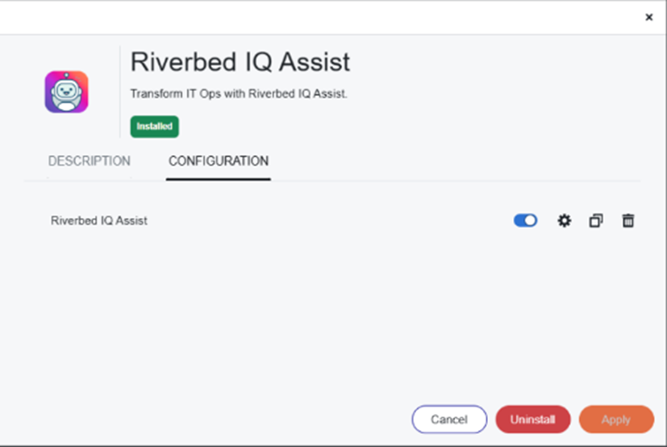
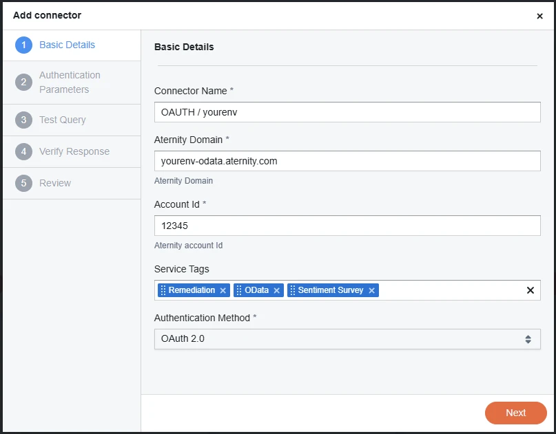
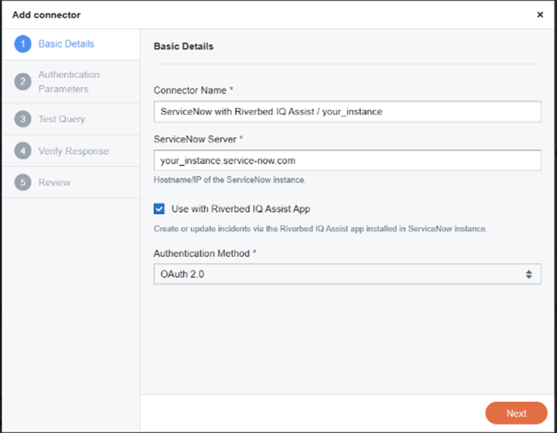

# Riverbed IQ Assist for ServiceNow - Cookbook IT ServiceDesk 101

:alarm_clock: Approximately 45 minutes

## Introduction

This cookbook contains the step-by-step instructions to integrate Riverbed IQ Assist with ServiceNow, enabling AI-powered IT service management capabilities for Incident, Problem, and Alert managers.

**What you'll accomplish:**
- Automate incident diagnosis and enrichment
- Enable intelligent troubleshooting from ServiceNow tickets
- Leverage Riverbed's observability data directly in your ITSM workflows

After setting up the app in ServiceNow, you'll learn how to customize and extend it with additional Skills.

| Prerequisites | Description |
|---------------|-------------|
| ServiceNow Tenant | A ServiceNow instance with admin access |
| Riverbed Platform | Active Riverbed tenant with Platform Admin role access |
| Data Sources | At least one configured data source (e.g., Aternity, NPM+) |

## Table of Contents

- [Preparation in the Riverbed Console](#preparation-in-the-riverbed-console)
   - [1. Access the console as Admin](#1-access-the-console-as-admin)
   - [2. Enable Riverbed IQ Assist](#2-enable-riverbed-iq-assist)
   - [3. Enable Riverbed Data-Sources](#3-enable-riverbed-data-sources)
- [Installation in ServiceNow](#installation-in-servicenow)
- [Configuration in Riverbed Console](#configuration-in-riverbed-console)
- [Finalize configuration in ServiceNow](#finalize-configuration-in-servicenow)
- [Testing Your Integration](#testing-your-integration)
- [Frequently Asked Questions (FAQ)](#frequently-asked-questions-faq)
- [Troubleshooting](#troubleshooting)

## Preparation in the Riverbed Console

### 1. Access the console as Admin

Open the Riverbed console with a user having the Platform Admin role, and navigate to **IQ Ops**

For example: `https://your_tenant.cloud.riverbed.com`

### 2. Enable Riverbed IQ Assist

* Go to IQ Ops > Management > **Riverbed IQ Assist Configuration**

* Review and click on opt-in to enable the feature

* Go to IQ Ops > Integrations Library 

* Find Riverbed IQ Assist, install the integration and configure a connector that you can name Riverbed IQ Assist

Click here to see an example screenshot

### 3. Enable Riverbed Data-Sources

* Go to IQ Ops > **Management** > **Edges & Data Sources** 

* Enable your data sources (e.g. Aternity SAAS, NPM+)

> [!NOTE]
> Setting up an integration is required for the **Aternity** data source

Click here for more details about Aternity connector

* Go to IQ Ops > Integrations Library

* Install Aternity EUEM integration

* Create a connector

* Configure the Basic Details
  
    * Aternity domain: in the Aternity web console, click on the User icon in the top right corner, click on REST API Access, grab the hostname from the URL (For example: your_env-odata.aternity.com)

    * Account Id: open the Aternity web console, check the URL, and extract the value of the **ACCT** url parameter (For example, **1234** in this URL `https://your_env.aternity.com/#/view/...?BACCT=1234&....`)
    
    * Authentication Method: It is recommended to use OAUTH 2.0 (Basic Authentication is also supported).
    
    * Service Tags: Enable ODATA and REMEDIATION

* Configure the Authentication Parameters for **OAUTH 2.0**

    * Follow the link to the help page to [enable OAUTH in Aternity](https://help.aternity.com/bundle/console_admin_guide_x_console_saas/page/console/topics/admin_config_auth.html) and obtain the details for the connector (credentials))

    * Grant Type: select **Client Credentials**

    * Set **Client Id**, **Client Secret**, **Authentication URI** and **Scope** 

* Test the connector for example using the following URL `https://your_env-odata.aternity.com/aternity.odata/latest/CONNECTION_TEST` (replacing **your_env** with your own environment)

## Installation in ServiceNow

* Go to ServiceNow store: [click to open ServiceNow store](https://store.servicenow.com/sn_appstore_store.do#!/store/search?q=Riverbed) 

* Open the page of the certified application **Riverbed IQ Assist** 

* With your ServiceNow admin team follow the **Installation Guide** provided in the **Links and documents** section. The guide contains the step-by-step process for the preparation of the ServiceNow instance and configuration of Riverbed IQ Assist for ServiceNow application (scoped application).

    * Install the application

    * Create a user in ServiceNow for the external system connector (Riverbed Platform)

    * Configure the application to enable connector to the Riverbed Platform

    * Grant permissions to users in ServiceNow (using roles)

* Get the details to set up the connector on the Riverbed Platform (instance name, URL and user credentials). 

## Configuration in Riverbed Console

### 1. Access the console as Admin

* Open the Riverbed console with a user having the Platform Admin role, and navigate to **IQ Ops**

For example: `https://your_tenant.cloud.riverbed.com`

### 2. Add a connector for ServiceNow

* Go to IQ Ops > Integrations Library

* Install ServiceNow integration

* Create a connector

* Configure the Basic Details

    * ServiceNow Server: Use the host of your ServiceNow instance, for example, it is `your_servicenow_instance` in the following ServiceNow console URL `https://your_servicenow_instance.service-now.com` 

    * Check the box **Use with Riverbed IQ Assist App**

    * Authentication Method: It is recommended to use OAUTH 2.0 (Basic Authentication is also supported).

* Configure the Authentication Parameters with the info provided by the ServiceNow team.

Click here to see an example screenshot

### 3. Configure the "Quick Start" skill

The "Quick Start" skill can be used for incident management and IT Service Desk assistance use-cases. When triggered from ServiceNow, the runbook diagnoses the end-user endpoint and enriches the incident ticket with diagnosis.

**Steps:**

1. **Import the Runbook**
   - Download the [runbook file](../../Automation/External%20Runbooks/100-riverbed-iq-assist-for-servicenow-incident-quickstart/Riverbed%20IQ%20Assist%20for%20ServiceNow%20-%20Incident%20-%20Quick%20Start.json)
   - Go to IQ Ops > Automation
   - Import the runbook in External Runbooks
   - Toggle "Allow Automation" on

2. **Add Automation Trigger**
   - Go to Automation Management
   - Click **Add Automation for external trigger**
   - Select Trigger: **Webhook**

3. **Set Conditions**
   Configure the following URL parameters:

| URL Parameter | Condition | Value | 
| --- | --- | --- |
| service |  equals | riverbed_iq_assist | 
| connector_type | equals |  servicenow | 
| instance | equals |  *your_servicenow_instance* (see Notes)  | 
| version | equals |  latest |
| type | equals |  incident |
| skill |  equals |  default | 

> [!NOTE]
> For the URL Parameter **instance**, use the name of your ServiceNow instance. It is the host prefix in the ServiceNow console URL. For example, the instance is `your_servicenow_instance` in this URL: `https://your_servicenow_instance.service-now.com`

## Finalize configuration in ServiceNow

* Go to IQ Ops > Management > API Access

* Grab **Base URI** and **Tenant Id** to compose the **Skills Webhook URL** as follows: **Base URI** + `/api/automation/1.0/tenants/` + **Tenant Id** + `/webhooks?service=riverbed_iq_assist&connector_type=servicenow&version=latest&instance=` + **ServiceNow instance**

| | Example |
| -- | -- |
| **Base URI** | `https://your_env.app.riverbed.cloud.com` |
| **Tenant Id** | `123456` |
| **ServiceNow instance** | `your_servicenow_instance` |
| **Skills Webhook URL** | `https://your_env.app.riverbed.cloud.com/api/automation/1.0/tenants/123456/webhooks?service=riverbed_iq_assist&connector_type=servicenow&version=latest&instance=your_servicenow_instance` |

* Grab the **Access Token URI** and **API Scope** from the API Access page:

| **Configuration** | **Example** |
| --- | --- |
| **Access Token URI** |`https://login.microsoftonline.com/987654-987654-987654/oauth2/v2.0/token`
| **API Scope** | `api://987654-654321-321654/.default`

* Click on **Create OAuth Client** to generate a new client. It requires a name, for example "Riverbed IQ Assist for ServiceNow".

* Obtain the generated credentials: **Client Id** and **Client Secret**

* Go to ServiceNow > All > Riverbed IQ Assist > Configuration. 

* Configure the application with the credentials and URLs obtained above (reference: IQ Assist for ServiceNow app - Installation Guide, section 3. Configuration):

> [!NOTE]
> Need help? Contact your Riverbed Solution Engineer or [Riverbed Support](https://support.riverbed.com/)

## Testing Your Integration

After completing the setup, verify the integration:

1. **Test from ServiceNow**
   - Create a test incident in ServiceNow
   - Trigger the Riverbed IQ Assist action
   - Verify the incident is enriched with diagnostic data

Click here to see an example screenshot

2. **Check Logs**
   - In Riverbed Console: IQ Ops > Automation > Automation Analysis history
   - In ServiceNow: All > Riverbed IQ Assist > Logs

## Frequently Asked Questions (FAQ)

### What data sources are supported?
Riverbed IQ Assist supports multiple data sources including Aternity EUEM, NPM+, AppResponse, APM, NetIM, and others.

### How long does installation take?
Plan for approximately 45 minutes for initial setup, plus additional time for skill customization.

### Can I customize the diagnostic workflow?
Yes! See the advanced skills configuration below.

### How to configure skills? (ADVANCED)

Use advanced skills to tailor IQ Assist for your specific Incident, Problem, or Alert workflows.

You can find and grab samples from the [Riverbed Community Toolkit repository](https://github.com/riverbed/Riverbed-Community-Toolkit/tree/master/IQ).

> [!NOTE]
> Need help designing or validating skills? Contact your Riverbed Solution Engineer.

## Troubleshooting

**Common Issues:**

| Issue | Solution |
|-------|----------|
| Webhook not triggering | Verify URL parameters match exactly |
| No data in incidents | Confirm data sources are enabled and connector is active |
| Authentication errors | Regenerate OAuth credentials and update in both systems |

## License

Copyright (c) 2026 Riverbed Technology, Inc.

The contents provided here are licensed under the terms and conditions of the MIT License accompanying the software ("License"). The scripts are distributed "AS IS" as set forth in the License. The script also include certain third party code. All such third party code is also distributed "AS IS" and is licensed by the respective copyright holders under the applicable terms and conditions (including, without limitation, warranty and liability disclaimers) identified in the license notices accompanying the software.

