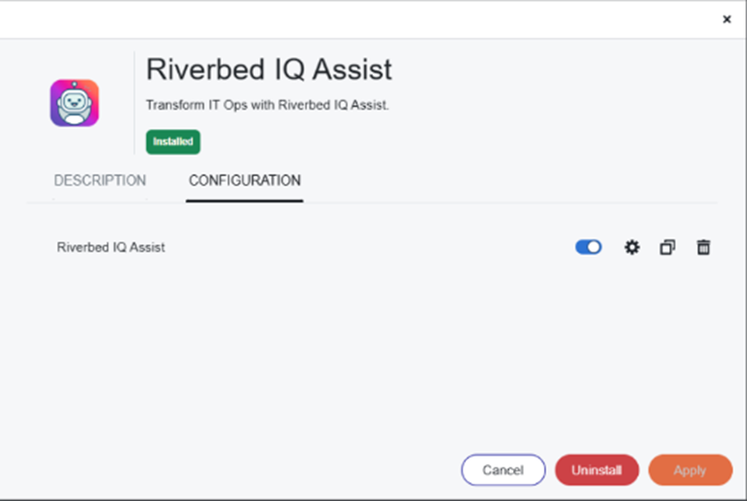
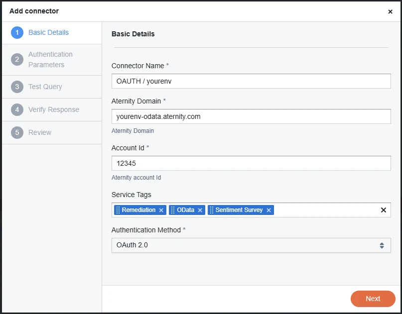
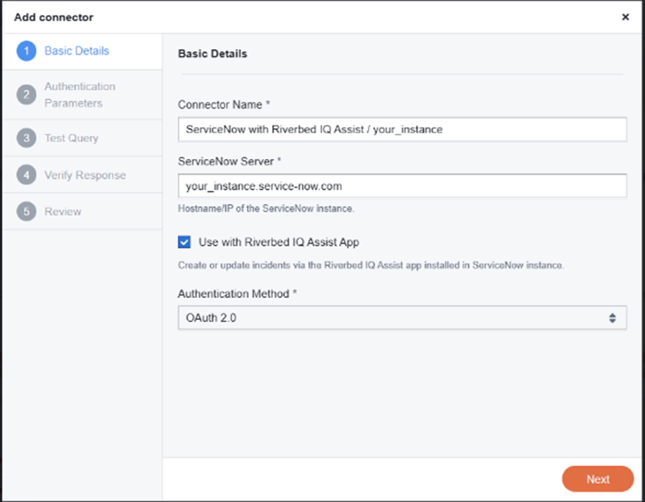

# Riverbed IQ Assist for ServiceNow - Cookbook IT ServiceDesk 101

:alarm_clock: Approximately 45 minutes

## Introduction

This cookbook contains the step-by-step instructions to integrate Riverbed IQ Assist with ServiceNow, enabling AI-powered IT service management capabilities for Incident, Problem, and Alert managers.

**What you'll accomplish:**
- Automate incident diagnosis and enrichment
- Enable intelligent troubleshooting from ServiceNow tickets
- Leverage Riverbed's observability data directly in your ITSM workflows

After setting up the app in ServiceNow, you'll learn how to customize and extend it with additional Skills.


| Prerequisites | Description |
|---------------|-------------|
| ServiceNow Tenant | A ServiceNow instance with admin access |
| Riverbed Platform | Active Riverbed tenant with Platform Admin role access |
| Data Sources | At least one configured data source (e.g., Aternity, NPM+) |


## Table of Contents

- [Preparation in the Riverbed Console](#preparation-in-the-riverbed-console)
   - [1. Access the console as Admin](#1-access-the-console-as-admin)
   - [2. Enable Riverbed IQ Assist](#2-enable-riverbed-iq-assist)
   - [3. Enable Riverbed Data-Sources](#3-enable-riverbed-data-sources)
- [Installation in ServiceNow](#installation-in-servicenow)
- [Configuration in Riverbed Console](#configuration-in-riverbed-console)
- [Finalize configuration in ServiceNow](#finalize-configuration-in-servicenow)
- [Testing Your Integration](#testing-your-integration)
- [Frequently Asked Questions (FAQ)](#frequently-asked-questions-faq)
- [Troubleshooting](#troubleshooting)


## Preparation in the Riverbed Console

### 1. Access the console as Admin

Open the Riverbed console with a user having the Platform Admin role, and navigate to **IQ Ops**

For example: `https://your_tenant.cloud.riverbed.com`

### 2. Enable Riverbed IQ Assist

* Go to IQ Ops > **Management** > **Riverbed IQ Assist Configuration**

* Review and click on opt-in to enable the feature

* Go to IQ Ops > **Integrations Library**

* Find Riverbed IQ Assist, install the integration and configure a connector that you can name Riverbed IQ Assist

<details>
<summary>Click here to see an example screenshot</summary>



</details>

### 3. Enable Riverbed Data-Sources

* Go to IQ Ops > **Management** > **Edges & Data Sources** 

* Enable your data sources (e.g. Aternity SAAS, NPM+)

> [!NOTE]
> Setting up an integration is required for the **Aternity** data source

<details>
<summary>Click here for more details about Aternity connector</summary>

* Go to IQ Ops > **Integrations Library**

* Install Aternity EUEM integration

* Create a connector

* Configure the Basic Details
  
    * Aternity domain: in the Aternity web console, click on the User icon in the top right corner, click on REST API Access, grab the hostname from the URL (For example: your_env-odata.aternity.com)

    * Account Id: open the Aternity web console, check the URL, and extract the value of the **ACCT** url parameter (For example, **1234** in this URL `https://your_env.aternity.com/#/view/...?BACCT=1234&....`)
    
    * Authentication Method: It is recommended to use OAUTH 2.0 (Basic Authentication is also supported).
    
    * Service Tags: Enable ODATA and REMEDIATION

* Configure the Authentication Parameters for **OAUTH 2.0**

    * Follow the link to the help page to [enable OAUTH in Aternity](https://help.aternity.com/bundle/console_admin_guide_x_console_saas/page/console/topics/admin_config_auth.html) and obtain the details for the connector (credentials))

    * Grant Type: select **Client Credentials**

    * Set **Client Id**, **Client Secret**, **Authentication URI** and **Scope** 

* Test the connector for example using the following URL `https://your_env-odata.aternity.com/aternity.odata/latest/CONNECTION_TEST` (replacing **your_env** with your own environment)



</details>


## Installation in ServiceNow

* Go to ServiceNow store: [click to open ServiceNow store](https://store.servicenow.com/sn_appstore_store.do#!/store/search?q=Riverbed) 

* Open the page of the certified application **Riverbed IQ Assist** 

* With your ServiceNow admin team, follow the **Installation Guide** provided in the **Links and documents** section. The guide contains the step-by-step process for the preparation of the ServiceNow instance and configuration of Riverbed IQ Assist for ServiceNow application (scoped application).

   * Install the application.

   * Create a user for the external system connector (Riverbed Platform), for example `riverbed_iq_assist`

   * Configure the application to enable the connector to the Riverbed Platform.

   * Grant the appropriate roles to users in ServiceNow.

* Get the details to set up the connector on the Riverbed Platform (instance name, URL and user credentials). 

## Configuration in Riverbed Console

### 1. Access the console as Admin

* Open the Riverbed console with a user having the Platform Admin role, and navigate to **IQ Ops**

For example: `https://your_tenant.cloud.riverbed.com`

### 2. Add a connector for ServiceNow

* Go to IQ Ops > **Integrations Library**

* Install ServiceNow integration

* Create a connector

* Configure the Basic Details

    * ServiceNow Server: Use the host of your ServiceNow instance, for example, it is `your_servicenow_instance` in the following ServiceNow console URL `https://your_servicenow_instance.service-now.com` 

    * Check the box **Use with Riverbed IQ Assist App**

    * Authentication Method: It is recommended to use OAUTH 2.0 (Basic Authentication is also supported).

* Configure the Authentication Parameters with the info provided by the ServiceNow team.

<details>
<summary>Click here to see an example screenshot</summary>



</details>

### 3. Configure the "Quick Start" skill

The "Quick Start" skill can be used for incident management and IT Service Desk assistance use-cases. When triggered from ServiceNow, the runbook diagnoses the end-user endpoint and enriches the incident ticket with diagnosis.

**Steps:**

1. **Import the Runbook**
   - Download the [runbook file](../../Automation/External%20Runbooks/100-riverbed-iq-assist-for-servicenow-incident-quickstart/Riverbed%20IQ%20Assist%20for%20ServiceNow%20-%20Incident%20-%20Quick%20Start.json)
   - Go to IQ Ops > Automation > Menu > **External Runbooks**
   - Import the runbook in External Runbooks
   - Toggle "Allow Automation" on

2. **Add Automation Trigger**
   - Go to IQ Ops > Automation > Menu > **Automation Management**
   - Click **Add Automation for external trigger**
   - Select Trigger: **Webhook**

3. **Set Conditions**
   Configure the following URL parameters:

| URL Parameter | Condition | Value | 
| --- | --- | --- |
| service |  equals | riverbed_iq_assist | 
| connector_type | equals |  servicenow | 
| type | equals |  incident |
| skill |  equals |  default | 

## Finalize configuration in ServiceNow

### 1. Gather details in IQ

* Go to IQ Ops > **Management** > Menu > **Riverbed IQ Assist Configuration**, then select the **RIVERBED IQ ASSIST FOR SERVICENOW** tab.

* Collect the following configuration details:

   * **Skills Webhook URL**
   * **Tenant Id**
   * **Scope**
   
* In the **Client ID** & **Client Secret** section, follow the link to open the **API Access** page.

* Click **Create OAuth Client** to generate a new client. Enter a name (for example, `Riverbed IQ Assist for ServiceNow`), select an expiration period, then click **Create**.

* Collect the generated credentials:

   * **Client Id**
   * **Client Secret**

### 2. Configure in ServiceNow

* Work with your ServiceNow admin team.

* Go to ServiceNow > All > Riverbed IQ Assist > Configuration

* Configure the application using the credentials and URLs collected above. For details, refer to section 3 of the Installation Guide.

> [!NOTE]
>
> Need help? Contact your Riverbed Solution Engineer or [Riverbed Support](https://support.riverbed.com/)
> The Installation Guide is available in the ServiceNow Store: [Riverbed IQ Assist for ServiceNow app](https://store.servicenow.com/sn_appstore_store.do#!/store/search?q=Riverbed).


## Testing Your Integration

After completing the setup, verify the integration:

1. **Test from ServiceNow**
   - Create a test incident in ServiceNow
   - Trigger the Riverbed IQ Assist action
   - Verify the incident is enriched with diagnostic data


<details>
<summary>Click here to see an example screenshot</summary>


</details>


2. **Check Logs**
   - In Riverbed Console: IQ Ops > Automation > Automation Analysis history
   - In ServiceNow: All > Riverbed IQ Assist > Logs


## Frequently Asked Questions (FAQ)

### What data sources are supported?

Riverbed IQ Assist supports multiple data sources including Aternity EUEM, NPM+, AppResponse, APM, NetIM, and others.

### How long does installation take?

Plan for approximately 45 minutes for initial setup, plus additional time for skill customization.

### Can I customize the diagnostic workflow?

Yes! See the advanced skills configuration below.

### How to configure skills with the Skills Selector? (ADVANCED)

The Skills Selector enables ServiceNow operators to choose from multiple pre-configured skills when launching Riverbed IQ Assist from an incident, problem or alert. Instead of running a single default runbook, the selector presents a drop-down list of available skills, each mapped to a specific automation runbook in Riverbed IQ, so that the IT staff in ServiceNow can pick the most relevant action for the situation at hand.

Using the skill selector allows to tailor Riverbed IQ Assist to your Incident, Problem, or Alert workflows.

> [!WARNING]
> Skills Selector is intended for teams already comfortable with Riverbed IQ runbooks, webhook trigger conditions, and ServiceNow property configuration. If this is your first deployment, complete the default Quick Start skill first, then return to this section.

> [!NOTE]
>
> Need help designing or validating skills? Contact your Riverbed Solution Engineer.

<details>
<summary>Click here to see the steps</summary>

When adding news skills, the steps in Riverbed IQ are similar to the steps described in the section [configure quick start skill](#3-configure-the-quick-start-skill) where you configured a single default skill. Then the Skills Selector can be set in the configuration of the app in ServiceNow.


####  Step 1: Configure skills in IQ

1. Go to IQ Ops > Automation > menu > **External Runbooks**
2. Import, edit, or create runbooks
3. Enable **Allow Automation**

> [!NOTE]
> * You can find sample skill and runbooks content in the [Riverbed Community Toolkit repository](https://github.com/riverbed/Riverbed-Community-Toolkit/tree/master/IQ).
> * When designing skills, verify that the Riverbed IQ Assist ServiceNow user (for example, `riverbed_iq_assist`) has the required permissions. For incident enrichment use cases (such as the Quick Start example), this typically means read/write access to Incidents and read access to CMDB.

#### Step 2: Add Automation Trigger

1. Go to IQ Ops > Automation > menu > **Automation Management**
2. Click **Add Automation for external trigger**
3. In **Select Trigger** set **Webhook**
4. In **Set Conditions**, add the following:

| URL Parameter | Condition | Value example |
| --- | --- | --- |
| service |  equals | **riverbed_iq_assist** |
| connector_type | equals |  **servicenow** |
| type | equals |  **incident** , **problem** or **alert** |
| skill |  equals |  *identifier of your choice* | skill_custom_diagnose_user_endpoint |

> [!NOTE]
>
> The type of workflow is *incident*, *problem* or *alert*
> The identifier must use lowercase and underscore. For example: `skill_custom_diagnose_user_endpoint`

#### Step 3: Configure the Skills Selector in ServiceNow

1. Open ServiceNow > All > Riverbed IQ Assist > Configuration.
2. Edit the relevant property, for example the incident skills property  `x_rivt2_iq_assist1.skills_incident`
3. Set JSON value with unique items and include default as mandatory. 

For example, with two skills:

```json
{
  "items": [
    {
      "displayValue": "Diagnose User Endpoint",
      "value": "default"
    },
    {
      "displayValue": "Custom Diagnose User Endpoint",
      "value": "skill_custom_diagnose_user_endpoint"
    }
  ]
}
```

> [!NOTE]
> **Rules for skills configuration**
> Each value must be unique
> A value named **default** is required

#### Step 4: Validate in ServiceNow (example Incident)

1. In ServiceNow, open Service Operations Workspace
2. Open an incident
3. Click the "Riverbed IQ Assist" button
4. Verify that the skill selector drop-down appears and shows all configured skills
5. Select the newly added skill and confirm it triggers the correct runbook

#### Step 5: Adding More Skills

   - Repeat steps 1 to 4 for each additional skill.
   - For example, a three-skill configuration would look like:

```json
{
  "items" : [
    {
      "displayValue" : "Diagnose User Endpoint",
      "value" : "default"
    },
    {
      "displayValue" : "Custom Diagnose User Endpoint",
      "value" : "skill_custom_diagnose_user_endpoint"
    },
    {
      "displayValue" : "Custom Find Caller Endpoints",
      "value" : "skill_custom_find_caller_endpoints"
    }
  ]
}
```

</details>

## Troubleshooting

**Common Issues:**

| Issue | Likely Cause | Verify | Fix |
|---|---|---|---|
| No enrichment data in incidents | Data source disabled or connector inactive | Check data source status and connector health | Enable data source and re-test connector |
| Authentication errors | Expired or mismatched OAuth values | Validate client, scope, and token issuance in both systems | Regenerate OAuth client and update both sides |
| Webhook not triggering (advanced) | URL conditions do not match | Compare trigger conditions and actual request parameters | Correct service, connector_type, type, and skill values |
| ServiceNow logs show 422 | Skill mapping missing or invalid | Check skill exists in trigger and ServiceNow selector config | Add or correct skill configuration |
| Skill selector not visible | Not using Service Operations Workspace | Confirm UI context in ServiceNow | Use Service Operations Workspace (not classic view) |

## License

Copyright (c) 2026 Riverbed Technology, Inc.

The contents provided here are licensed under the terms and conditions of the MIT License accompanying the software ("License"). The scripts are distributed "AS IS" as set forth in the License. The script also include certain third party code. All such third party code is also distributed "AS IS" and is licensed by the respective copyright holders under the applicable terms and conditions (including, without limitation, warranty and liability disclaimers) identified in the license notices accompanying the software.

