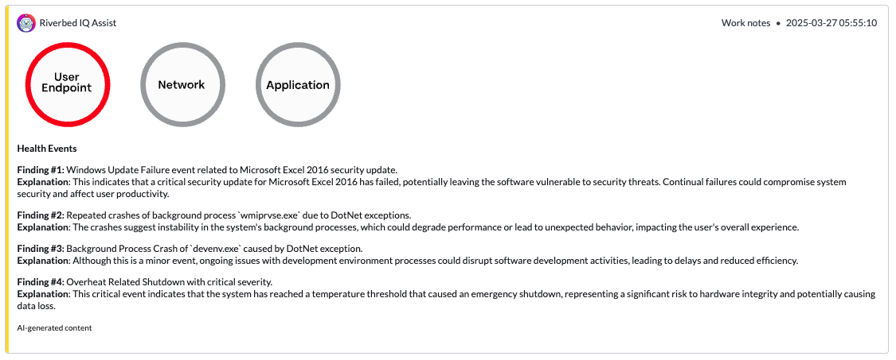

# Riverbed IQ Assist for ServiceNow - Incident - Quick Start

The runbook [Riverbed IQ Assist for ServiceNow - Incident - Quick Start](./Riverbed%20IQ%20Assist%20for%20ServiceNow%20-%20Incident%20-%20Quick%20Start.json) can be used as-is for Incidents assistance with Riverbed IQ Assist for ServiceNow.
When triggered from ServiceNow, the runbook diagnoses the end-user endpoint and updates the incident ticket.

## Prerequisistes

1. IQ Assist feature is enabled (see [help page](https://help.cloud.riverbed.com/IQ/Content/runbook_node_ai.htm?Highlight=GenAI)).

2. [Riverbed IQ Assist for ServiceNow](https://store.servicenow.com/sn_appstore_store.do#!/store/search?listingtype=allintegrations%253Bancillary_app%253Bcertified_apps%253Bcontent%253Bindustry_solution%253Boem%253Butility%253Btemplate%253Bgenerative_ai%253Bsnow_solution&q=riverbed%20IQ%20Assist) is installed from ServiceNow Store.

3. Aternity integration on Riverbed IQ is installed.

4. ServiceNow integration is installed (IQ > Integration Library).

## Quick Setup

After downloading the [runbook file](./Riverbed%20IQ%20Assist%20for%20ServiceNow%20-%20Incident%20-%20Quick%20Start.json), go to IQ Automation, import the runbook in the External Runbooks. And toggle "Allow Automation" on.

### License

Copyright (c) 2025 Riverbed Technology, Inc.

The contents provided here are licensed under the terms and conditions of the MIT License accompanying the software ("License"). The scripts are distributed "AS IS" as set forth in the License. The script also include certain third party code. All such third party code is also distributed "AS IS" and is licensed by the respective copyright holders under the applicable terms and conditions (including, without limitation, warranty and liability disclaimers) identified in the license notices accompanying the software.