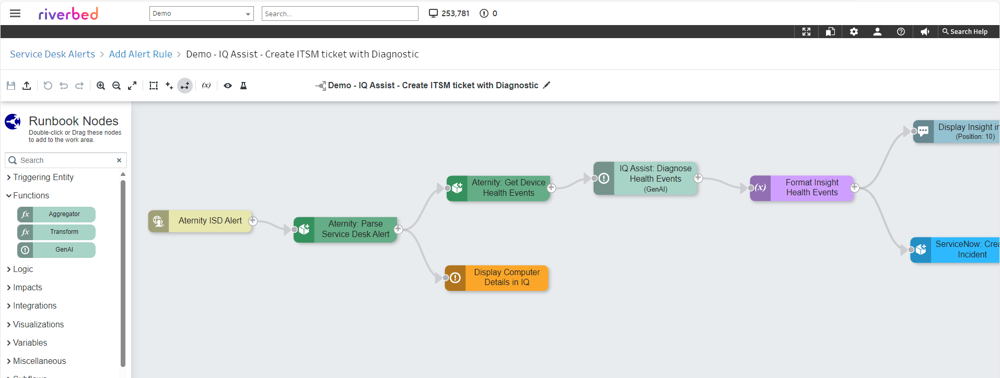

# Demo - IQ Assist - Create ITSM ticket with Endpoint Diagnostic

The runbook [Demo - IQ Assist - Create ITSM ticket with Endpoint Diagnostic](./Demo%20-%20ISD%20-%20Riverbed%20IQ%20Assist%20-%20Create%20ITSM%20ticket%20with%20Endpoint%20Diagnostic.json) is an AIOps automation that can be attached to any Aternity ISD Alert.
When triggered it diagnoses the end-user endpoint and then creates a ticket in a 3rd party ITSM (e.g. ServiceNow).

## Prerequisistes

1. ISD Alert feature is enabled (Aternity EUEM > Configuration > Alerts)

2. ServiceNow integration is installed and the connector is configured (IQ > Integration Library)

3. IQ Assist feature is enabled (see [help page](https://help.cloud.riverbed.com/IQ/Content/runbook_node_ai.htm?Highlight=GenAI))

## Quick Setup

After downloading the [runbook file](./Demo%20-%20ISD%20-%20Riverbed%20IQ%20Assist%20-%20Create%20ITSM%20ticket%20with%20Endpoint%20Diagnostic.json), go to IQ Automation, import the runbook in the External Runbooks. And toggle "Allow Automation" on.

Then go to the Alerts page in Aternity, and edit an existing Rule or create a new Alert Rule. And in the Actions section, select the runbook from the drop-down list.

### License

Copyright (c) 2025 Riverbed Technology, Inc.

The contents provided here are licensed under the terms and conditions of the MIT License accompanying the software ("License"). The scripts are distributed "AS IS" as set forth in the License. The script also include certain third party code. All such third party code is also distributed "AS IS" and is licensed by the respective copyright holders under the applicable terms and conditions (including, without limitation, warranty and liability disclaimers) identified in the license notices accompanying the software.