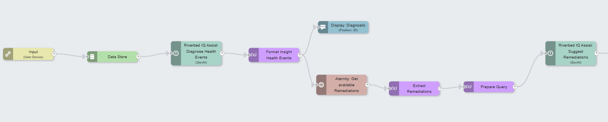

# IQ Assist - Suggest Remediation

On-demand runbook that suggests remediations to run on a device based on the health events detected for that device

The runbook fetches health events for the request device, uses a first GenAI node to get an analysis of the events and suggested resolutions, then continues the GenAI conversation though a second genAI node to assess what remediation from the available remediations on the tenant would address the issues.

## Prerequisites

1. Riverbed IQ Assist feature is enabled

2. Aternity integration is installed and the connector is configured (IQ > Integration Library)

3. Remediations available in the Aternity tenant

## Quick Setup

After downloading the runbook file, go to IQ Automation, import the runbook in the On-Demand Runbooks. And toggle "Allow Automation" on.

### License

Copyright (c) 2025 Riverbed Technology, Inc.

The contents provided here are licensed under the terms and conditions of the MIT License accompanying the software ("License"). The scripts are distributed "AS IS" as set forth in the License. The script also include certain third party code. All such third party code is also distributed "AS IS" and is licensed by the respective copyright holders under the applicable terms and conditions (including, without limitation, warranty and liability disclaimers) identified in the license notices accompanying the software.
