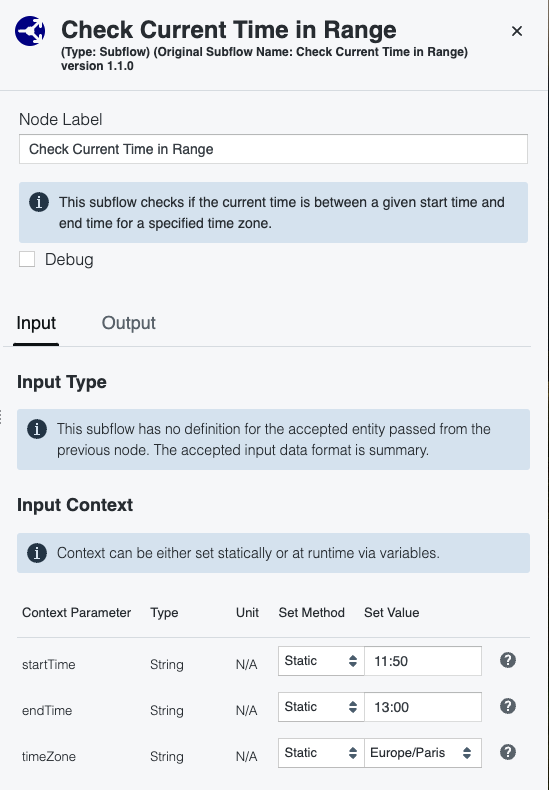

# Check Current Time in Range

This subflow checks if the current time is between a given start time and end time for a specified time zone.

## Prerequisistes

None

## Quick Setup

After downloading the [subflow file](./Check%20Current%20Time%20in%20Range.txt), go to IQ *Automation* page, import the subflow in the *Subflows* page.

Then, when creating a new runbook, the subflow *Check Current Time in Range* will be available in the list of subflow nodes.

### License

Copyright (c) 2025 Riverbed Technology, Inc.

The contents provided here are licensed under the terms and conditions of the MIT License accompanying the software ("License"). The scripts are distributed "AS IS" as set forth in the License. The script also include certain third party code. All such third party code is also distributed "AS IS" and is licensed by the respective copyright holders under the applicable terms and conditions (including, without limitation, warranty and liability disclaimers) identified in the license notices accompanying the software.
