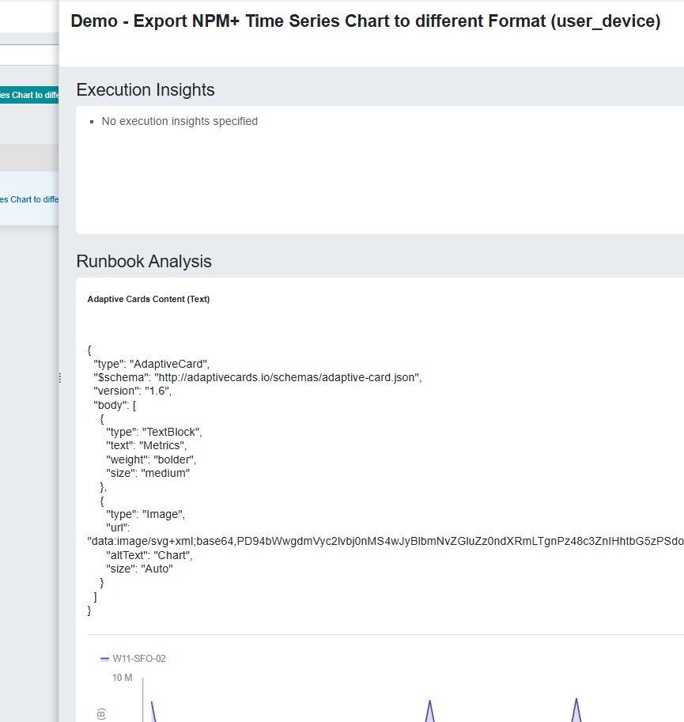

# Convert SVG image to Adaptive Cards Image URL

Skill that converts an image in SVG format into a URL for Image Element in Adaptive Cards

## Setup

1. Download the [subflow file](Convert%20SVG%20image%20to%20Adaptive%20Cards%20Image%20URL.json).

2. Go to *Automation*, *Subflows*, and hit **Import**.

## How to use

This [On-Demand runbook](Demo%20-%20Export%20NPM+%20Time%20Series%20Chart%20to%20different%20Format.json) demonstrates how to use the skill "Convert SVG image to Adaptive Cards Image URL", generating a chart image, converting the image, and composing an Adaptive Cards (for Teams).

1. Download the [On-Demand runbook](Demo%20-%20Export%20NPM+%20Time%20Series%20Chart%20to%20different%20Format.json)

2. Go to *Automation*, *On-Demand Runbooks*, and hit **Import**.

3. Run the runbook

4. The output will display the content of the composed Adaptive Cards

### License

Copyright (c) 2025 Riverbed Technology, Inc.

The contents provided here are licensed under the terms and conditions of the MIT License accompanying the software ("License"). The scripts are distributed "AS IS" as set forth in the License. The script also include certain third party code. All such third party code is also distributed "AS IS" and is licensed by the respective copyright holders under the applicable terms and conditions (including, without limitation, warranty and liability disclaimers) identified in the license notices accompanying the software.
