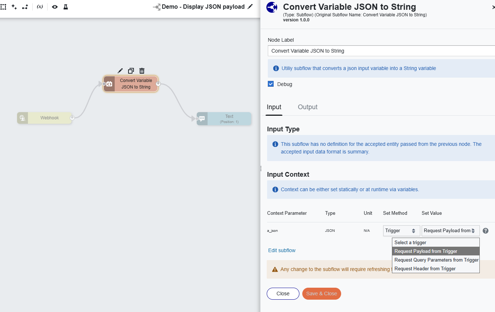
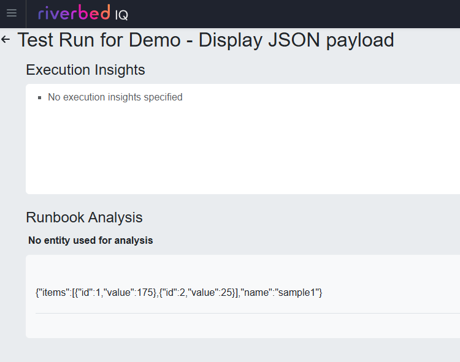

# Convert Variable JSON to String

This utility subflow converts a JSON input variable into a String variable

## Setup

Simply download the [subflow file](./Convert%20Variable%20JSON%20to%20String.json).

Then in IQ, go to *Automation*, *Subflows*, and hit **Import**.

## Demo

This [external runbook](./Demo%20-%20Display%20JSON%20payload.json) demonstrates how to use the "Convert Variable JSON to String" subflow to display the payload of the runbook to the Runbook Output.

This is a sample of this output:

### License

Copyright (c) 2025 Riverbed Technology, Inc.

The contents provided here are licensed under the terms and conditions of the MIT License accompanying the software ("License"). The scripts are distributed "AS IS" as set forth in the License. The script also include certain third party code. All such third party code is also distributed "AS IS" and is licensed by the respective copyright holders under the applicable terms and conditions (including, without limitation, warranty and liability disclaimers) identified in the license notices accompanying the software.
