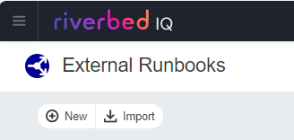

# Riverbed-Community-Toolkit - IQ Automation

This folder contains samples of AIOPs Runbooks for the Riverbed Platform.

You can download the Runbook files from the tables below and import into your Riverbed IQ account. 

> [!NOTE]
> * To use runbook the you need active licenses of the Riverbed Products.  Please visit the website of Riverbed for more information about the [Riverbed Platform](https://www.riverbed.com/platform)
> * For help about Riverbed IQ, please refer to the [help page](https://help.cloud.riverbed.com/) 

## Automation runbooks

### External Runbooks

| Runbook | Description | Tags | Last update |
| --- | --- | --- | --- | 
| [Magic Sample](https://github.com/riverbed/Riverbed-Community-Toolkit/raw/refs/heads/2501-iq/IQ/Automation/External%20Runbooks/101/Magic%20Sample.json) | *work in progress* Magic Sample | AIOps, Aternity EUEM, ISD, SNOW | jan. 2025 |

### Incident Runbooks

| Runbook | Description | Tags | Last update |
| --- | --- | --- | --- | 
| [Sample](#) | *work in progress* | | |

### Lifecyle Runbooks

| Runbook | Description | Tags | Last update |
| --- | --- | --- | --- | 
| [Sample](#) | *work in progress* | | |

### On-Demand Runbooks

| Runbook | Description | Tags | Last update |
| --- | --- | --- | --- | 
| [Sample](#) | *work in progress* | | |

### Subflows

| Runbook | Description | Tags | Last update |
| --- | --- | --- | --- | 
| [Magic Subflow Sample](#) | *work in progress* | | |

## How to use?

* Step 1: Choose a runbook type: Incident Runbooks, Lifecyle Runbook, On-Demand Runbooks, External Runbooks ok Subflows

* Step 2: Hit the link in the table to download the Runbook file (.json)

* Step 3: Navigate to IQ, open the Menu, go to Automation to import the runbook.

### License

Copyright (c) 2025 Riverbed Technology, Inc.

The contents provided here are licensed under the terms and conditions of the MIT License accompanying the software ("License"). The scripts are distributed "AS IS" as set forth in the License. The script also include certain third party code. All such third party code is also distributed "AS IS" and is licensed by the respective copyright holders under the applicable terms and conditions (including, without limitation, warranty and liability disclaimers) identified in the license notices accompanying the software.
