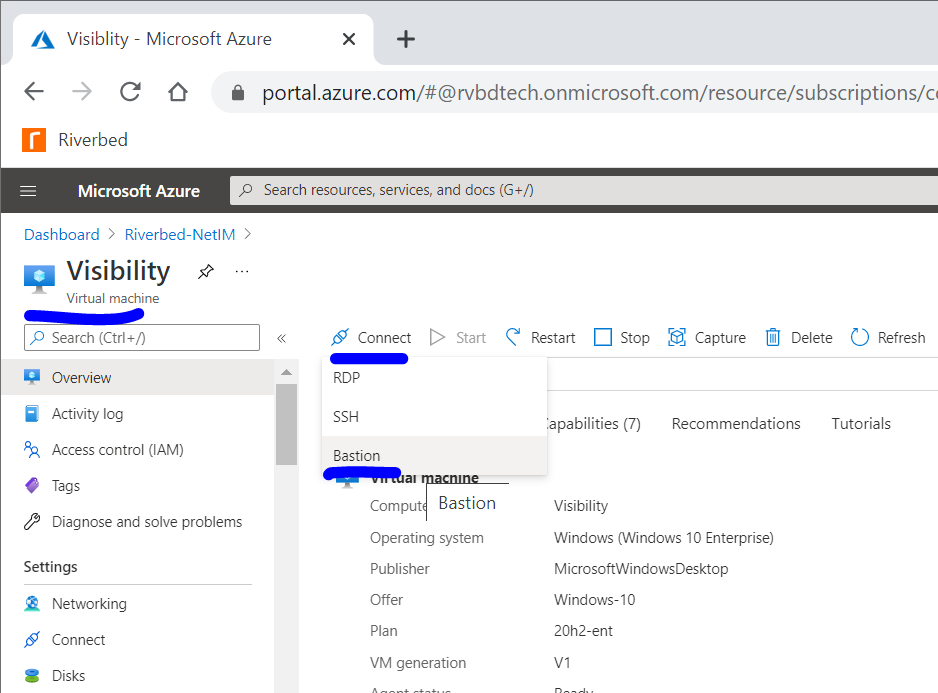

# Riverbed Community Cookbooks - NetIM Simple Demo

 

Deploy [Riverbed NetIM](https://www.riverbed.com/products/npm/netim) in your own Azure Cloud subscription in just few clicks with the Riverbed Community Toolkit provided by the [Riverbed Community](https://community.riverbed.com/). Ideal to set up a simple demo or test environment for your favorite Infrastructure Monitoring solution.

Please have a try and join the [Riverbed Community](https://community.riverbed.com/) to discuss.

## Usage

1. Hit the "Deploy to Azure" button above
2. Fill usual fields:
    - Subscription
    - Resource Group: create a new, e.g. Riverbed-NetIM-Demo
    - Region: Select an Azure Region
3. Fill the parameters
    - Location: leave as it is or set an Azure Region to deploy the resources, e.g. francecentral
    - Jumpbox Username: Default is riverbed-community
    - Jumpbox Password: Set a password with enough complexity (8 characters lengths, 1 or more numeric, 1 or more special char)
    - Version: Select the NetIM version among the version supported by the template
4. Hit "Review + create", then hit "Create"
5. Wait for the deployment, approximately 30 min to 1h depending on the region.

## Demo

When deployed, navigate to the resource group, find the virtual machine named "Visibility" and connect to it via the Bastion.

On the Jumpbox you can launch PowerShell and connect each NetIM node with ssh using the standard initial **netimadmin** credential.

The default IP Addresses for the nodes are:

- 10.100.5.11 : NetIM Manager node
- 10.100.5.21 : NetIM Worker node
- 10.100.5.31 : NetIM Core node

When the configuration of the node is done. Stay on the Jumpbox to launch the browser and connect to the NetIM webconsole https://10.100.5.31:8543 (https on port 8543 of the core node)

## Notes

`Tags: Riverbed,Visibility,NPM,NetIM,Infrastructure,Monitoring`
