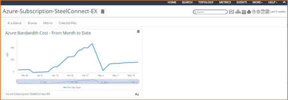

# NetIM GMC - Azure Bandwidth Costs

## Description

With this custom metric you can make a simple widget in NetIM to visualize the bandwidth cost.



## Deploy

Install the python script prerequisites

```shell
pip install adal
pip install requests
```

*todo*
