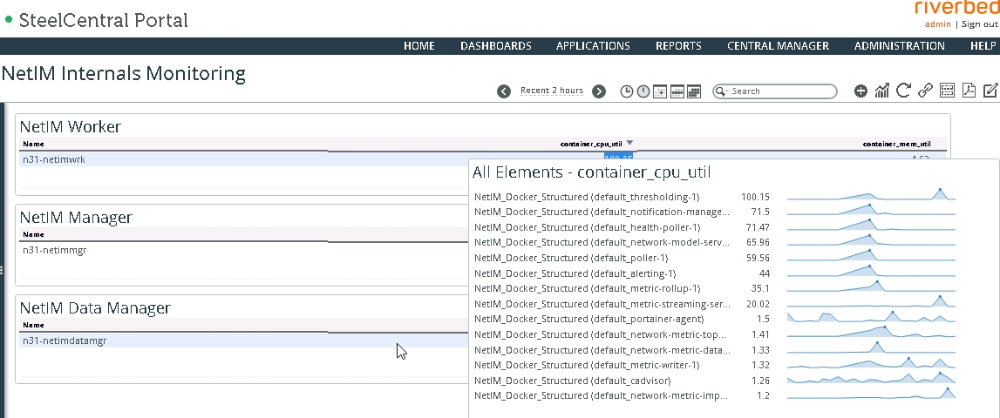
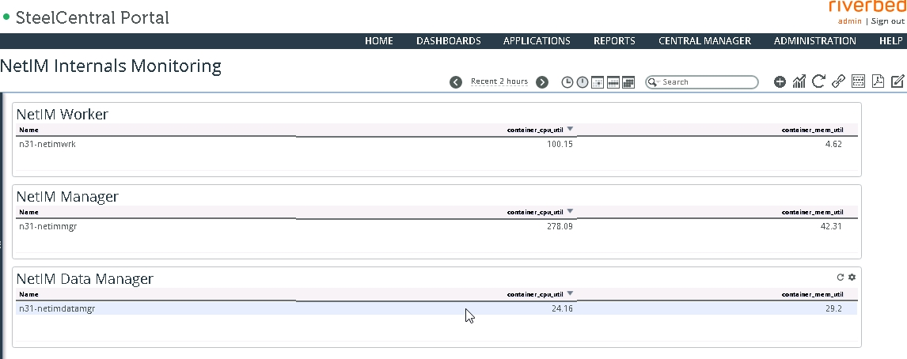

# NetIM GMC - Lightweight Self-Docker Monitoring

## Description

### Here is how this GMC setup works for the mtr file based approach the code is in ```scripts_mtr``` folder
1. Use a Linux machine with python3 and [Paramiko](http://www.paramiko.org/) installed.
1. Add your NetIM nodes into the NetIM inventory keeping in mind the names you assign to the devces in ```n31-netimrvbdlab.json```
```curl --insecure --user admin:admin -H 'Content-Type: application/json' -d @n31-netimrvbdlab.json https://10.99.31.75:8543/api/netim/v1/devices```
1. Verify that the NetIM nodes have made it into NetIM inventory.
1. Copy the ```gmc.sh```, ```copy-mtr-files.py``` and ```netim-docker-gmc.py``` to the machine where you intend to run the script.
1. Create a folder called ```input``` and update the location of that folder in file ```netim-docker-gmc.py``` and ```copy-mtr-files.py```
1. Make sure to put the details of only the docker nodes into ```NETIM_DOCKER_NODES``` inside ```netim-docker-gmc.py```
1. Make sure to put the details for the core node into ```NETIM_CORE``` inside ```netim-docker-gmc.py```
1. Ensure the paths everywhere in all files are correct for your NetIM instance

Here is the final view in SCPortal




### Here is how this GMC setup works for the new metrics api based approach the code is in ```scripts_metrics_api``` folder
1. The Paramiko requirements remain the same as for the above mtr file approach.
1. The MIB file will also remain the same.
1. The code is an example from a working setup which captures docker stats fot two NetIM instances DAL and CHE.
1. Both NetIMs have disparate number of worker VMs (keep that in mind when adapting the code).
