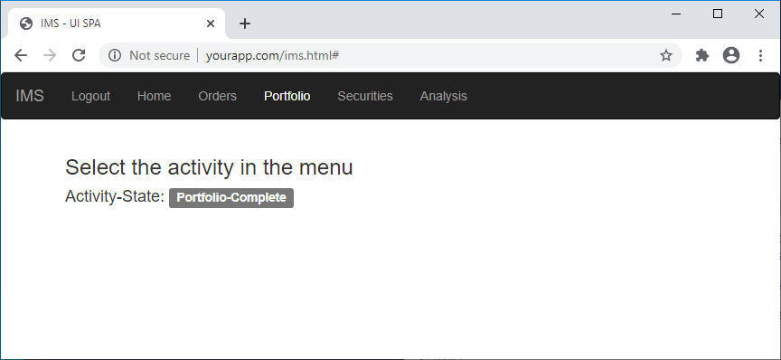

# Synthetic Test - Browse YourAppDemo

Usecase: App monitoring

Recommended Robots: Web Selenium

## YourApp

This simple web application is called "IMS - UI SPA".

It is a sinlge page app (SPA) based on bootstrap framework and provided for demo prupose.

In Chrome the app looks like this : 



### Install

To install it, simply copy the content of the folder [yourapp-sample](yourapp-sample) on any webserver the NetIM robot can access to.

### Test it

From your Web Selenium robot, simply open a browser and navigate to the page.

## NetIM configuration sample

### Synthetic Test for Edge on a Web Selenium Robot

Create a new Synthetic Test

- Type: External Script
- Command: 

```
"C:\Program Files\Python38\python.exe" "C:\Riverbed-Community-Toolkit\NetIM\Synthetic-Test\Synthetic-003-Browser-Browse-YourAppDemo\Edge-browse-yourapp.py"
```

### Synthetic Test for Chrome on a Web Selenium Robot

Create a new Synthetic Test

- Type: External Script
- Command: 

```
"C:\Program Files\Python38\python.exe" "C:\Riverbed-Community-Toolkit\NetIM\Synthetic-Test\Synthetic-003-Browser-Browse-YourAppDemo\Chrome-browse-yourapp.py"
```


## License

The scripts provided here are licensed under the terms and conditions of the MIT License accompanying the software ("License"). The scripts are distributed "AS IS" as set forth in the License. The script also include certain third party code. All such third party code is also distributed "AS IS" and is licensed by the respective copyright holders under the applicable terms and conditions (including, without limitation, warranty and liability disclaimers) identified in the license notices accompanying the software.

## Copyright (c) 2020 Riverbed Technology, Inc.
