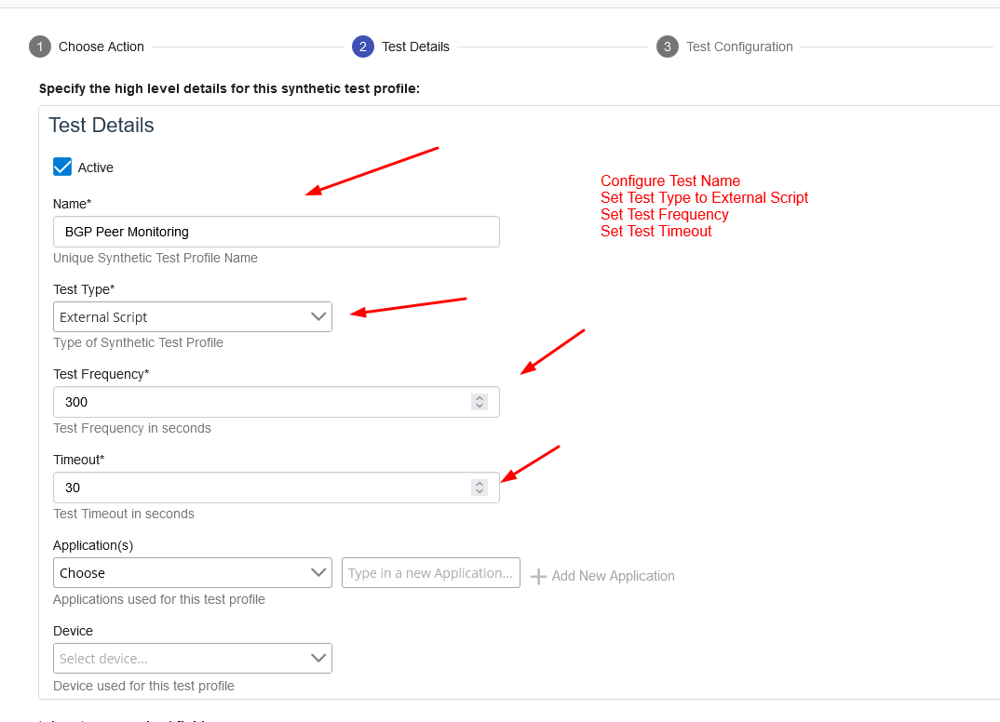
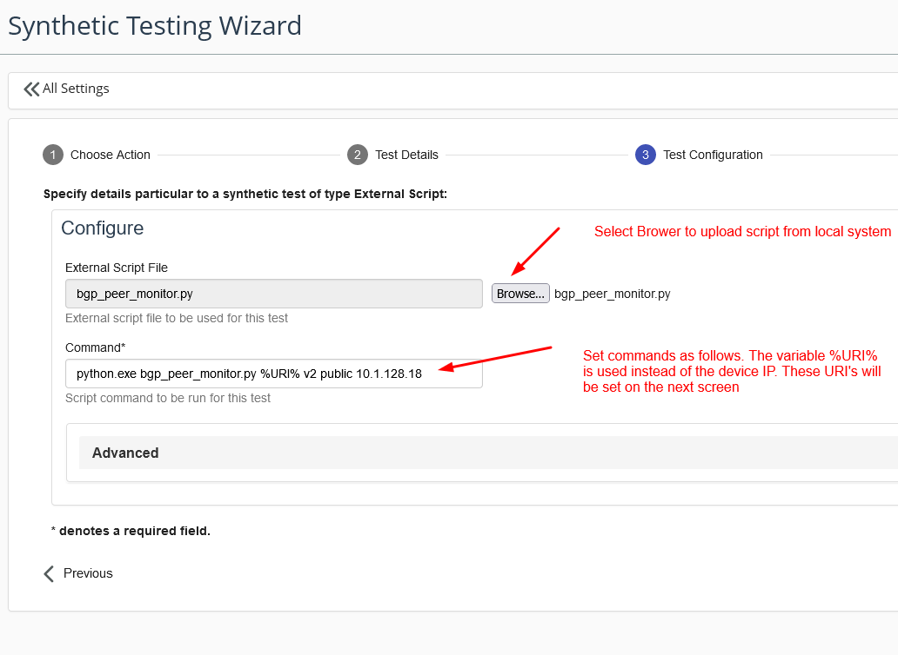
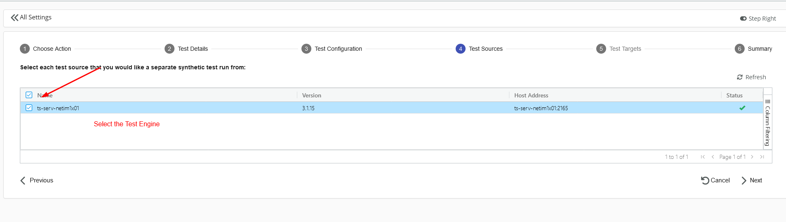
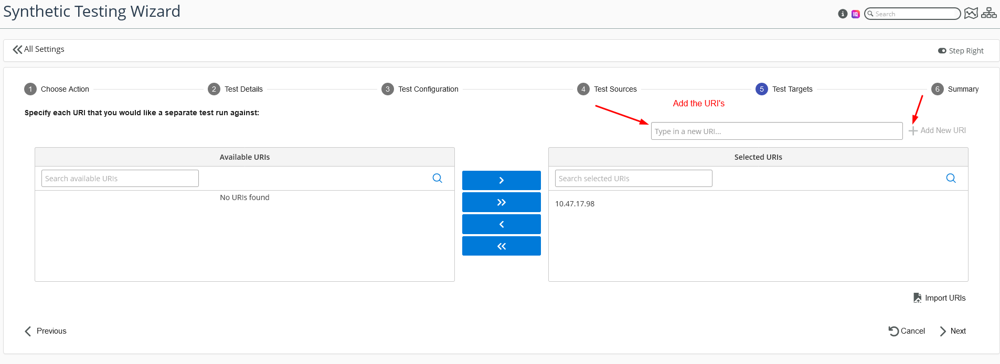
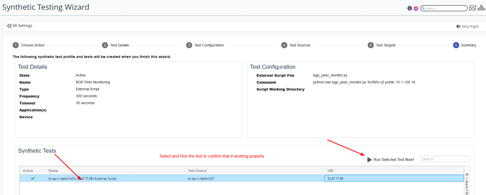
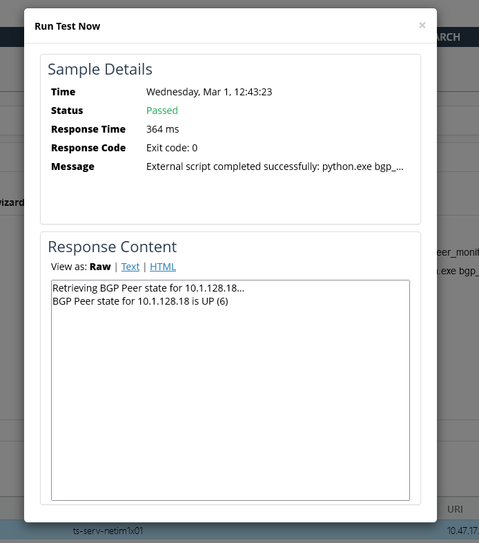

# Synthetic Test - Monitor BGP Peer State

Usecase: Infrastruture Health Monitoring

This synthetic monitoring script allows the synthetic testing of BGP peers using the [PySNMP library](https://pysnmp.readthedocs.io) by [Alluvio NetIM](https://www.riverbed.com/products/alluvio-netim)

## Preparation

1. This script can be executed on a Linux or Windows system properly configured for access into the devices whose BGP Peer state you wish to monitor.

2. Python3 and [PySNMP](https://pysnmp.readthedocs.io) should be installed properly on the machine where synthetic tests are going to be executed.

3. Ensure that the device(s) to monitor are configured to respond to SNMP requests. Any firewalls are properly provisioned to pass throuh SNMP ports and the SNMP credentials to access the device are correctly configured.

4. The NetIM Testing Engine must be properly installed and sync'd with a NetIM instance.

## Manual Testing

### Step 1. Get the python script

Download the [`bgp_peer_monitor.py`](./bgp_peer_monitor.py) script and save it to a directory of your choice.

### Step 2. Navigate to the file

Open a command prompt and navigate to the directory where `bgp_peer_monitor.py` is saved.

### Step 3. Run the python command for SNMPv2

`python bgp_peer_monitor.py [IP_ADDRESS] v2 [COMMUNITY_STRING] [PEER_IP_1],[PEER_IP_2],...,[PEER_IP_N]`
Replace `[IP_ADDRESS]` with the IP address of the device you want to monitor, `[COMMUNITY_STRING]` with your community string, and `[PEER_IP_1]`,`[PEER_IP_2]`,...,`[PEER_IP_N]` with a comma-separated list of peer IP addresses.

### Step 4. Run the python command for SNMPv3

`python bgp_peer_monitor.py [IP_ADDRESS] v3 [SECURITY_NAME] [PEER_IP_1],[PEER_IP_2],...,[PEER_IP_N]`

Replace `[IP_ADDRESS]` with the IP address of the device you want to monitor, `[SECURITY_NAME]` with your security name, and `[PEER_IP_1]`,`[PEER_IP_2]`,...,`[PEER_IP_N]` with a comma-separated list of peer IP addresses.

### Step 5. Examine Results

The script will retrieve the BGP peer state for each peer IP address and display the results in the command prompt.

### Step 6. Examples

Basic usage with SNMPv2c:

`python bgp_peer_monitor.py 10.0.0.1 v2c public 192.168.1.1,192.168.1.2`

Usage with SNMPv3 and SHA authentication:

`python bgp_peer_monitor.py 10.0.0.1 v3 admin SHA authpass 192.168.1.1,192.168.1.2`

Usage with SNMPv3 and MD5 authentication:

`python bgp_peer_monitor.py 10.0.0.1 v3 admin MD5 authpass 192.168.1.1,192.168.1.2`

Usage with SNMPv3, SHA authentication, and privacy (AES):

`python bgp_peer_monitor.py 10.0.0.1 v3 admin SHA authpass AES privpass 192.168.1.1,192.168.1.2`

Usage with SNMPv3, MD5 authentication, and privacy (AES):

`python bgp_peer_monitor.py 10.0.0.1 v3 admin MD5 authpass AES privpass 192.168.1.1,192.168.1.2`

## Running The Script via NetIM Synthetic Testing

### Step 1. Define a new Synthetic Test in NetIM

### Step 2. Configure the exact command for the test

### Step 3. Select the test engine to deploy the test

### Step 4. Add the devices to target for BGP peer testing

### Step 5. Execute the test manually for validation

### Step 6. Sample successful result from test

## License

The scripts provided here are licensed under the terms and conditions of the MIT License accompanying the software ("License"). The scripts are distributed "AS IS" as set forth in the License. The script also include certain third party code. All such third party code is also distributed "AS IS" and is licensed by the respective copyright holders under the applicable terms and conditions (including, without limitation, warranty and liability disclaimers) identified in the license notices accompanying the software.

## Copyright (c) 2023 Riverbed Technology, Inc.
