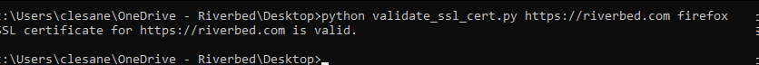
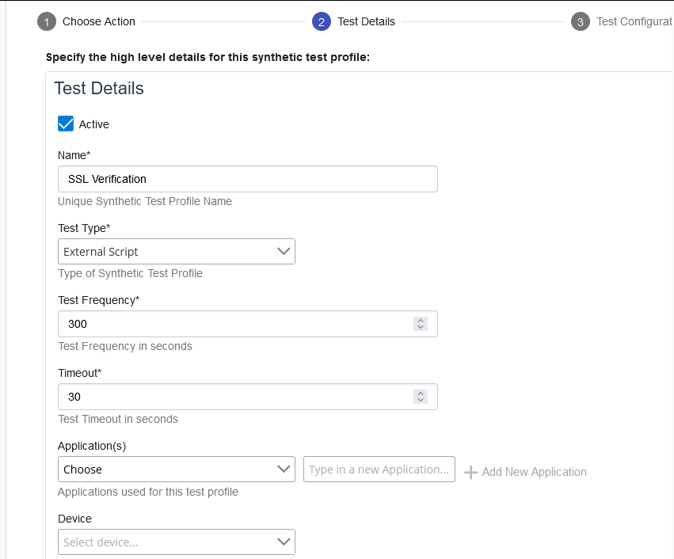
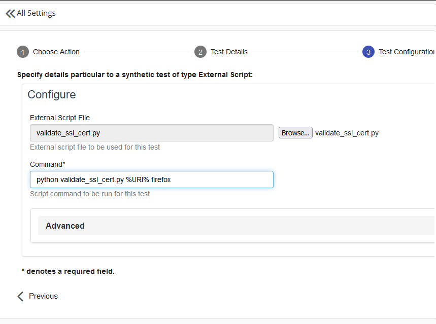
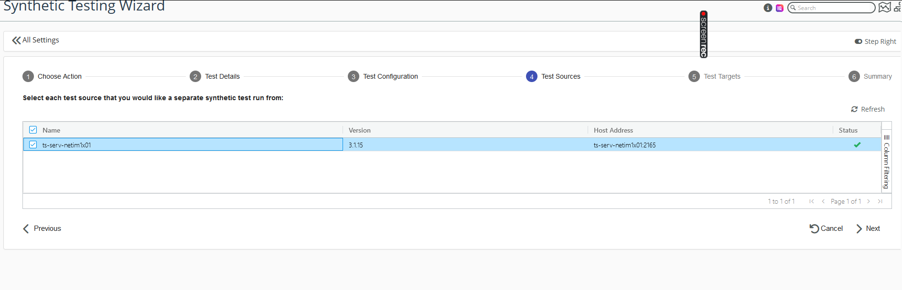
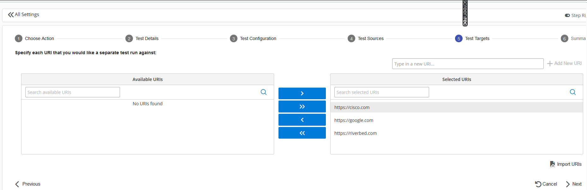
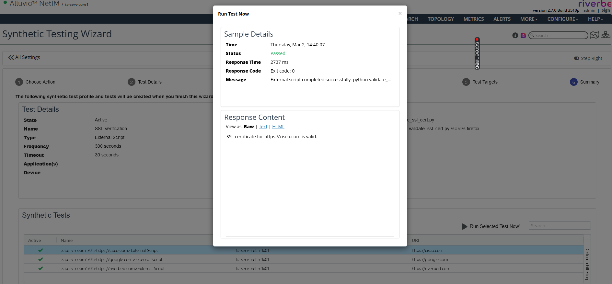

# Synthetic Test - Monitor TLS/SSL Certificate Expiration

Usecase: Infrastruture Health Monitoring

This synthetic monitoring script allows the synthetic testing of TLS/SSL Certificate expiry by [Alluvio NetIM](https://www.riverbed.com/products/alluvio-netim)

## Preparation

1. This script can be executed on a Linux or Windows system properly configured for access to the various web servers.

2. Python3 and requests should be installed properly on the machine where synthetic tests are going to be executed.

3. The NetIM Testing Engine must be properly installed and sync'd with a NetIM instance.

4. Fully working desktop environment is required for Linux machines for this script.

## Manual Testing

### Step 1. Get the python script

Download the [`validate_ssl_cert.py`](./validate_ssl_cert.py) script and save it to a directory of your choice.

### Step 2. Navigate to the file

Open a command prompt and navigate to the directory where `validate_ssl_cert.py` is saved.

### Step 3. Run the python command

`python validate_ssl_cert.py https://riverbed.com chrome`

### Step 4. Run the python command for SNMPv3

To validate an SSL certificate using the Firefox user agent, run the following command:

`python validate_ssl_cert.py https://riverbed.com firefox`

To validate an SSL certificate using the Edge user agent, run the following command:

`python validate_ssl_cert.py https://riverbed.com edge`

Note: Replace the URL (https://riverbed.com) in the above commands with the URL of the website you want to validate.

That's it! The script will display the validation results for the SSL certificate of the specified website using the selected user agent.

### Step 5. Examine Results

If the SSL certificate is valid, the script will exit with code 0. If the SSL certificate is invalid, the script will exit with code 1.

## Running The Script via NetIM Synthetic Testing

### Step 1. Define a new Synthetic Test in NetIM

### Step 2. Configure the exact command for the test

### Step 3. Select the test engine to deploy the test

### Step 4. Add the URLs for SSL Testing

### Step 5. Sample successful result from test

## License

The scripts provided here are licensed under the terms and conditions of the MIT License accompanying the software ("License"). The scripts are distributed "AS IS" as set forth in the License. The script also include certain third party code. All such third party code is also distributed "AS IS" and is licensed by the respective copyright holders under the applicable terms and conditions (including, without limitation, warranty and liability disclaimers) identified in the license notices accompanying the software.

## Copyright (c) 2023 Riverbed Technology, Inc.
