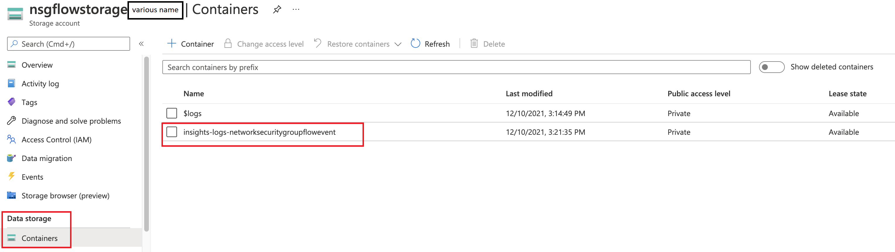
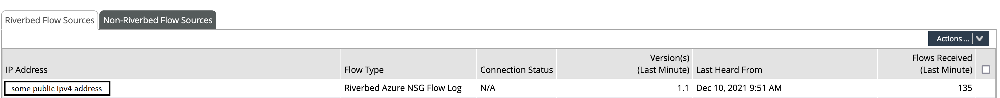

# NSG flow export deployment
The following cookbook contains a description of a **Ansible playbook** on how to automaticaly deploy **Azure NSG Flows export** to a Netprofiler flowgateway with the use of **Azure Cli** commands.

### Step 1 - Building the Ansible docker container
The Ansible docker container can be build with the following [docker-file](dockerfile-ansible)
```
docker build -t m_ansible:nsg -f docker-ansible .
```

### Step 2 - Verify that the container image exists
```
docker images m_ansible:nsg
```

### Step 3 - Download the Ansible playbook and the NSG flow export function (serverless)
Download the Ansible playbook [NSG.yml](NSG.yml)  
Download the NSG flow export function [NSG_flow_exporter](NSG_Flow_Exporter.zip)

### Step 4 - Start the Ansible container with the current directory as volume attached
Make sure that the current directory contains the downloaded artifacts from Step 4.
```
docker run --rm -ti m_ansible:nsg -v $PWD:/app /bin/bash
```

### Step 5 - Login into Azure via the Azure cli from within the ansible container
```
root@2db982bf41ce:/app# az login -u 'some_username'@'some_domain'
```

### Step 6 - Modify the Ansible playbook with the correct variable values
```
root@2db982bf41ce:/app# vi NSG.yml
```
```
  vars:
    networkwatcher_region: "some region name"         #ex. westeurope
    resource_group: "some resource group name"        #Resource group to monitor (export flows from)
    nsg_flow_log_name: "NSGflowlogs"                  #Name of the NSG flow log file
    nsg_to_monitor: "some nsg name"                   #nsg from which to export flow (nsg must be part of the resource group)
    service_plan_name: "MyServicePlan"                #Service plan name
    function_app_name: "nsgflowexport"                #Function app name
    function_app_zip: "NSG_Flow_Exporter.zip"         #Full path of NGSexporter.zip file
    flow_gateway_ip: "some flowgateway ipv4"          #Flow Gateway ip address (public one for Azure)
    flow_gateway_port: "2055"                         #default netflow port to Flow gateway is 2055
    vnet_integration_vnet_name: "flow_net"
    vnet_net: "192.168.25.0/24"                       #not used net + subnet
    vnet_subnet: "192.168.25.0/24"                    #can be the same as the vnet_subnet /24
```

### Step 7 - Run the Ansible playbook
```
root@2db982bf41ce:/app# ansible-playbook -T 20 NSG.yml
```
or run verbose
```
root@2db982bf41ce:/app# ansible-playbook -vvv -T 20 NSG.yml
```

### Step 8 - Verify that the function app is uploaded correctly


### Step 9 - Verify that the 'insights-logs' file inside the nsgflowlog storage account container is created

Note: This can take up to 10min before the file is created by the AzureRM. If the file doesn't appear please verify that the function app has been uploaded correctly.

### Step 10 - Verify that the Flowgateway receives the exported NSG flows from Azure


### Step 11 - Create a service principal for the polling of the Netprofiler


## Copyright (c) 2021 Riverbed Technology
