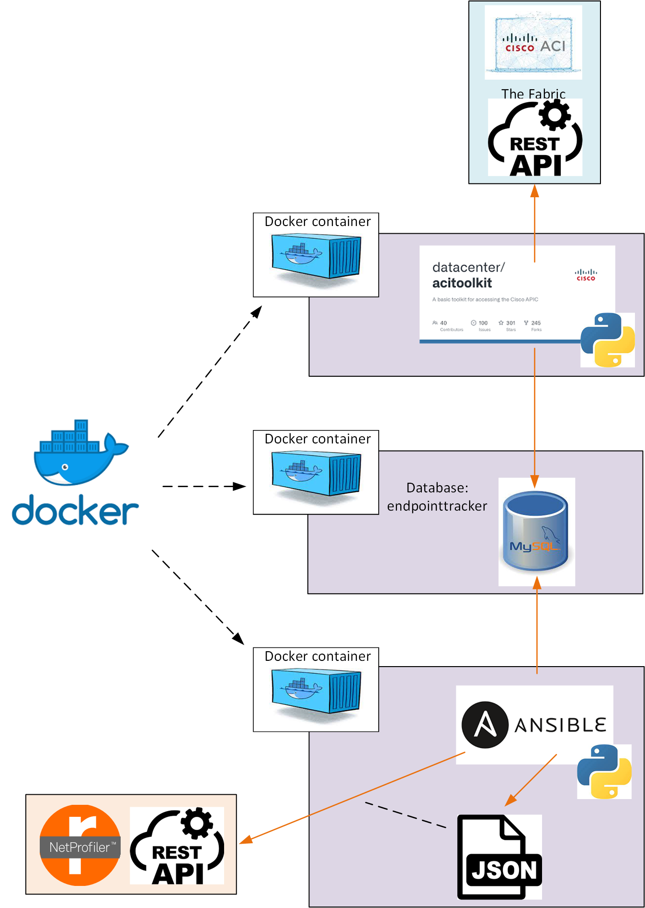

## NetProfiler Cisco ACI integration - mapping ACI EPGs to NetProfiler Host Groups
The following cookbook contains a description of a workflow on how to create **NetProfiler** Host Groups based on the endpoint groups defined within a **Cisco ACI** instance. The mechanism has now been extended to include the ability to create and update Host Groups in an **AppResponse** instance within the same framework.

## Workflow overview



## Prerequisites
1. A host with Docker installed, e.g. a Linux host, and sufficient access to create and run Docker containers
2. A NetProfiler instance with OAuth credentials available for a user able to create and modify Host Groups (created via Administration > OAuth Access)
3. And/or an instances of AppResponse with credentials for a user able to manage Host Group definitions
4. Access to the source Cisco ACI APIC with suitable credentials

## Workflow description
The workflow represented above consists of the following parts:  
1. Docker container which runs the [Cisco ACI toolkit](https://developer.cisco.com/codeexchange/github/repo/datacenter/acitoolkit). 
2. Docker container which runs [MySQL](https://www.mysql.com) server.
2. Docker container which runs [Ansible](https://www.ansible.com/) and SteelScript which is used to configure the NetProfiler and/or AppResponse instances.

The Cisco ACI toolkit contains a script [aci_endpointtracker](https://acitoolkit.readthedocs.io/en/latest/endpointtracker.html) which extracts all the endpoints from an indicated Tenant and stores them into a MySQL table (endpoints) with the following structure:
```
MariaDB [endpointtracker]> desc endpoints;
+-----------+-----------+------+-----+---------------------+-------------------------------+
| Field     | Type      | Null | Key | Default             | Extra                         |
+-----------+-----------+------+-----+---------------------+-------------------------------+
| mac       | char(18)  | NO   |     | NULL                |                               |
| ip        | char(16)  | YES  |     | NULL                |                               |
| tenant    | char(100) | NO   |     | NULL                |                               |
| app       | char(100) | NO   |     | NULL                |                               |
| epg       | char(100) | NO   |     | NULL                |                               |
| interface | char(100) | NO   |     | NULL                |                               |
| timestart | timestamp | NO   |     | current_timestamp() | on update current_timestamp() |
| timestop  | timestamp | YES  |     | NULL                |                               |
+-----------+-----------+------+-----+---------------------+-------------------------------+
```

## Setting up
Before starting the [docker-compose](docker-compose-final.yml) process, the custom Ansible and Cisco ACI Toolkit container images need to be built using the following docker-files: [dockerfile-ansible](dockerfile-ansible), [dockerfile-acitoolkit](dockerfile-acitoolkit).
```
docker build -t m_ansible:aci -f dockerfile-ansible .
docker build -t acitoolkit:rvbd -f dockerfile-acitoolkit .
```
Verify that the container image is now existing:
```
docker images m_ansible:aci
docker images acitoolkit:rvbd
```
Modify the docker-compose file environment variables APIC_URL, APIC_LOGIN and APIC_PASSWORD to the working values for the target Cisco APIC instance:
```
   environment:
      - APIC_URL=https://myapic.url
      - APIC_LOGIN=admin
      - APIC_PASSWORD=mysecret_password
```
It may also be necessary to change the default network (172.18.0.0/24) used if this conflicts with existing network allocations - any such changes will require changes to the various YML files and to commands shown below.

Start the `docker-compose` (use `docker compose` if the `docker-compose` command is not available) process:
```
docker-compose -f docker-compose-final.yml up -d
```
Verify that all 3 containers are up and running:
```
docker ps -a                     
CONTAINER ID   IMAGE                    COMMAND                  CREATED          STATUS          PORTS                 NAMES
c44e76fe01c9   acitoolkit:rvbd          "sleep infinity"         32 seconds ago   Up 31 seconds                         acitoolkit
008a14bc3c98   m_ansible:aci            "sleep infinity"         32 seconds ago   Up 31 seconds                         ansible
dc237249a07a   mysql:latest             "docker-entrypoint.s…"   32 seconds ago   Up 31 seconds   3306/tcp, 33060/tcp   mysql_db
```
Note that a slightly modified version of the `aci-endpoint-tracker.py` script is created in the `acitoolkit` container which fixes a couple of issues and adds a "one-off" option to force the script to execute one scan of ACI, export endpoint data into MySQL and then exit rather than running perpetually updating the database as the ACI system changes.

Connect to the `acitoolkit` container and execute the Python script that gets the endpoint information and writes it in to the MySQL database:
```
docker exec -ti acitoolkit /bin/bash
cd acitoolkit/applications/endpointtracker/
python aci-endpoint-tracker.py -o
```
Disconnect from the `acitoolkit` container and connect to the `ansible` container to verify that the database exists and is now populated:
```
docker exec -ti ansible /bin/bash
mysql -u root -ppassword -h 172.18.0.3 endpointtracker
select * from endpoints limit 10;
exit
```
Disconnect from the `ansible` container and modify the [app/create-hostgroups.yml](app/create-hostgroups.yml) file with the NetProfiler details for your environment:
```
  vars:
    host: "NetProfiler IPv4 address"
    access_code: "Oauth access code"
    tenant: "myTenant"
```
If the AppResponse integration is being used, modify the [app/ar11-create-hostgroups.yml](app/ar11-create-hostgroups.yml) file with the AppResponse details for your environment (note that the AR11 integration uses password authentication rather than OAUTH):
```
  vars:
    host: "AppResponse IPv4 address"
    user: "user name for a user with admin privileges"
    password: "password for above user"
    tenant: "myTenant"
```

Now reconnect to the `ansible` container and run `ansible-playbook` using the above file(s):
```
docker exec -ti ansible /bin/bash
ansible-playbook -vvv create-hostgroups.yml
ansible-playbook -vvv ar11-create-hostgroups.yml
```
## Running in Production
The ACI script can be run in one-off mode or in daemon mode. In one-off mode, the script pulls the endpoint data from the APIC and adds the entries matching the specified Tenant to the MySQL database.
If an endpoint entry already exists (matching MAC address) then the existing entry is updated to capture any changed details. Without one-off mode (default is now one-off mode) the application will keep running, listening for APIC events and updating the database accordingly.
In daemon mode, the application puts itself into the background.

For deployment, one could run the script chain from a cronjob or cronjobs, e.g. once an hour:
1. Run the ACI script to update the MySQL database
2. Run the Ansible script to update the Host Group definitions

It will be necessary to ensure the containers are shutdown cleanly when the system is shutdown and restarted when the system boots.

## Limitations
1. The current model only handles one Cisco ACI Tenant. The model could be extended to support multiple tenants with separate Host Group Types per Tenant, for instance.
2. The mechanism only supports creating Host Groups in one NetProfiler and/or one AppResponse; it should support multiple instances of AppResponse at least and also support Portal as this can be used to manage HG definitions across multiple AppResponse instances.

## Troubleshooting
1. Make sure that the containers are up and running
2. Make sure there really are endpoints defined in the APIC for the scripts to discover (the Cisco ACI sandbox is often empty!)
2. Make sure the access information and credentials are correct for the APIC
3. Make sure the access information and credentials are correct for the NetProfiler and/or AppResponse - note that the OAuth tokens expire so will need renewing at some point
4. If there are Python errors make sure that nothing is installed that is not compatible with the old version of Python used by the ACI toolkit (Python version 2.7)

## Reference
The [aci-endpoint-tracker](acitoolkit/applications/endpointtracker/aci-endpoint-tracker-rvbd.py) script provides the following online help:
```
root@c5aa4f455f11:/opt/acitoolkit/applications/endpointtracker# python aci-endpoint-tracker-rvbd.py --help
usage: aci-endpoint-tracker-rvbd.py [-h] [-u URL] [-l LOGIN] [-p PASSWORD]
                                    [--cert-name CERT_NAME] [--key KEY]
                                    [--snapshotfiles SNAPSHOTFILES [SNAPSHOTFILES ...]]
                                    [-i MYSQLIP] [-a MYSQLLOGIN]
                                    [-s MYSQLPASSWORD] [-d] [--kill]
                                    [--restart] [-o]

Application that logs on to the APIC and tracks all of the Endpoints in a
MySQL database.

optional arguments:
  -h, --help            show this help message and exit
  -u URL, --url URL     APIC URL e.g. http://1.2.3.4
  -l LOGIN, --login LOGIN
                        APIC login ID.
  -p PASSWORD, --password PASSWORD
                        APIC login password.
  --cert-name CERT_NAME
                        X.509 certificate name attached to APIC AAA user
  --key KEY             Private key matching given certificate, used to
                        generate authentication signature
  --snapshotfiles SNAPSHOTFILES [SNAPSHOTFILES ...]
                        APIC configuration files
  -i MYSQLIP, --mysqlip MYSQLIP
                        MySQL IP address.
  -a MYSQLLOGIN, --mysqllogin MYSQLLOGIN
                        MySQL login ID.
  -s MYSQLPASSWORD, --mysqlpassword MYSQLPASSWORD
                        MySQL login password.
  -d, --daemon          Run as a Daemon
  --kill                if run as a process, kill it
  --restart             if run as a process, restart it
  -o, --oneoff          Run one pass only and exit
  ```
## Copyright (c) 2023 Riverbed Technology
