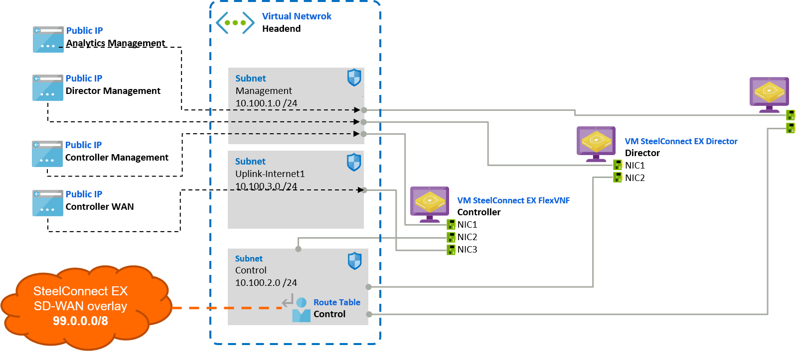
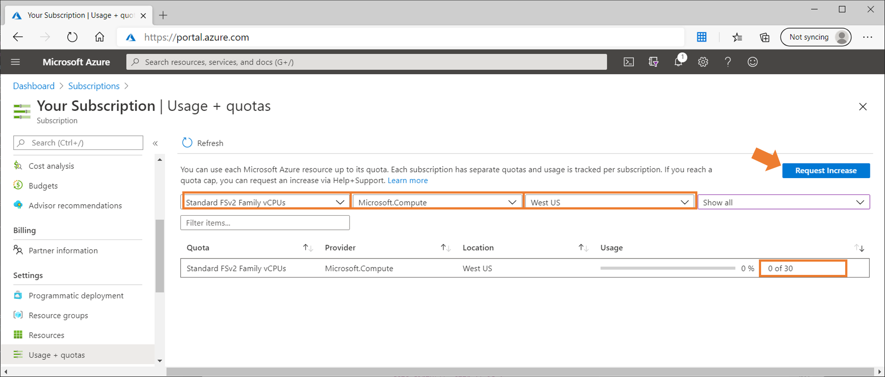
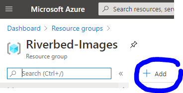
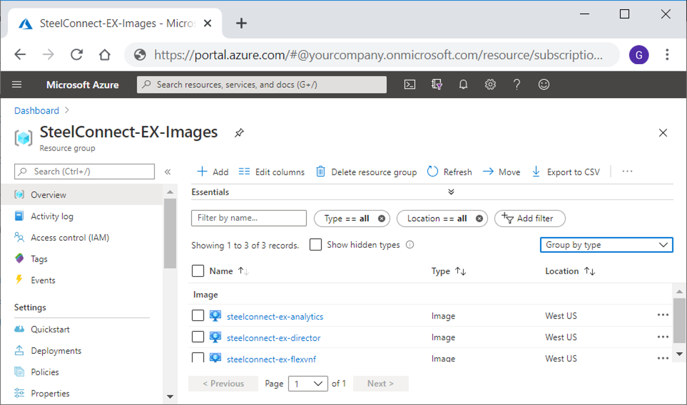
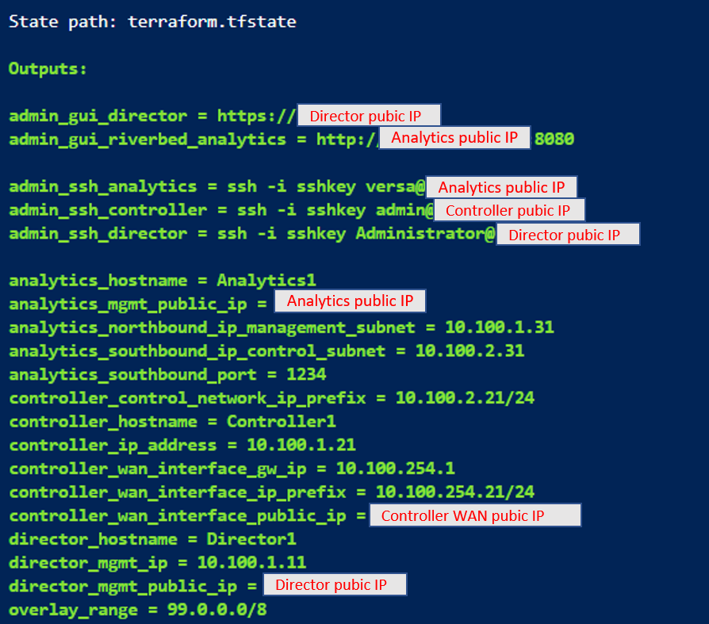
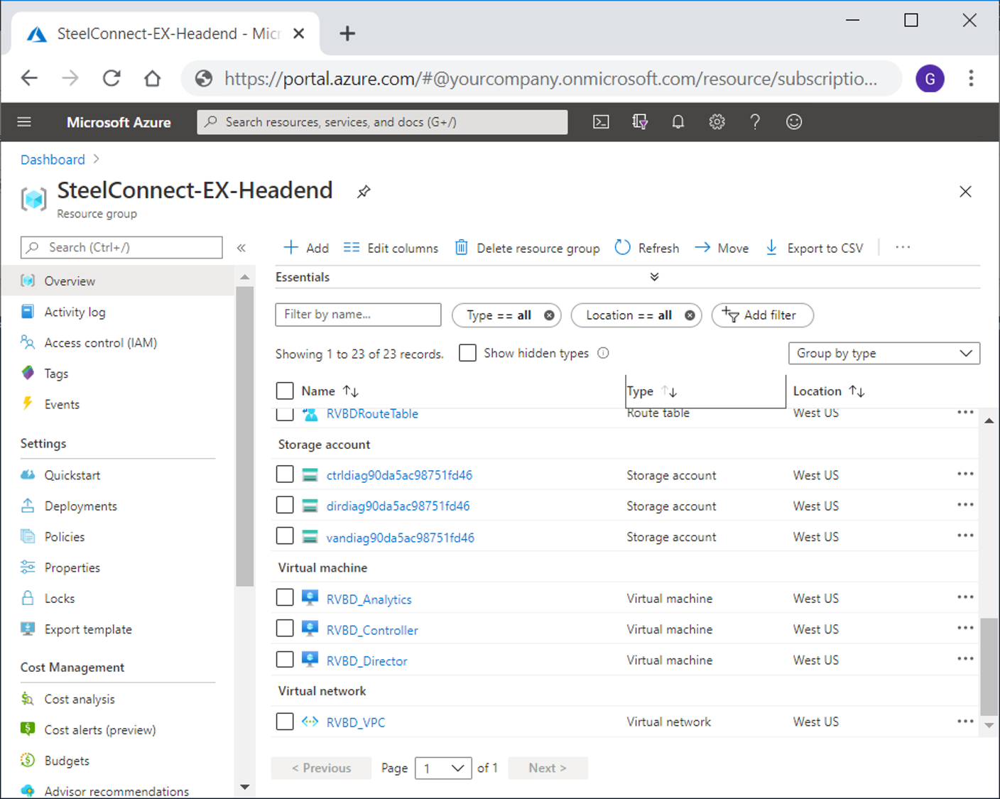
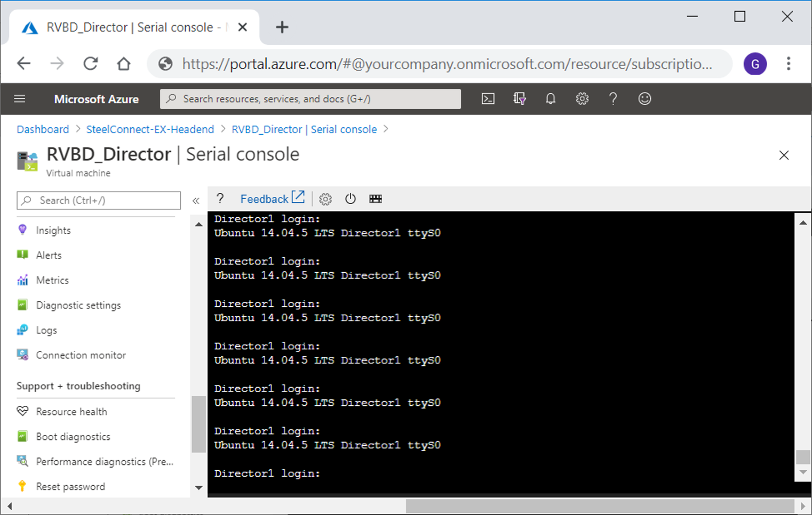

# Cookbook - Deploy SteelConnect EX Standalone Headend in Azure

- [Overview](#overview)
- [Prerequisites](#prerequisites)
- [Deployment](#deployment)
    - [1. Create Azure Image Resources](#1-create-azure-image-resources)
    - [2. Deploy using Terraform template](#2-deploy-using-terraform-template)
- [Connect to the appliances](#connect-to-the-appliances)

## Overview

This cookbook explains how to deploy a SteelConnect-EX Standalone Headend in Azure.



The Cookbook uses the following parameters and default values.

| Parameters | Default Value |
| --- | --- |
| SD-WAN overlay network | 99.0.0.0 /8 |
| VNET | 10.100.0.0/16 |
| Azure VM Size | Standard_F8s_v2 |
| Azure Location* | *no default value* |

> The cookbook let you choose any **Azure Location** for the deployment, for example **West-US**, **West-Europe** or **Korea Central**. Thus in some location the default VM size is not available, for example Standard_F8s_v2 is currently not available in Switzerland North, in that case please refer to the SteelConnect deployment guide and adapt the cookbook script parameters to use an other VM size.

## Prerequisites

| Tasks | Description |
| --- | --- |
| 1. Connect to the Azure Portal and check there is enough vCPU available in the target location: navigate to your Subscription details, open Usage and Quota menu|<ul><li>Sign-in on [Azure portal](https://portal.azure.com)</li><li>At least **24 vCPU available for the Standard FsV2 Compute in the target Location**</li><li>Hit "Request Increase" button if you need more vCPU</li></ul>|
| 2. Create a resource group in the location where you will deploy SteelConnect EX appliances| <ul><li>Resource Group name: **Riverbed-Images**</li><li>Location: **Target location for appliances**</li></ul> |
| 3. Create a Storage Account resource, and then create a Blob container  | <ul><li>Storage Account Name: *a unique name*</li><li>Location: **Target location for appliances**</li><li>Replication: Locally-redundant storage (LRS) is ok</li><li>Container name: **images**</li></ul> |
| 4. Send a request to [Riverbed Support](https://support.riverbed.com/) with a SAS and connecting string to receive images in your Blob Container: FlexVNF, Director and Analytics | <ul><li>Generate a **Shared Access Signature** for your blob container</li><li>Transmit the **SAS and connection string** to Riverbed Support to obtain the .vhd images</li></ul>|

## Deployment

### 1. Create Azure Image Resources

| Tasks | Description |
| --- | --- |
| 1. In the Azure Portal, navigate to the Resource group |Go to [Azure portal](https://portal.azure.com)|
| 2. Add new resource, select Image, and hit Create new|  |
| 3. Fill parameters to create an Image resource for the **SteelConnect EX FlexVNF**| <ul><li>Name: **steelconnect-ex-flexvnf**</li><li>Location: **Target location** for appliances</li><li>OS disk type: **Linux**</li><li>Storage Blob: url of the **flexvnf vhd** in the storage account blobs container</li><li>Storage type: Premium SSD recommended</li></ul>|
| 4. Repeat **step 2.** and fill the parameters to create an Image resource for the **SteelConnect EX Director**| <ul><li>Name: **steelconnect-ex-director**</li><li>Location: **Target location** for appliances</li><li>OS disk type: **Linux**</li><li>Storage Blob: url of the **director vhd** in the storage account blobs container</li><li>Storage type: Premium SSD recommended</li></ul>|
| 5. Repeat **step 2.** and fill the parameters to create an Image resource for the **SteelConnect EX Analytics**| <ul><li>Name: **steelconnect-ex-analytics**</li><li>Location: **Target location** for appliances</li><li>OS disk type: **Linux**</li><li>Storage Blob: url of the **analytics vhd** in the storage account blobs container</li><li>Storage type: Premium SSD recommended</li></ul>|

#### Example

When the import is done, the resource group will contain a storage account and an image resource for each appliance. In the Azure portal, it should looks like this:



### 2. Deploy using Terraform template

#### 1. Open Azure Cloud Shell and select PowerShell console

Try from Azure Portal, or [shell.azure.com](https://shell.azure.com), or by clicking [](https://shell.azure.com)

#### 2. Get Riverbed Community Toolkit sources

The following PowerShell commands initialize the console and download the sources from Riverbed Community Toolkit git repository on GitHub.

```PowerShell
# Check the Azure context (subscription and tenant id are correct)
$azureContext = Get-AzContext
$azureContext.Subscription

# Comment our the line below and fill the parameter {your-test-sub} to select a different subscription
# Select-AzSubscription -SubscriptionName "{your-test-sub}"

# Change dir
cd $user

# Copy the sources/scripts from Github
git clone https://github.com/riverbed/Riverbed-Community-Toolkit.git
```

#### 3. Stage variables for Terraform

The following PowerShell commands prepare the parameters file *terraform.vartf* for Terraform.

```PowerShell
Set-Location ./Riverbed-Community-Toolkit
Set-Location ./SteelConnect/Azure-DeployHeadend/scripts

./SteelConnect-EX_Stage-DefaultHeadhendStandalone.ps1
```

#### 4. Deploy Terraform

The following PowerShell commands launch the deployment using Terraform ((init, plan and apply)

```PowerShell
../../Azure-DeployHeadend/scripts/SteelConnect-EX_Deploy-Terraform.ps1
```

#### 5. Keep the output

After 3 to 5 minutes, the deployment finishes and the terrafrom output gives useful information such as WebConsole URL and public IP.



In the Azure portal, the resource group contains all the resources.



## Connect to the appliances

Appliances can be accessed via Azure Serial Console, SSH or Webconsole.

For example, connect the Director VM with Azure Serial Console:



## Copyright (c) 2020 Riverbed Technology