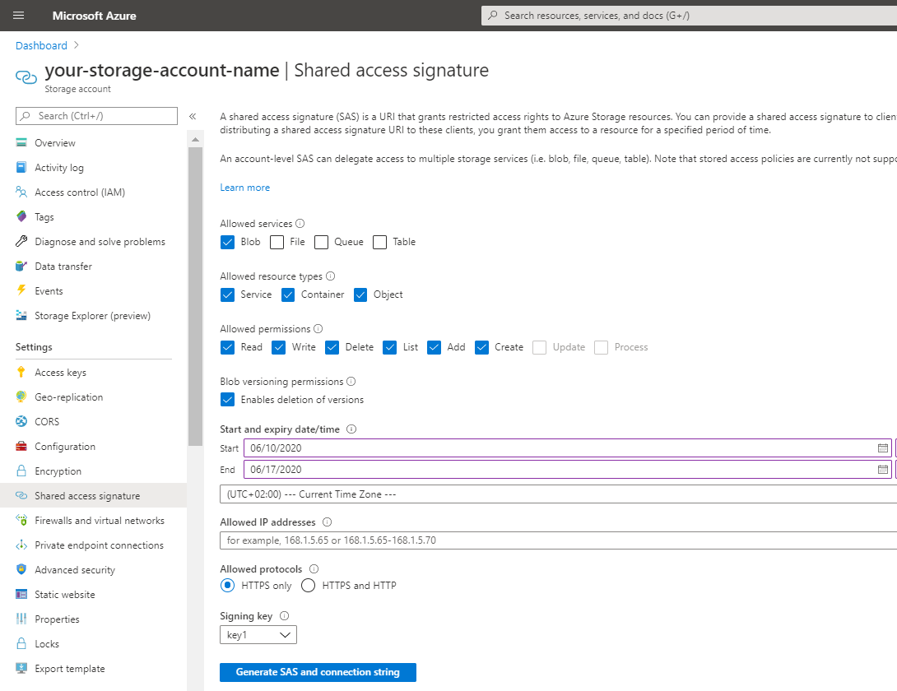
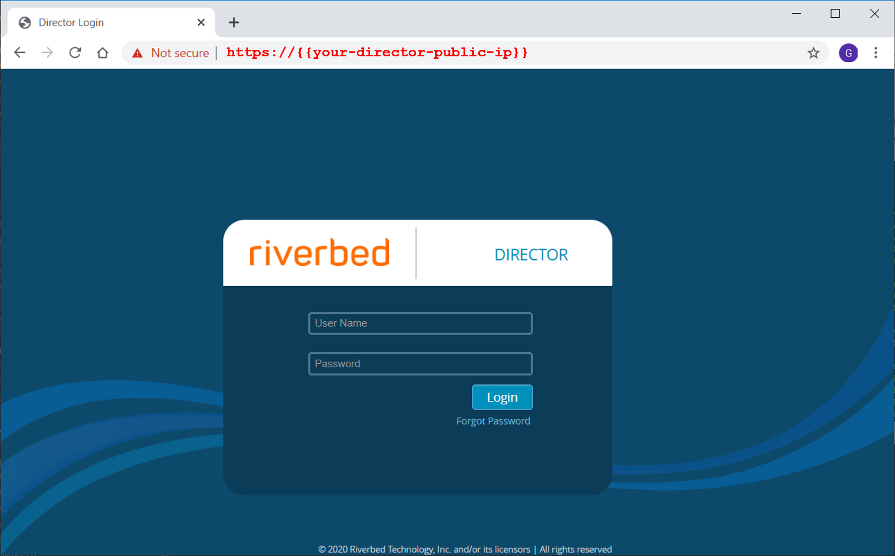
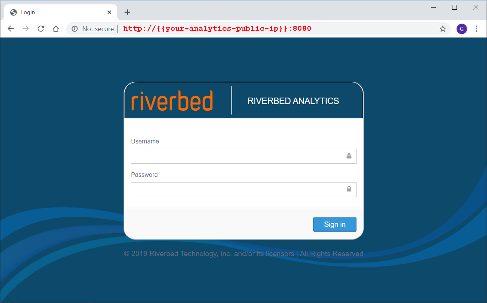
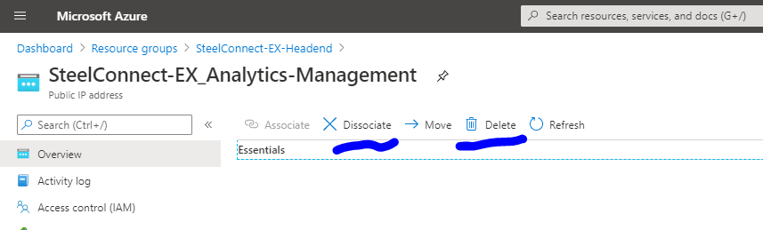
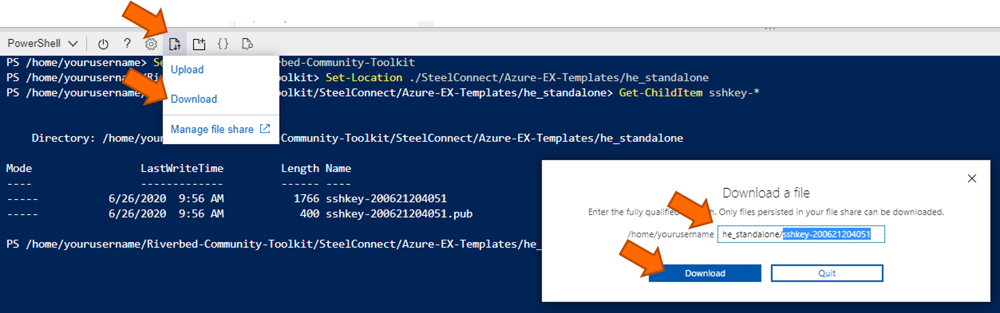

# Cookbook - Deploy SteelConnect EX Standalone Headend in Azure

- [Overview](#overview)
- [Prerequisites](#prerequisites)
- [Deployment](#deployment)
    - [1. Create Azure Image Resources](#1-create-azure-image-resources)
    - [2. Deploy using Terraform template](#2-deploy-using-terraform-template)
- [Usage](#usage)
- [How to](#how-to)

## Overview

The Riverbed Community Toolkit provides this cookbook to deploy an SteelConnect-EX Standalone Headend in Azure.

Some easy steps are described in the prerequisites and deployment sections. The how-to section contains more details or advanced topics.

With this cookbook you will deploy the architecture below in the Azure location of your choice.


The Cookbook uses the following parameters and default values.

| Parameters | Default Value |
| --- | --- |
| SD-WAN overlay network | 99.0.0.0 /8 |
| VNET | 10.100.0.0/16 <ul><li>Management subnet: 10.100.1/24</li><li>Control subnet: 10.100.2/24</li><li>Internet Uplink subnet: 10.100.254/24</li></ul>|
| Azure VM Size | Standard_F8s_v2 |
| Azure Location* | *no default value* |
| SSH keypair | *generated in local files sshkey-timestamp and sshkey-timestamp.pub* |
| SSH key passphrase | riverbed-community |
| Analytics Southbound port | 1234 |

> Any **Azure Location** can be chosen for the deployment, for example **West-US**, **West-Europe** or **Korea Central**. Thus in some location the default VM size is not available, for example Standard_F8s_v2 is currently not available in Switzerland North, in that case please refer to the SteelConnect deployment guide and adapt the cookbook script parameters to use an other VM size.

## Prerequisites

### 1. Azure subscription with enough vCPU Quota

| Tasks | Description |
| --- | --- |
| 1. Connect to the Azure Portal | <ul><li>Sign-in on [Azure portal](https://portal.azure.com)</li></ul> |
| 2. Check there is enough vCPU available in the target location: navigate to your Subscription details, open Usage and Quota menu. If required hit "Request Increase" button to increase the quota |<ul><li> **24 vCPU available for the Standard FsV2 Compute in the target Location**</li></ul>|

### 2. All the VHD in a Blob Container

| Tasks | Description |
| --- | --- |
| 1. Create a resource group in the location where you will deploy SteelConnect EX appliances| <ul><li>Resource Group name: **Riverbed-Images**</li><li>Location: **your target location for appliances**</li></ul> |
| 2. Create a Storage Account resource in the resource group previously created  | <ul><li>Storage Account Name: *a unique name*</li><li>Location: **your target location for appliances**</li><li>Replication: Locally-redundant storage (LRS) is ok</li></ul> |
| 3. Create a Blob container in the Storage Account previously created | <ul><li>Container name: **images**</li></ul> |
| 4. Generate a temporary Shared Access Signature for this Storage Account/Container. Hit **Generate SAS and connection string** button | <ul><li>Allowed services: Blob</li><li>End date: few days</li></ul>|
| 5. Send a request to Riverbed Support with the **SAS and connection string** generated previously |<ul><li>Request to [Riverbed Support](https://support.riverbed.com/)</li></ul> |
| 6. Check that all the .vhd files are in the Blob Container |<ul><li>3 VHD files: SteelConnect EX FlexVNF, Director and Analytics</li></ul> |

## Deployment

### 1. Create Azure Image Resources

| Tasks | Description |
| --- | --- |
| 1. In the Azure Portal, navigate to the Resource group **Riverbed Images** |Go to [Azure portal](https://portal.azure.com)|
| 2. Add a new resource, select Image, and hit Create new|  |
| 3. Fill parameters to create an Image resource for the **SteelConnect EX FlexVNF**| <ul><li>Name: **steelconnect-ex-flexvnf**</li><li>Location: **Target location** for appliances</li><li>OS disk type: **Linux**</li><li>Storage Blob: url of the **flexvnf vhd** in the storage account blobs container</li><li>Storage type: Premium SSD recommended</li></ul>|
| 4. Repeat **step 2.** and fill the parameters to create an Image resource for the **SteelConnect EX Director**| <ul><li>Name: **steelconnect-ex-director**</li><li>Location: **Target location** for appliances</li><li>OS disk type: **Linux**</li><li>Storage Blob: url of the **director vhd** in the storage account blobs container</li><li>Storage type: Premium SSD recommended</li></ul>|
| 5. Repeat **step 2.** and fill the parameters to create an Image resource for the **SteelConnect EX Analytics**| <ul><li>Name: **steelconnect-ex-analytics**</li><li>Location: **Target location** for appliances</li><li>OS disk type: **Linux**</li><li>Storage Blob: url of the **analytics vhd** in the storage account blobs container</li><li>Storage type: Premium SSD recommended</li></ul>|

#### Example

When the import is done, the resource group will contain a storage account and an image resource for each appliance. In the Azure portal, it should looks like this:


### 2. Deploy using Terraform template

#### 1. Open Azure Cloud Shell and select PowerShell console

Launch Cloud Shell from Azure Portal, or [shell.azure.com](https://shell.azure.com), or by clicking [](https://shell.azure.com)

#### 2. Get Riverbed Community Toolkit sources

The following PowerShell commands initialize the console and download the sources from Riverbed Community Toolkit git repository on GitHub.

```PowerShell
# Check the Azure context
# i.e check subscription and tenant id are correct
Get-AzContext

# uncomment the line below and replace {your subscription name} if you need to select a different subscription
# Set-AzContext -SubscriptionName "{your subscription name}"

# Get a local copy of the Riverbed Community Toolkit scripts from Github
git clone https://github.com/riverbed/Riverbed-Community-Toolkit.git
```

#### 3. Stage variables for Terraform

The following PowerShell commands prepare the parameters file *terraform.vartf* for Terraform and generate a keypair for SSH stored local files *sshkey-timestamp* and *sshkey-timestamp.pub*.

```PowerShell
Set-Location ./Riverbed-Community-Toolkit
Set-Location ./SteelConnect/Azure-DeployHeadend/scripts

./SteelConnect-EX_Stage-DefaultHeadhendStandalone.ps1
```

#### 4. Deploy Terraform

The following PowerShell commands launch the deployment using Terraform (init, plan and apply)

```PowerShell
../../Azure-DeployHeadend/scripts/SteelConnect-EX_Deploy-Terraform.ps1
```

#### 5. Keep the output

Usually after 5 to 6 minutes, the deployment finishes and the Terraform deployment output gives useful information such as WebConsole URL and Public IP for each appliance.


In the Azure portal, the resource group contains all the resources.


## Usage

At this point you should be good to configure your headend as you have learnt during the bootcamp. Typically you will:
- Define a connector to the Analytics cluster and register the  analytics node
- Create the initial Organization and some others using the workflow
- Deploy a controller with staging capabilities using the workflow
- Check VPN profile id details on the staging controller
- Define workflow template for device creation and try onboarding some devices
- For Security, set strong passwords, filter management traffic or just remove the un-necessary Public IPs bound to management NICs in Azure (for example remove the management public IP of the Controller and the Analytics)
- Generate a license request
- ...
- and more

The very next step is probably to connect to the admin GUI of the Director and the Analytics (screenshot below). You can also access CLI via Azure Serial Console or SSH.

| Director | Analytics |
| --- | --- |
| [https://{{your-director-public-IP}}]()  | [http://{{your-analytics-public-IP}}:8080]()  |

## How to

### Remove un-necesseray Public IP

Typically Analytics and Controller might not need to be exposed on Internet. 
In the Azure Portal navigate to the Public IP resource. You need first to dissociate and then you can delete it. For example:




### CLI console access

In the Azure Portal navigate to the Virtual Machine resource corresponding to your applance. In the left menu scroll down to the Support - troubleshooting section to find the Serial console. For example on the Director:


 ### Connect to appliances using SSH

The appliance are configured for SSH Public Key authentifcation.

For example the following command show how to connect to the public IP of Director:
- replace **{{your sshkey-timestamp}}** with the actual file name generated in the current directory
- replace **{{your Director public IP}}** with the actual IP of the Director, see terraform output

```shell
ssh -i {{your sshkey-timestamp}} Administrator@{{your Director public IP}}
```

 ### Find the generated keypair

By default, the deployment process generates a keypair. The private key stored in a local file *sshkey-timestamp* in the deployment) proteced by a passphrase (see [cookbook default values](#overview)).

To find the key
```
Set-Location ./Riverbed-Community-Toolkit
Set-Location ./SteelConnect/Azure-EX-Templates/he_standalone
Get-ChildItem sshkey-*
```

Example of output:

```output
sshkey-200621204051
sshkey-200621204051.pub
```

### Download the ssh key

From the Cloud Shell, in the menu select Download and fill the path of the sshkey file. For example: "Riverbed-Community-Toolkit/SteelConnect/Azure-EX-Templates/he_standalone/sshkey-200621204051"




## Copyright (c) 2020 Riverbed Technology