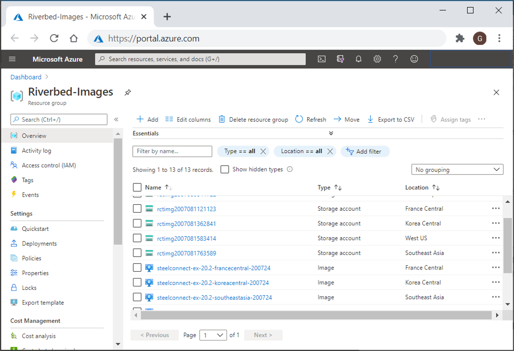

# Cookbook - Deploy SteelConnect EX FlexVNF Image in Azure Locations

- [Overview](#overview)
- [Prerequisites](#prerequisites)
- [Steps](#steps)
- [Usage](#usage)

## Overview

After having deployed a SteelConnect-EX Headend in Azure, following a cookbook like [SteelConnect-EX Standalone Headend in Azure](../Azure-DeployHeadend), the will probably need to deploy some SteelConnect-EX FlexVNF appliances in the VNET in multiple Azure Locations.

This cookbook allows to deploy the SteelConnect-EX FlexVNF image automating the creation of some Azure Image resource in other Azure Locations.

## Prerequisites

This cookbook requires URI with a SAS Token.

You might already have the VHD in one of your storage account (for example if you have used the [Deploy Headend Cookbook](../Azure-DeployHeadend)), here is how to get the URI and generate a SAS Token

| Tasks | Description |
| --- | --- |
| 1. Browse the Storage Account and the Blob Container that contain the .vhd of SteelConnect EX FlexVNF appliance |<ul><li>Resource Group name: **Riverbed-Images**</li><li>Container name: **images**</li></ul> |
| 2. Select the vhd and copy the URL |<ul><li>**URL**: http</li></ul> |
| 3. Generate a temporary Shared Access Signature for this Storage Account/Container. Hit **Generate SAS and connection string** button | <ul><li>Allowed services: Blob</li><li>End date: few days</li></ul>|


## Steps

### Deploy using a script

#### 1. Open a PowerShell Console 

A PowerShell console having Az module and azcopy is required, like the Azure Cloud Shell.

Azure Cloud Shell can be launch from the Azure Portal, or connecting to [shell.azure.com](https://shell.azure.com), or by clicking
[](https://shell.azure.com)

#### 2. Get Riverbed Community Toolkit sources

The following PowerShell downloads the latest sources from Riverbed Community Toolkit git repository on GitHub.

```PowerShell
# Get a local copy of the Riverbed Community Toolkit scripts from Github
git clone https://github.com/riverbed/Riverbed-Community-Toolkit.git

#  Initialization script
Set-Location ./Riverbed-Community-Toolkit/
Set-Location SteelConnect/Azure-DeployImageInLocations
```

#### 3. Connect Azure context

The PowerShell script below allows to check and set the Azure context.

```PowerShell
# Check the Azure context, i.e check if subscription and tenant id are correct
Get-AzContext

# uncomment the line below if not already connected to Azure.
# Connect-AzAccount

# uncomment the line below and replace {your subscription name} if you need to select a different subscription
# Set-AzContext -SubscriptionName "{your subscription name}"
```

#### 4. Fill parameters and run the script

The script New-ImageFromVhdUri requires the following parameters:

| Parameters | Description | Example |
| --- | --- | --- | 
| DestinationLocations | comma separated list of Azure Location or "ALL" for all Azure Locations | westeurope,francecentral,koreacentral  or  ALL |
| DestinationVhdFileName | filename of the vhd to be copied in each Location. Can be the same name as in the source. | steelconnect-ex-flexvnf-20.2.vhd
| DestinationImageBaseName | will be use to create Azure Image resource. The name will be {ImageBaseName}-{Location} |  steelconnect-ex-20.2 |
| SourceVhdUri | url of the vhd file in the Storage Account | "https://yourstorageaccount.blob.core.windows.net/images/steelconnect-ex-flexvnf-20.2-30239j.vhd"
| SourceSASToken | a valid SAS token generated on the Storage Account to grant read access to the vhd Blob | "?sv=2019-10-10&ss=b&srt=co&sp=rwdlacx&se=2020-07-22T05:51:31Z&st=2020-07-21T21:51:31Z&spr=https&sig=JAFoNef" |

For example the following script will deploy the images in the resource group Riverbed-Images

```PowerShell
./Create-ImageFromVhdUri.ps1 -ResourceGroupName "Riverbed-Images" -Location "westeurope" `
    -DestinationLocations westeurope,francecentral,koreacentral,westus,southeastasia `
    -DestinationVhdFileName "steelconnect-ex-flexvnf-20.2-bhd93.vhd" `
    -DestinationImageBasename "steelconnect-ex-20.2" `
    -SourceVhdUri "https://yourstorageccount.blob.core.windows.net/images/steelconnect-ex-flexvnf-20.2.vhd" `
    -SourceSASToken "?sv=2019-10-10&ss=b&srt=co&sp=rwdlacx&se=2020-07-22T05:51:31Z&st=2020-07-21T21:51:31Z&spr=https&sig=JAFoNefbVBktBuWIe2sYTNV3bCf1jjx%2FuERl%2FC%2BSsWo%3D"
```

### Usage

The script will usually take few minutes to deploy the image in each location. When done he Storage Account and Images resources will be available in the resource group (default name: Riverbed images).



Image can be be used to deploy the SteelConnect appliance directly from the Azure portal (navigate to the image and hit New VM), via ARM templates, or else using the automated deployment from the SteelConnect-EX Director gui.

## License

Copyright (c) 2019 Riverbed Technology, Inc.
The scripts provided here are licensed under the terms and conditions of the MIT License accompanying the software ("License"). The scripts are distributed "AS IS" as set forth in the License. The script also include certain third party code. All such third party code is also distributed "AS IS" and is licensed by the respective copyright holders under the applicable terms and conditions (including, without limitation, warranty and liability disclaimers) identified in the license notices accompanying the software.

### Copyright (c) 2019 Riverbed Technology, Inc.