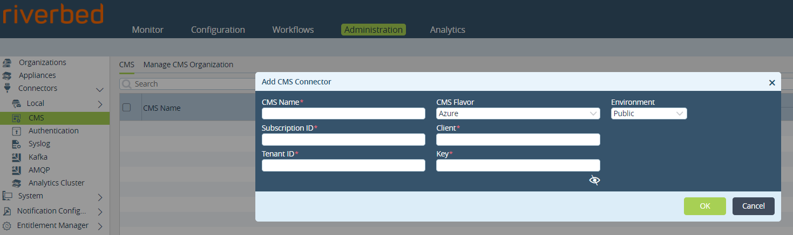

# Generate Azure Credentials for SteelConnect automation

## Steps

### 1. Open Cloud Shell (select Bash mode)

Try from shell.azure.com or clicking 
[](https://shell.azure.com)

### 2. Run the script and keep the output

The following bash commands download the script **azure_credentials_generate.sh** that create a service principal.

```bash
wget https://raw.githubusercontent.com/riverbed/se-toolkit/master/SteelConnect/Azure-Generate-Credentials/azure_credentials_generate.sh

chmod +x azure_credentials_generate.sh

azure_credentials_generate.sh
```

About 2 min after, the output will display the generated credential and application details to setup a connector to Azure:

- Subscription ID
- Application ID (client ID)
- Secret Key
- Tenant ID

### 3. Configure SteelConnect

Use the credentials and details to configure the Azure connector in SteelConnect CX or EX:

- in SteelConnect CX from the SCM > Network Design > Azure

- in SteelConnect EX from the Director > Administration > Connectors > CMS, new connector for Azure


