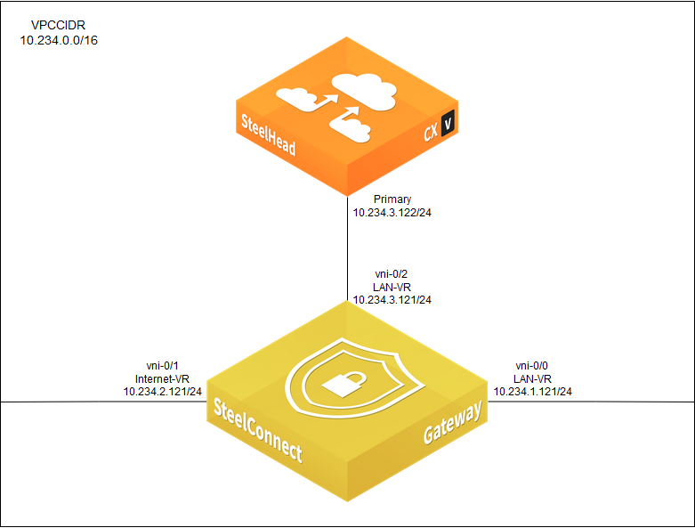

# Cookbook - Deploying the SteelConnect EX SD-WAN gateway and Cloud Accelerator (2BOX solution)

- [Overview](#overview)
- [Diagram](#diagram)
- [Prerequisites](#prerequisites)
- [Deployment](#deployment)
    - [1. Update CloudFormation template AMIs](#1-update-cf-ami-ids)
    - [2. Deploy using CloudFormation template](#2-deploy-using-cf-template)
- [Post-deployment Steps](#post-deployment)
- [Versions Tested](#versions)
- [Caveats & Known Limitations](#caveats)

## Overview

This Riverbed Community Toolkit cookbook provides instructions for deploying a 2BOX SteelConnect EX Cloud Accelerator Solution in AWS. This cookbook describes how to add a 2BOX solution to an already working SteelConnect EX Headend service.

A SteelConnect EX SD-WAN gateway instance automatically starts in your AWS region. The "Post-Deployment Steps" section describes the staging process to get the gateway added to your SD-WAN infrastructure.

A Cloud Accelerator (aka Cloud SteelHead) instance also starts automatically to provide Cloud Acceleration services to SD-WAN traffic in AWS. The "Post-Deployment Section" describes the steps to configure the Cloud Accelerator.

The SteelConnect EX gateway and Cloud Accelerator are directly connected to allow Cloud Accelerator to optimize service chaining traffic. The "Post-Deployment Steps" section describes how to configure the SteelConnect EX service chaining feature.

## Diagram

This figure shows a network diagram of the AWS 2BOX deployment:

## Prerequisites

This cookbook assumes the following prerequisite are met:

1. General familiarity with SteelConnect EX deployments.
2. A working SteelConnect EX Headend service, including Director and controller.
3. A post-staging device template and device group have been created that the AWS SD-WAN gateway will be assigned to.

## Deployment

### 1. Update CloudFormation template AMIs

The CloudFormation template has region mappings for the SteelConnect EX and Cloud Accelerator AMIs. These AMI IDs are deprecated over time, so if you want to run the latest image then you will want to update the template with the latest image IDs for your region.

### 2. Deploy using the CloudFormation template

From your AWS account, navigate to the [CloudFormation console](https://console.aws.amazon.com/cloudformation/home) in the desired region, and select to Create Stack with new resources.

Upload the following template file, which defines the parameters and resources required to deploy the 2BOX solution:

[CloudFormation Template: 2BOX SCONEX + CLOUD ACCELERATOR](aws-sconex-wanopt.json)

Click Next to go to Specify stack details, where you must assign values to the template parameters. Provide your values such as stack name, owner name, and SSH key pair. You can leave default parameters as is, unless you would prefer to use different values. Click Next to change any other configuration parameters. When finished, click Create Stack.

When the stack successfully completes launching, new Cloud Accelerator and SteelConnect EX FlexVNF instances will be running.

## Post-deployment Steps

### 1. Disable source/destination checks

By default, each AWS EC2 VM instance must be the source or destination of any traffic it sends or receives. Otherwise, the packets will be dropped.

SteelConnect EX and Cloud Accelerator both route and/or NAT traffic, so this check must be disabled on them.

Follow the instructions [provided here.](https://docs.aws.amazon.com/vpc/latest/userguide/VPC_NAT_Instance.html#EIP_Disable_SrcDestCheck)

### 2. Staging the SteelConnect EX gateway

An AWS-based SteelConnect EX gateway can be staged and onboarded to the Director similar to a Riverbed hardware appliance. Obtain the device serial number, and use that number to add a new device on your SteelConnect EX Director. An AWS cloud connector does not need to be configured for deploying AWS-based SteelConnect EX resources.

To obtain the device serial number, look up the SteelConnect EX device's public IP address, and connect to it via SSH using the SSH key provided when the stack was created.

Once at the device's remote shell, enter the CLI and run the following command to get the serial number:

    admin@flexvnf-cli> show system details | grep Serial
       Serial number       <serial number>

To add the device on the Director, go to Workflows => Devices and click the plus sign (+) to add the new device. 

Enter the serial number, and select the desired device group. Then enter the location information and bind data variables from your template.

From the SteelConnect EX device, clear the running configuration for security purposes:

    admin@flexvnf-cli> request erase running-config

Allow a few minutes for the services to restart, and then run the staging script:

    sudo /opt/versa/scripts/staging.py -l SDWAN-Branch@Riverbed.com -r <controller_name>-staging@Riverbed.com -n <serial_number> -c <controller_WAN_IP> -w 1 -s <EX_WAN_IP/netmask> -g <gateway_IP>

- controller\_name = hostname of the SD-WAN controller configured in the post-staging template
- serial\_number = serial number of the AWS SteelConnect EX SD-WAN gateway
- controller\_WAN\_IP = public IP address of the SD-WAN controller's Internet WAN interface
- EX\_WAN\_IP/netmask = static IP address of the SteelConnect EX device's Internet interface
- gateway\_IP = IP address of the SteelConnect EX's Internet next-hop gateway

### 3. Cloud Accelerator Configuration

After Cloud Accelerator has been deployed in AWS, it must first be licensed. Refer to *SteelHead (in the Cloud) User Guide* available on the Riverbed Support site.

Historically, a Discovery Agent package has been required to be installed on the end server in order for the auto-discover peering process to work between client-side and server-side SteelHeads. With the 2BOX SteelConnect EX set up in AWS, no Discovery Agent is needed. Client and server traffic is automatically redirected to the Cloud Accelerator by the SteelConnect EX device via service chaining rules, which are described in the next section.

### 4. Service Chaining Configuration

Cloud Accelerator uses a single interface, the *primary* interface, for all ingress and egress traffic. This is referred to as an L3 mode deployment. Therefore, service chaining will be configured in L3 mode.

To configure service chaining for this AWS 2BOX deployment, follow the authoritative deployment guide *SteelHead Installation Guide for SteelConnect EX* located on the Riverbed Support site under the SteelConnect EX product support documentation. Follow the relevant steps in the *Deploying an external SteelHead with SteelConnect-EX (Two-Box)* section and use the L3 configuration mode.

The Cloud Accelerator itself requires no configuration with regards to service chaining.

## Versions Tested

Riverbed Engineering has tested this CloudFormation template using SteelConnect EX 21.2.2.

## Caveats and Known Limitations

1. The SteelHead Compatibility feature (aka NSH Reflect) is not supported by Cloud Accelerator, so please do not attempt to use it.

## License

Copyright (c) 2022 Riverbed Technology, Inc.

The scripts provided here are licensed under the terms and conditions of the MIT License accompanying the software ("License"). The scripts are distributed "AS IS" as set forth in the License. The script also include certain third party code. All such third party code is also distributed "AS IS" and is licensed by the respective copyright holders under the applicable terms and conditions (including, without limitation, warranty and liability disclaimers) identified in the license notices accompanying the software.