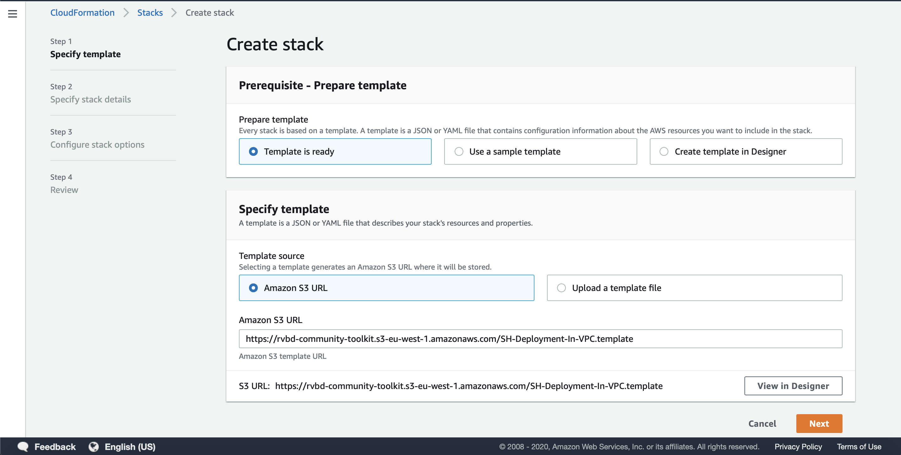
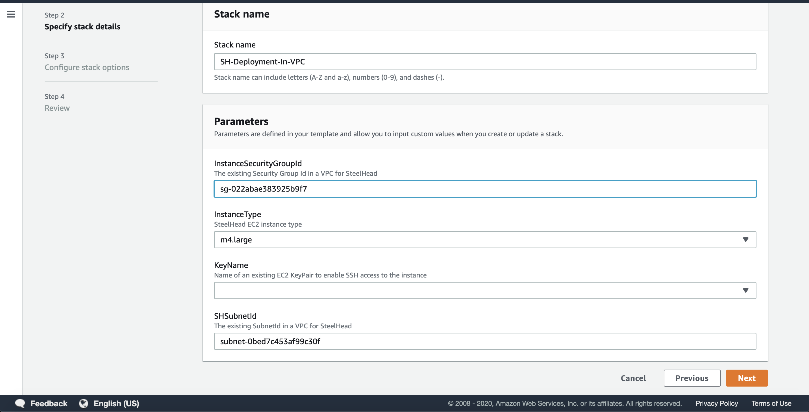

# Deploying Acceleration in an existing VPC having a gateway appliance (VPN or SD-WAN)

SH-101 scenario deploys a steelhead instance in your existing AWS infrastructure. Typically, VPN or SD-WAN solutions have a gateway inside the AWS VPC to interconnect with other sites gateways. It is a one click deployment solution and the Administrator will be responsible for configuring the access to SteelHead & routing via SteelHead.

### Step 1: Launch Stack in AWS
Click below button to launch stack in AWS. It will redirect you to AWS cloudformation console.

[](https://console.aws.amazon.com/cloudformation/home?region=ap-south-1#/stacks/new?stackName=SH-Deployment-In-VPC&templateURL=https://rvbd-community-toolkit.s3-eu-west-1.amazonaws.com/SH-Deployment-In-VPC.template)

**Note**:- By default the SteelHead appliance will be deployed in AWS region - ap-south-1. You can copy the url and change the region parameter accordingly in the URL. In below URL change **region=ap-south-1** with your region.
```PowerShell
https://console.aws.amazon.com/cloudformation/home?region=ap-south-1#/stacks/new?stackName=SH-Deployment-In-VPC&templateURL=https://rvbd-community-toolkit.s3-eu-west-1.amazonaws.com/SH-Deployment-In-VPC.template
```

### Step 2: Select Template
The template will be selected from AWS S3 bucket and you just need to click on next button as shown in below snapshot:



### Step 3: Provide Stack Inputs
Provide inputs corresponding to your setup and then click next.



### Step 4: Advanced Configurations (Optional)
After providing Stack inputs, you will be asked to configure advanced settings. It is an optional step and you can skip this step by just clicking on next button.

### Step 5: Deploy Resources
This is the final step. You can review your setting in this step & then click on the **Create Stack** button at the right bottom of the page.

## License

Copyright (c) 2019 Riverbed Technology, Inc.
The scripts provided here are licensed under the terms and conditions of the MIT License accompanying the software ("License"). The scripts are distributed "AS IS" as set forth in the License. The script also include certain third party code. All such third party code is also distributed "AS IS" and is licensed by the respective copyright holders under the applicable terms and conditions (including, without limitation, warranty and liability disclaimers) identified in the license notices accompanying the software.
