# Cookbook - Chaining Acceleration in a VNET having a virtual network appliance (e.g. VPN or SD-WAN)

1. [Overview](#1-overview)
2. [Quickstarts](#2-quickstarts)
3. [How-to](#3-how-to)

## 1 - Overview

When deploying Cloud SteelHead to accelerate your applications and workloads in Azure, the network service chaining approach brings lot of advantages, such as transparent deployment for application, bidrectional acceleration, agentless interception and by nature will ease connection to other existing network services.

Typically, VPN or SD-WAN solutions have a gateway inside the Azure VNET to interconnect with other sites gateways. In this case the Acceleration can be chained. The traffic of applications can flow through the Cloud SteelHead and other SteelHeads and can get accelerated (hardware or virtual appliance, agents on Windows and Mac OS X).

Moreover, integrating the Azure platform also offer opportunities to extend the solution or address some topics using Cloud techniques, for example monitoring, resiliency and availability.

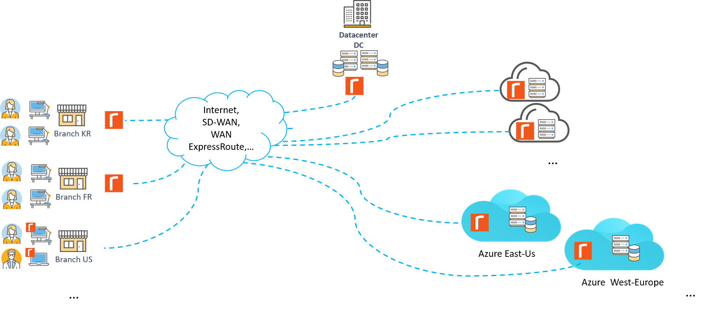

This cookbook explains how to chain the Acceleration in a VNET and also include some extensions based on services of the Azure Cloud Platform, see diagram below. All design details, PowerShell scripts and ARM templates are provided. Here are the main topics covered by the cookbook:

- Create a sandbox (i.e. VM and VNET)
- Create the acceleration subnet in an existing VNET
- Deploy the Cloud SteelHead VM
- Licensing and basic configuration
- Service Chain, i.e. Interception in Azure
- Set or Bypass the acceleration
- "Fail-to-Wire" i.e. ability to recover from a crash of the acceleration service with minimum network disruption

The [Quickstarts](#quickstarts) section gives simple PowerShell scripts to quickly build some sandboxes, deploy the acceleration solution and extensions. Then the [How-to](#howto) section goes into details about each steps of implementation. Additional tuning or adaption may be required to fit specific environments.

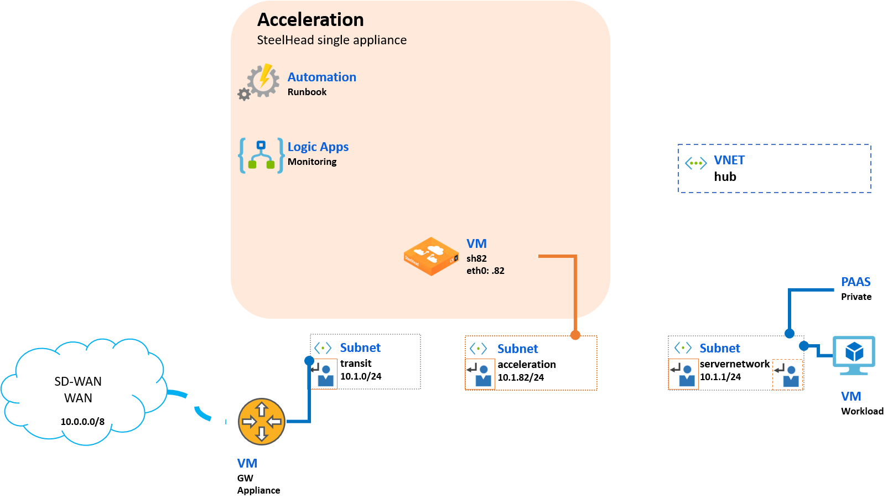

## 2 - Quickstarts

Clone the Riverbed community toolkit and retrieve the PowerShell scripts that you will run against your Azure subscription, for example using [Azure Cloud Shell](https://shell.azure.com/powershell).

```PowerShell
# Copy the sources/scripts and go to the cookbook folder
git clone https://github.com/riverbed/Riverbed-Community-Toolkit.git
cd "Riverbed-Community-Toolkit\SteelHead\Azure-Cloud-Cookbooks"
```

Check the Azure context is the correct subscription where you would like to deploy the acceleration resources.

```PowerShell
# Check current Azure context
Get-AzContext

# Check available subscriptions
Get-AzSubscription

# Fill the parameter to select your subscription
Select-AzSubscription -SubscriptionName "{your-test-sub}"
```

### Deploy acceleration in a sandbox having workloads

#### Sandbox AZE

This script deploys the sample site AZE in westeurope without a gateway so that you can then deploy the appliance of your choice to interconnect the VNET with other sites (VNET, other cloud or branch locations). It also deploys the Azure resources for acceleration and the Runbook.

```PowerShell
.\quickstarts\Test-SampleAZE.ps1
```

The following post-deployment configurations steps are required:

- Deploy a gateway appliance to interconnect with other sites, for the network interface in the subnet transit, use the static IP address **10.3.0.254**
- Create a RunAsAccount in the automation account **aze-automation-westeurope** (Account Settings > Run as Account)
- Configure the SteelHead appliance (change admin password, get and set a license, ssl cert, ...), **https://10.3.82.82**
- Execute the Runbook to set acceleration

#### Sandbox AZK

AZK is a sandbox similar to AZE but in the location koreacentral with a different network range (e.g. servernetwork is 10.82.1.0/24). This script does not deploy a gateway appliance. It just deploys the sandbox, the acceleration and the Runbook.

```PowerShell
.\quickstarts\Test-SampleAZK.ps1
```

Post-deployment configuration required:

- Deploy a gateway appliance with static IP address **10.82.0.254**
- Create RunAsAccount in the automation account **azk-automation-koreacentral**
- Configure the SteelHead appliances, **https://10.82.82.82**
- Execute the Runbook to set acceleration

### Deploy acceleration with "fail-to-wire" in a sandbox having workloads

#### Sandbox AZX

AZX is a sandbox similar to AZE and AZK but in the location eastus2 with a different network range (e.g. servernetwork is 10.6.1.0/24). The script does not deploy a gateway appliance. It just deploys the sandbox, the acceleration, the Runbook and the "fail-to-wire" logic apps.

```PowerShell
.\quickstarts\Test-SampleAZX-Fail-to-Wire.ps1
```

Post-deployment configuration required:

- Deploy a gateway appliance with static IP address **10.6.0.254**
- Create RunAsAccount in the automation account **azx-automation-koreacentral**
- Configure the SteelHead appliances, **https://10.6.82.82**
- Execute the Runbook to set acceleration

### Deploy other configurations from ARM templates

The templates used in the cookbook and be deployed and configured in the Azure Portal by clicking on the buttons "Deploy in Azure" in the table below:

| **VNET sample** | **Acceleration** | **Service Chain** | **Automation Runbooks** | **Automatic "Fail-to-Wire"** |
| --- | --- | --- | --- | --- | --- |
| [](https://portal.azure.com/#create/Microsoft.Template/uri/https%3A%2F%2Fraw.githubusercontent.com%2Friverbed%2FRiverbed-Community-Toolkit%2Fmaster%2FSteelHead%2FAzure-Cloud-Cookbooks%2F101-service-chain-gw-appliance%2Fazuredeploy-sandbox.json) | [](https://portal.azure.com/#create/Microsoft.Template/uri/https%3A%2F%2Fraw.githubusercontent.com%2Friverbed%2FRiverbed-Community-Toolkit%2Fmaster%2FSteelHead%2FAzure-Cloud-Cookbooks%2F101-service-chain-gw-appliance%2Fazuredeploy-acceleration.json) | [](https://portal.azure.com/#create/Microsoft.Template/uri/https%3A%2F%2Fraw.githubusercontent.com%2Friverbed%2FRiverbed-Community-Toolkit%2Fmaster%2FSteelHead%2FAzure-Cloud-Cookbooks%2F101-service-chain-gw-appliance%2Fazuredeploy-routetables.json)| n.a. | [](https://portal.azure.com/#create/Microsoft.Template/uri/https%3A%2F%2Fraw.githubusercontent.com%2Friverbed%2FRiverbed-Community-Toolkit%2Fmaster%2FSteelHead%2FAzure-Cloud-Cookbooks%2F101-service-chain-gw-appliance%2Fazuredeploy-ise.json) - [](https://portal.azure.com/#create/Microsoft.Template/uri/https%3A%2F%2Fraw.githubusercontent.com%2Friverbed%2FRiverbed-Community-Toolkit%2Fmaster%2FSteelHead%2FAzure-Cloud-Cookbooks%2F101-service-chain-gw-appliance%2Fazuredeploy-logicapps-simple.json) |

All the ARM templates can be found in the [cookbook folder](./101-service-chain-gw-appliance/) with some examples of parameters files in the [sample subfolder](./101-service-chain-gw-appliance/sample).

## 3 - How-to

### Get ready to run scripts with your Azure subscription

To run and test other "how-to", you will need to connect [Azure portal](https://portal.azure.com) and run some PowerShell scripts provided here on the [Riverbed Community Toolkit](https://github.com/riverbed/Riverbed-Community-Toolkit/tree/master/SteelHead/Azure-Cloud-Cookbooks).

The following are quick steps to download sources from GitHub and initialize the Azure Context in the PowerShell console. For simplicity we recommend to run all scripts in [Azure Cloud Shell](https://shell.azure.com/).

```PowerShell
# Copy the sources/scripts and go to the cookbook folder
git clone https://github.com/riverbed/Riverbed-Community-Toolkit.git
cd "Riverbed-Community-Toolkit\SteelHead\Azure-Cloud-Cookbooks"

# Check current Azure context
Get-AzContext

# Check available subscriptions
Get-AzSubscription

# Fill the parameter to select your subscription
Select-AzSubscription -SubscriptionName "{your-test-sub}"
```

### Deploy a sandbox in Azure to integrate acceleration

#### Initial topology

For this cookbook we have designed a simplified network topology to apply the concepts of integration. The below diagram represents an actual implementation, the site is called AZE and hosted in Azure West Europe.

The VNET contains 4 subnets:

- servernetwork: connecting some Virtual Machines and PAAS services
- transit: the gateway downlink to workloads in Azure
- UL-Internet1: connected to the internet uplink of the gateway
- siteOOB: connected to the out-of-band management uplink of the gateway reachable via a public IP

The WAN traffic, i.e. traffic with other sites (e.g. users in branches, datacenter, cloud providers), is typically set to flow through the gateway. It uses Azure Route Tables.

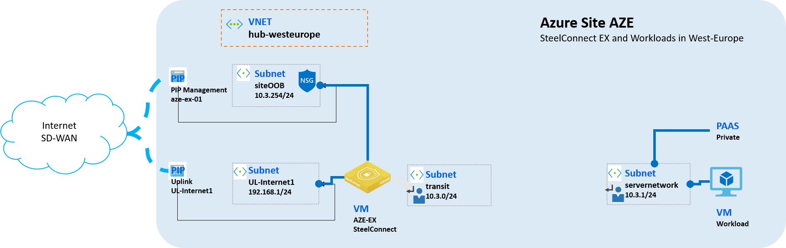

The script Deploy-Sandbox.ps1 helps to build a similar topology, with or without a gateway appliance, in order to try the Acceleration integration. The script is based on an ARM template so that it can be customized in other environments.

#### Deploy with a gateway appliance

By default, the script will create a VNET, a linux VM for the gateway appliance and a linux VM for workloads for the sample site called AZE. Resources will be deployed in westeurope location. *The configuration of the gateway and the VM will be discussed in another cookbook.*

```PowerShell
# Create resources with default parameters
.\scripts\Deploy-Sandbox.ps1
```

After the deployment, the resource group **aze-hub-westeurope** in Azure will look like this:

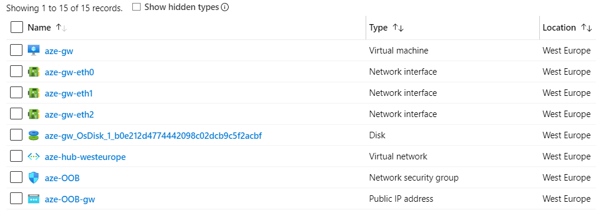

#### Deploy without gateway

Running the script without a gateway, will just create the VNET and provision a linux VM for workloads. You can then deploy your own appliance, for example SD-WAN (e.g. SteelConnect, Viptela, Versa Networks).

```PowerShell
# Create resources with default parameters and skip the creation of a gateway
.\scripts\Deploy-Sandbox.ps1 -CreateVirtualMachine_gateway skip
```

#### Other details

The script generates an SSH keypair and deploys the public key on the VM. The generated private and the public keys are stored locally in 2 separate files in the artifact directory so that they can be used to connect using SSH on the VM. The **default passphrase** is **riverbed-community**:

```PowerShell
ssh -i .\artifacts\aze-vm-sshkey riverbed-community@vm-ip-address
```

The script parameters allow overriding of the public key.

```PowerShell
# Set an existing SSH public key
$adminPublicKey = "ssh-rsa FAKEsdfsadfasdfasdfadsfasdfasdfasdfadsfO263BFzT+ZQlYQ== rsa-key-20190230"

# Create resources with default parameters, overriding adminPublicKey to use an existing SSH public key
.\scripts\Deploy-Sandbox.ps1 -adminPublicKey $adminPublicKey
```

The parameters ProjectName and Location can also be overriden. Those parameters are used to match the template parameters filename which are by default located in the sample directory. For example, deploying site azk in location koreacentral, match the template file [./sample/azuredeploy-sandbox.parameters.azk.json](./101-service-chain-gw-appliance/sample/azuredeploy-sandbox.parameters.azk.json):

```PowerShell
# Create resources with default parameters
.\scripts\Deploy-Sandbox.ps1 -ProjectName "azk" -Location "koreacentral"
```

### Create a subnet dedicated to Acceleration

Creating a subnet inside the existing VNET will allow integration of the Acceleration appliance. The new subnet, called "acceleration", has a /24 prefix.

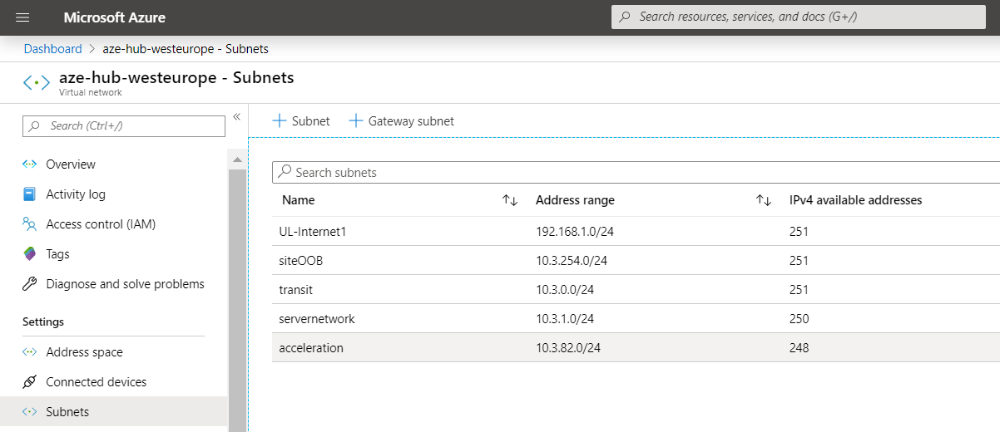

The script [Create-SubnetAcceleration.ps1](./scripts/Create-SubnetAcceleration.ps1) can be used to deploy the acceleration subnet in any VNET. The parameters are basically the Virtual Network, its Resource Group name and the /24 subnet prefix for acceleration.

For example, here is how to deploy on the sample topology AZE:

```PowerShell
.\scripts\Create-SubnetAcceleration.ps1 -VirtualNetworkResourceGroupName "aze-hub-westeurope" -VirtualNetworkName "aze-hub-westeurope" `
    -SubnetPrefix_acceleration "10.3.82.0/24"
```

### Deploy Cloud SteelHead

The Cloud SteelHead is a Virtual Machine with a single Network Interface. The Riverbed SteelHead image is available on the [Azure Marketplace](https://azuremarketplace.microsoft.com/en-us/marketplace/apps/riverbed.riverbed-steelhead-9-9-1?tab=Overview).

After deployment, the appliance will require some basic configuration for the acceleration service to run properly. The next "how-to" gives more details about configuration (change admin password, licensing, ssl cert, ...).

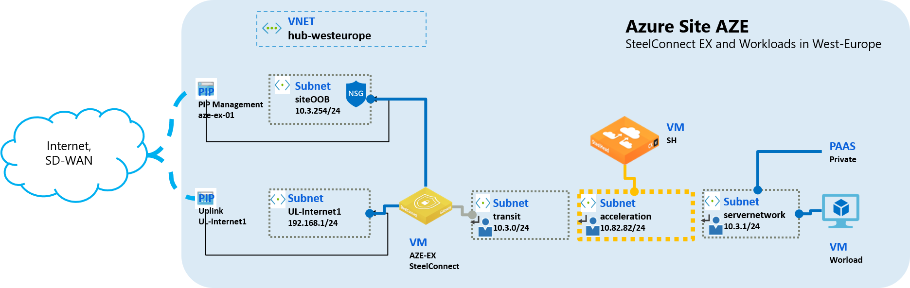

#### License for your Acceleration appliance

Please [Contact Riverbed](http://www.riverbed.com/contact/steelhead-contact.html) to get a **Free Trial License** or a **Buy a new License** to use on your appliance (and connect to the [License Cloud Portal](https://cloudportal.riverbed.com) to retrieve it)

#### Deployment methods

##### PowerShell

The following script is based on an ARM template. It deploys the Cloud Steelhead and other related resources. By default the script prepares artifacts, like generating an ssh keypair, and deploys the resources targeting the sample sandbox AZE (in location westeurope).

```PowerShell
## Deploy acceleration
.\scripts\Deploy-Acceleration.ps1 -generateKeypair -fetchVirtualNetworkId
```

The template parameters file can be customized. The main parameters are ProjectName, subnet prefix, VirtualNetworkId and adminPublicKey. The ProjectName parameter is used for the resource naming convention.

For example, it can be run like this:

```PowerShell
# 1. Create a template parameter file: sample\azuredeploy.parameters.yoursite.json set values for ProjectName, subnetPrefix for acceleration, VirtualNetworkId and adminPublicKey
# 2. Run the command, overriding the Resource Group
.\scripts\Deploy-Acceleration.ps1 -ProjectName "yoursite" -Location "your-azure-location" -ResourceGroupName "your-rg-name"
```

##### Azure Portal or Marketplace

Navigate to the [SteelHead in Azure MarketPlace](https://azuremarketplace.microsoft.com/en-us/marketplace/apps/riverbed.riverbed-steelhead-9-9-1?tab=PlansAndPrice).

Choose **Get it Now** and then **Deploy**. It is recommended to follow the [SteelHead in the Cloud User Guide](https://support.riverbed.com/bin/support/download?did=bjjjqgkb1oro6m4l7v7q6ifbvk&version=9.9.1) and pay attention to the following details:

- Deploy in a **new resource group**: **acceleration**
- Create a **new subnet**: **acceleration**
- Disk Type: **SSD Premium**

#### SteelHead basic configuration

Appliances can be configured directly via webconsole, SSH, SSH via Azure Bastion, or via a SteelHead Controller Appliance. The SteelHead controller is also available in the marketplace, [SteelHead Controller in Azure Marketplace](https://azuremarketplace.microsoft.com/en-us/marketplace/apps/riverbed.riverbed-scc-990a?tab=Overview).

Via webconsole, here are the minimal settings:

- Open a browser on [https://<your_appliance_vm_IP_address>](https://<your_appliance_vm_IP_address>) to get access to the SteelHead webconsole
- Log on with the default administrator acount: "admin". Default password: "password".
- Change the default password (ADMINISTRATION > My Account)
- Set your license (ADMINISTRATION > License)
- Create a user account "api-user" with Readonly permissions (ADMINISTRATION > User Permissions: add new account).
- Create a REST API access code (ADMINISTRATION > REST API)
- Replace the private key and certifcate (ADMINISTRATION > Web Settings: replace certificate)
- Save the configuration

For more details you can refer to the [Riverbed SteelHead in the Cloud User Guide](https://support.riverbed.com/bin/support/download?did=bjjjqgkb1oro6m4l7v7q6ifbvk&version=9.9.1).

### Service Chain, i.e. interception in the Cloud

This mechanism is the actual Service Chain that allows you to have acceleration service on the network path. It is based on Azure Routing Tables attached to subnets.

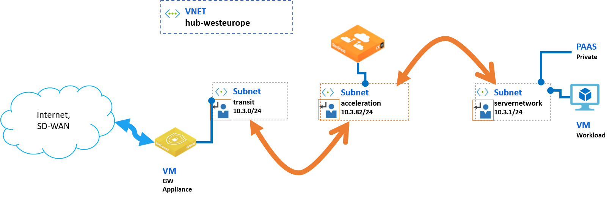

A Route Table corresponding to each subnet "in the path" must be created. In the model we call them transit_ACCELERATION, acceleration and servernetwork_ACCELERATION.

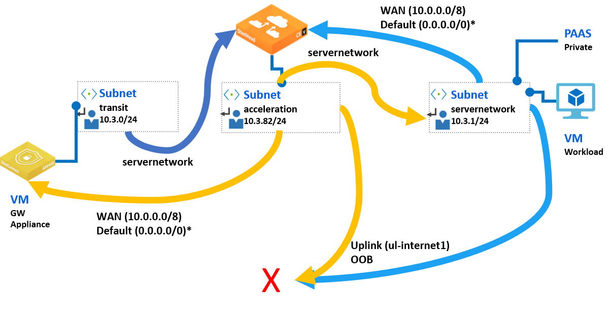

As a convention, each Route Table is named using the format "{site}-{subnet}". "-ACCELERATION" is appended to distinguish Route Tables created for Acceleration. In the diagram, each color represents the route defined by the Route Table for each subnet.

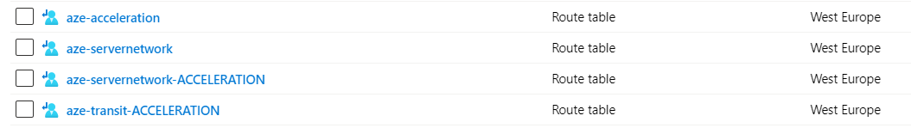

#### Deployment methods for the Service Chain

##### PowerShell based on ARM Template

The following script deploys a template that creates the Route Tables for Acceleration and Bypass.

By default the script targets the sample site AZE (in westeurope location)

```PowerShell
# Create Route Tables
.\scripts\Deploy-RouteTables.ps1
```

The deployment can be customized via template parameters in the artifact directory, for example:

```PowerShell
## Deploy route tables
.\scripts\Deploy-RouteTables.ps1 -ProjectName "azk" -Location "koreacentral" -ResourceGroupName "azk-acceleration-koreacentral" `
    -templateParameterFilePath ".\sample\azuredeploy-routetables.parameters.azk.json"
```

##### *draft - PowerShell script only*

*The Route Tables for Acceleration can also be created using the script [Create-ServiceChain.ps1](https://github.com/riverbed/Riverbed-Community-Toolkit/blob/master/SteelHead/Azure-ServiceChain/Create-ServiceChain.ps1) which can be customized via parameters.*

### Create a Runbook to Set/Bypass Acceleration

The Azure Automation service and Runbooks, provide an handy way to Set or temporarily Bypass the Acceleration, which can be useful in production, for example, in case of maintenance. The Runbook can be triggered from the Azure Portal or via webhook.

This automation is based on a PowerShell script that is customizable. To enable Acceleration, the logic attaches the set of Acceleration route tables to the subnets. To Bypass, it will detach or swap to other Route Tables. Switching from Set to Bypass may take 5-10 seconds as a guideline, but could be faster

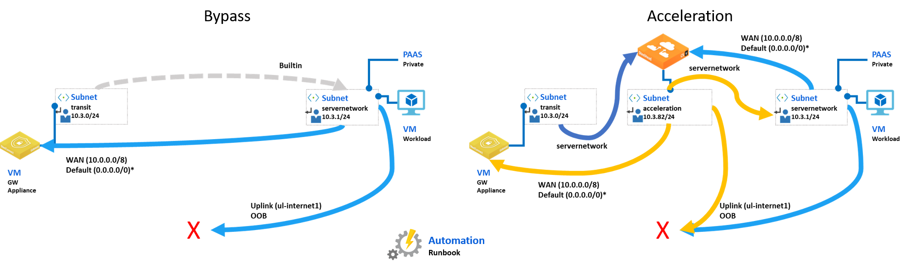

#### Deploy Runbook from Azure Portal

1. Provision an Automation Account with an Azure RunAsAccount and specific modules required for the Runbooks (Az.Accounts, Az.Automation and Az.Network)
2. Create a new PowerShell Runbook based on the template [Template-Runbook-AccelerationRoutes.ps1](./101-service-chain-gw-appliance/scripts/Template-Runbook-AccelerationRoutes.ps1)
    - Naming for the Runbook: {siteName}-Runbook-AccelerationRoutes.ps1.
    - In the customization section of script, set parameters with actual value for Virtual Network name, Resource Group name and Route Tables id

#### Deploy Runbook with PowerShell

The following script deploys the resources for the sample sandbox topology AZE, in location westeurope.

```PowerShell
## Deploy Runbook (post-deployment deployment step required: create RunAsAccount in Automation Account)
.\scripts\Deploy-Automation.ps1

### Create the runbook
.\scripts\Create-AccelerationRoutes-Runbook.ps1 -searchResourcesDetailByName

```

When done, **the RunAsAccount must be created** from the Azure Portal gui.

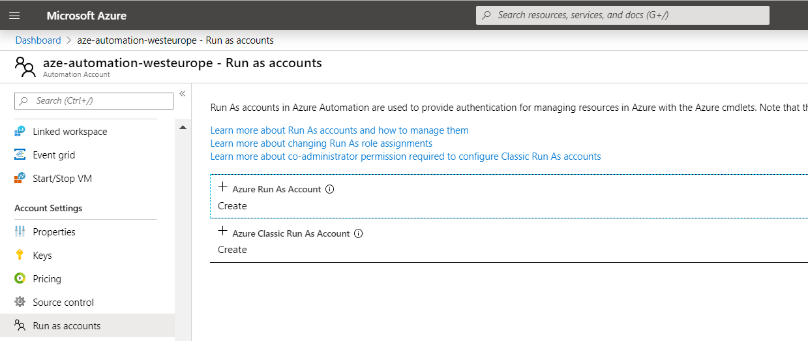

The parameters can be overriden to match another template parameters file which can then be used to customize a deployment for another environment. For example the runbook can be created to a specific environment with different naming convention:

```PowerShell
## Deploy Runbook
.\scripts\Deploy-Automation.ps1 -ProjectName "azk" -Location "koreacentral" -ResourceGroupName "azk-acceleration-koreacentral" `
    -automationAccountName "azk-automation-koreacentral"

### Create the runbook for the sample AZK
$parameters = @{
    VirtualNetworkName = "azk-hub-koreacentral"
    VirtualNetworkResourceGroupName = "azk-hub-koreacentral"
    RouteTablesResourceGroupName = "azk-acceleration-koreacentral"
    subnetName_transit = "transit"
    subnetName_servernetwork = "servernetwork"
    subnetName_acceleration = "acceleration"
    routeTableName_servernetwork = "azk-servernetwork"
    routeTableName_acceleration = "azk-acceleration"
    routeTableName_transit = "azk-transit-ACCELERATION"
    routeTableName_servernetwork_ACCELERATION = "azk-servernetwork-ACCELERATION"
}
.\scripts\Create-AccelerationRoutes-Runbook.ps1 -ProjectName "azk" -Location "koreacentral" `
    -AutomationAccountName "azk-automation-koreacentral" -searchResourcesDetailByName @parameters
```

### Execute the Runbook to Set or Bypass acceleration

This step requires the **RunAsAccount** has been created in the Automation Account.

Starting the Runbook from the Azure Portal looks like this:
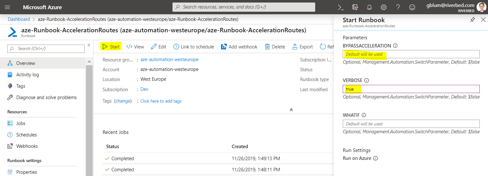

BYPASSACCELERATION and VERBOSE are the main parameters:

- **By default** the runbook will **Set Acceleration Routes**, i.e. attach the acceleration route tables to subnets in order to chain the acceleration service
- If **BYPASSACCELERATION=true** then runbook will bypass the acceleration routes
- VERBOSE=true enables capture of the runbook output, see example below:

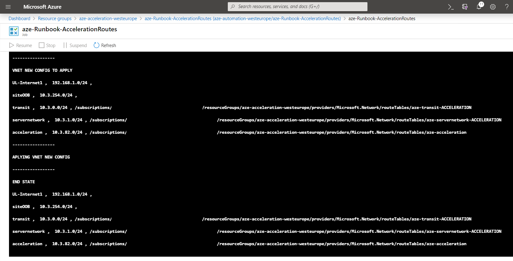

### Automatic "Fail-to-Wire" in the Cloud

With the Automatic "Fail-to-Wire", in case of H/W or S/W fault, for example during maintenance, the service can be automatically bypassed. "Fail-to-Wire" is the name of a a feature normally associated with a physical SteelHead appliance that will let the traffic pass through even if there is no power.
*Note: To mitigate the risk of H/W fault a good recommendation is to use highly available VM instance types to get the Azure 99.9% HA SLA. For example, in this cookbook we use Standard_DS3_v2 Virtual Machine Size with Premium SSD storage for the OS disk and for Data Disk*

#### Method with a Simple Logic Apps

A Logic Apps can be used to orchestrate the detection of the availability and automatically trigger failover or failback.

The diagram represents a simple design where the Logic Apps is regularly polling the appliance to detect whether the appliance VM is Running and if the service is actually ready. When not available, the Logic Apps will trigger a failover action to make the traffic Bypass the Acceleration Routes. When the appliance returns to a "healthy" state, the Logic Apps will automatically detect and trigger a failback action to set Acceleration Routes.

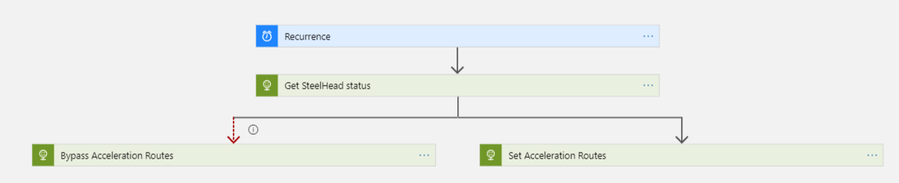

For the implementation, we will use an Integration Service Environment (ISE) connected to the VNET so that the Logic Apps can effectively access to the API of the Cloud SteelHead using the private network range. The failover/failback actions will be implemented using webhook bound to the AccelerationRoute Runbook.
*Note: At the time of writing ISE is available in the following regions 'northcentralus, centralus, southcentralus, northeurope, westeurope, eastasia, southeastasia, westus, eastus, eastus2, japanwest, japaneast, australiaeast, australiasoutheast, southindia, centralindia, canadacentral, westus2, uksouth, ukwest'*

The following scripts deploys the resources for the sample topology "AZE", in location westeurope. The LogicApps deployment script requires some settings of the SteelHead that can be provided inline or via the template parameter file: FQDN (matching the HTTPS certificate), and the username and password for the user account that the Logic Apps will use to connect to the API.

```PowerShell

    # Create new subnets for ISE integration for sandbox sample AZE
    # with default naming for resources and dependencies
    .\scripts\Deploy-ISE.ps1 -ProjectName "aze" -Location "westeurope" -NewSubnetsISE

    # Deploy the Logic Apps for sandbox sample AZE,
    # using default naming (template parameters file path, resource group to search ISE, automation name to generate webhook)
    .\scripts\Deploy-LogicApps-Simple.ps1 -ProjectName "aze" -Location "westeurope" `
        -shApiUsername (ConvertTo-SecureString -AsPlainText -Force "api-user") `
        -shApiPassword (ConvertTo-SecureString -AsPlainText -Force "api-user-password") `
        -generateRunbookWebhook
```

Customization can also be applied with inline parameters.

```PowerShell
    # Create new subnets for ISE integration in an existing vnet
    .\scripts\Deploy-ISE -ProjectName "yoursite" -Location "your-azure-location" `
        -VirtualNetworkResourceGroupName "your-vnet-rg" -VirtualNetworkName "your-vnet" `
        -NewSubnetsISE `
        -subnetNameISE1 "ISE1" -subnetNameISE2 "ISE2" -subnetNameISE3 "ISE3" -subnetNameISE4 "ISE4" `
        -subnetPrefixISE1 "10.1.253.0/26" -subnetPrefixISE2 "10.1.253.64/26" `
        -subnetPrefixISE3 "10.1.253.128/26" -subnetPrefixISE4 "10.1.253.192/26" `
        -templateParameterFilePath ".\sample\azuredeploy-ise.parameters.yoursite.json"

    # Create new subnets for ISE integration in an existing vnet
    .\scripts\Deploy-ISE -ProjectName "yoursite" -Location "your-azure-location" `
        -VirtualNetworkResourceGroupName "your-vnet-rg" -VirtualNetworkName "your-vnet" `
        -NewSubnetsISE `
        -subnetNameISE1 "ISE1" -subnetNameISE2 "ISE2" -subnetNameISE3 "ISE3" -subnetNameISE4 "ISE4" `
        -subnetPrefixISE1 "10.1.253.0/26" -subnetPrefixISE2 "10.1.253.64/26" `
        -subnetPrefixISE3 "10.1.253.128/26" -subnetPrefixISE4 "10.1.253.192/26" `
        -templateParameterFilePath ".\sample\azuredeploy-ise.parameters.yoursite.json"
```

## License

Copyright (c) 2019 Riverbed Technology, Inc.
The scripts provided here are licensed under the terms and conditions of the MIT License accompanying the software ("License"). The scripts are distributed "AS IS" as set forth in the License. The script also include certain third party code. All such third party code is also distributed "AS IS" and is licensed by the respective copyright holders under the applicable terms and conditions (including, without limitation, warranty and liability disclaimers) identified in the license notices accompanying the software.
