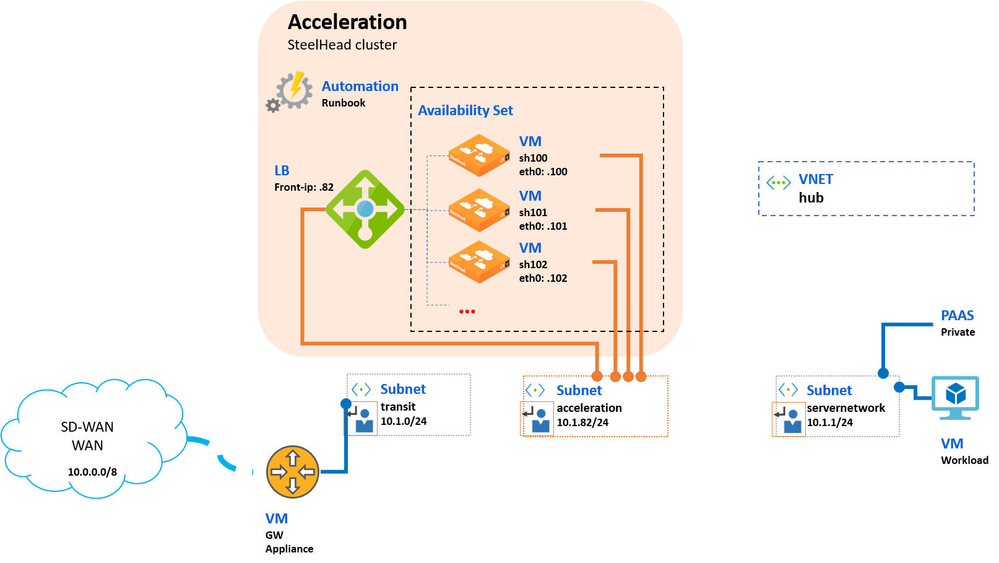

# Cookbook - Acceleration Scale Out in Azure

## Overview

To increase the capacity and the availability of the acceleration service in the cloud, the Cloud SteelHead can scale up (i.e. increasing sizing of the appliance and license) and also scale out (i.e multiplying the nodes).

This cookbook uses the scale out approach where a load balancer can distribute the inbound and outbound traffic to multiple SteelHead nodes. It will be based on the Service Chain concepts explained in details in the cookbook [101 - Chain Acceleration in a VNET having a gateway appliance (VPN or SD-WAN)](101-service-chain-gw-appliance.md).



The [Quickstarts](#quickstarts) section gives simple PowerShell scripts to quickly build some sandboxes, deploy the acceleration scale out solution.

## Quickstarts

Get ready to run PowerShell scripts in your Azure subscription, for example using [Azure Cloud Shell](https://shell.azure.com/powershell).

```PowerShell
# Copy the sources/scripts and go to the cookbook folder
git clone https://github.com/riverbed/Riverbed-Community-Toolkit.git
cd "Riverbed-Community-Toolkit\SteelHead\Azure-Cloud-Cookbooks"
```

Check the Azure context is the correct subscription where you would like to deploy the acceleration resources.

```PowerShell
# Check current Azure context
Get-AzContext

# Check available subscriptions
Get-AzSubscription

# Fill the parameter to select your subscription
Select-AzSubscription -SubscriptionName "{your-test-sub}"
```

### Deploy acceleration in a sandbox having workloads

#### Sandbox AZE in west-europe

This quickstart reuses some scripts of the cookbook [101 - Chain Acceleration in a VNET having a gateway appliance (VPN or SD-WAN)](101-service-chain-gw-appliance.md), to deploy a sample sandbox AZE in westeurope region and then deploy the acceleration Scale Out resources (3 nodes) with the Runbook.

The execution takes about 30 min.

```PowerShell
.\quickstarts\Test-SampleAZE-ScaleOut.ps1
```

All the artifacts will be stored in a subfolder called *artificats*. For example it will contain the generated ssh keypair some CLI configuration based on this [SteelHead simple CLI template](./102-scale-out/scripts/Template-CloudSteelHeadConfiguration.cli).

Some post-deployment configurations steps are required:

- Deploy a gateway appliance to interconnect with other sites, for the network interface in the subnet transit use the static IP address **10.3.0.254**
- Create a RunAsAccount in the automation account **aze-automation-westeurope** (Account Settings > Run as Account)
- Configure the SteelHead appliances (change admin password, get and set a license, ssl cert, ...), https://10.3.82.100, https://10.3.82.101 and https://10.3.82.102
- Execute the Runbook to set acceleration

### Sandbox AZU in westus

Same as previous quickstart script, it will deploy sample sandbox AZU in westus region with acceleration Scale Out configured with 10 SteelHead nodes, and without the gateway appliance.

The deployment takes about 30 min.

```PowerShell
.\quickstart\Test-SampleAZU-ScaleOut.ps1
```

Post-deployment configuration required:

- Deploy a gateway appliance with static IP address **10.1.0.254**
- Create RunAsAccount in the automation account **azu-automation-westus**
- Configure the SteelHead appliances, **https://10.1.82.100, https://10.1.82.100, , ... https://10.1.82.109**
- Execute the Runbook to set acceleration

### Deploy other configurations with ARM templates

The templates used in the cookbook and be deployed and configured in the Azure Portal by clicking on the buttons "Deploy in Azure" in the table below:

| VNET sample | **Acceleration - Scale Out** | Service Chain | Automation Runbooks |
| --- | --- | --- | --- | --- |
| [](https://portal.azure.com/#create/Microsoft.Template/uri/https%3A%2F%2Fraw.githubusercontent.com%2Friverbed%2FRiverbed-Community-Toolkit%2Fmaster%2FSteelHead%2FAzure-Cloud-Cookbooks%2F101-service-chain-gw-appliance%2Fazuredeploy-sandbox.json) | [](https://portal.azure.com/#create/Microsoft.Template/uri/https%3A%2F%2Fraw.githubusercontent.com%2Friverbed%2FRiverbed-Community-Toolkit%2Fmaster%2FSteelHead%2FAzure-Cloud-Cookbooks%2F102-scale-out%2Fazuredeploy-acceleration-scale.json) | [](https://portal.azure.com/#create/Microsoft.Template/uri/https%3A%2F%2Fraw.githubusercontent.com%2Friverbed%2FRiverbed-Community-Toolkit%2Fmaster%2FSteelHead%2FAzure-Cloud-Cookbooks%2F101-service-chain-gw-appliance%2Fazuredeploy-routetables.json)| n.a. |

The template for "Acceleration Scale Out" is in the [cookbook folder](./102-scale-out) with some examples of parameters files in the [sample subfolder](./102-scale-out/sample). The other templates come from the [Chaining Acceleration cookbook's folder](./101-service-chain-gw-appliance).

## License

Copyright (c) 2019 Riverbed Technology, Inc.
The scripts provided here are licensed under the terms and conditions of the MIT License accompanying the software ("License"). The scripts are distributed "AS IS" as set forth in the License. The script also include certain third party code. All such third party code is also distributed "AS IS" and is licensed by the respective copyright holders under the applicable terms and conditions (including, without limitation, warranty and liability disclaimers) identified in the license notices accompanying the software.
