# Next Generation Virtual SteelHead VCX on GNS3

Virtual SteelHead VCX is the virtual form factor of the multi-awards winning WAN Acceleration appliance Riverbed SteelHead. It is is available as a virtual solution on most major hypervisors including VMware vSphere, Microsoft Hyper-V and KVM.
Free-Trials are available on the  [Riverbed website](https://www.riverbed.com/trialdownloads.html)  from where you can get a 90-day license.

For additional references on the product including deployment guide, configuration guide and how-to videos visit  [Riverbed Support website](https://support.riverbed.com/content/support/software/steelhead/cx-appliance.html)  and its  [Youtube channel.](https://www.youtube.com/user/RiverbedSupport/playlists).

A question, a problem, ask the  [community](https://community.riverbed.com/)!

GNS3 is a network software emulator that is used by thousands of network engineers to simulate complex network topologies, learn new technologies as well as prepare professional certifications.
GNS3 is a free tool that can be downloaded from the  [GNS3 website](https://gns3.com/software).

The solution guide will help you adding the Next Generation Virtual SteelHead VCX to your topology on GNS3.
For your convenience, we have added an appliance that you can import directly on GNS3 once you have downloaded the **Next Generation Virtual SteelHead VCX image for KVM** from [Riverbed Support website](https://support.riverbed.com/content/support/software/steelhead/cx-appliance.html).

## How to add Accelerators in your GNS3 project step by step?

1. Connect to the GNS3 Web GUI, for example http://yourserver:3080

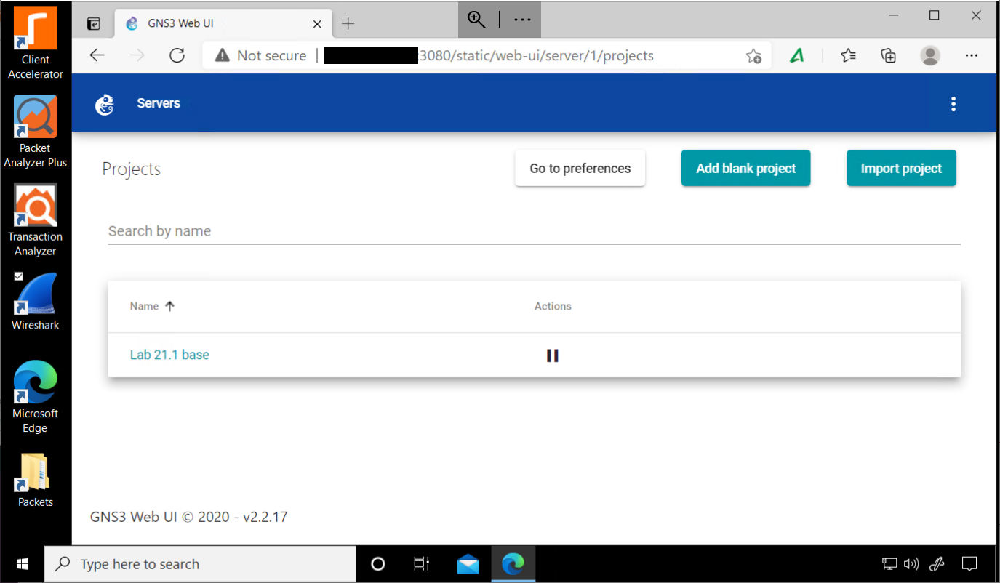

2. Open the project

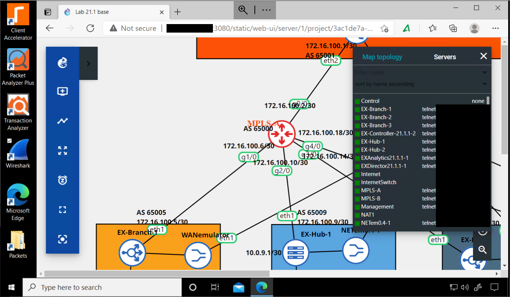

3. Create a New Template

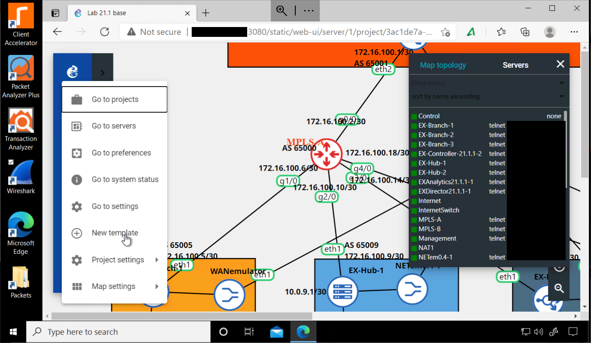

4. Select **Import an appliance file**

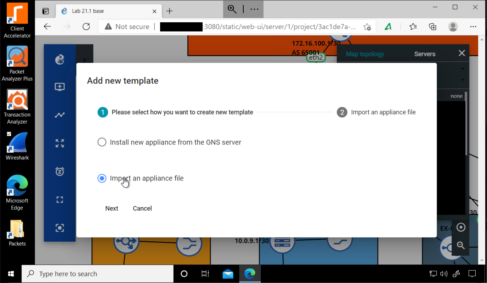

5. Next

6. Open tab and download the gns3a file from https://github.com/riverbed/Riverbed-Community-Toolkit/tree/master/SteelHead/GNS3

7. Back in GNS3, Click to Import File

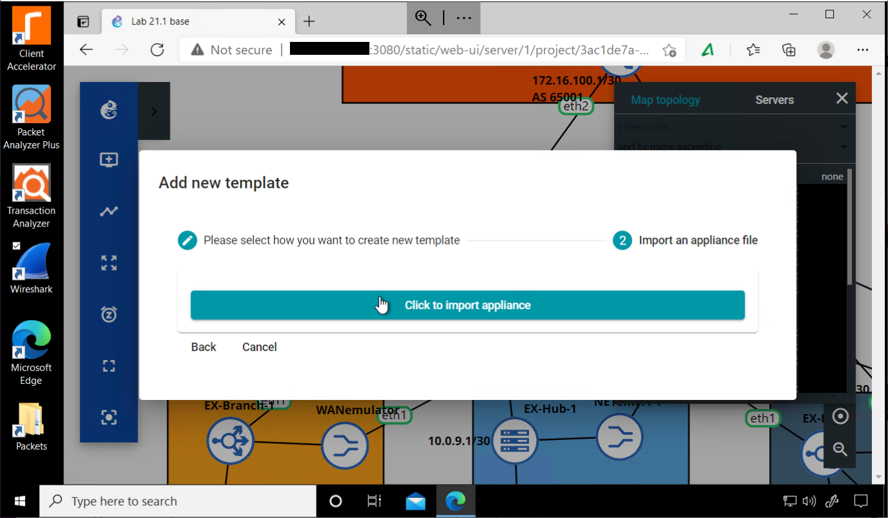

8. Scroll to the targeted version, for example SteelHead version 9.12.0

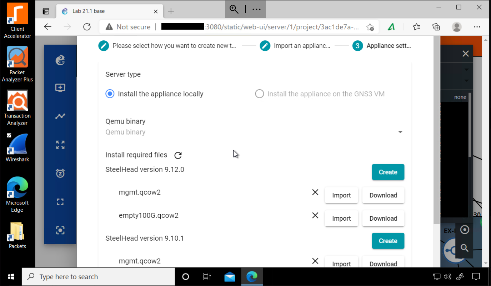

9. For mgmt.qcow2 (the OS disk), hit Download. The Riverbed Support page gets opened.
10. Download the KVM image and expand the .tgz archive locally to get the mgmt.qcow2 file

11. Back in GNS3, Import and Select the local file

12. The import takes approximately 2min

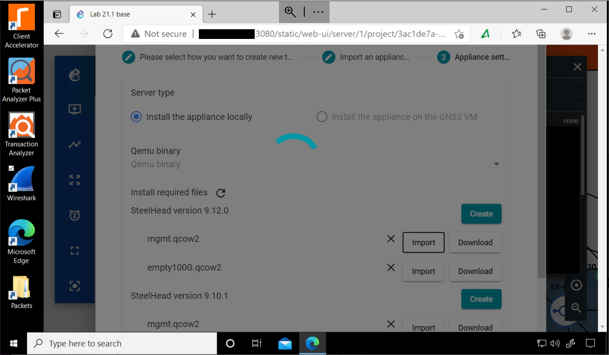

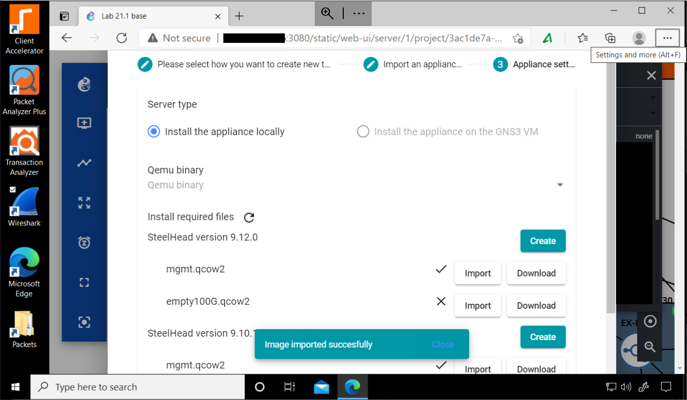

13. Download and Import the empty100G.qcow2 (Data disk).It should be immediately imported

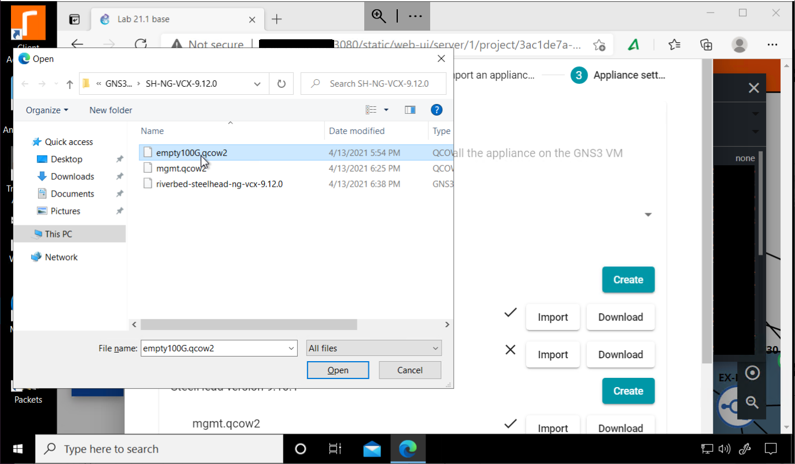

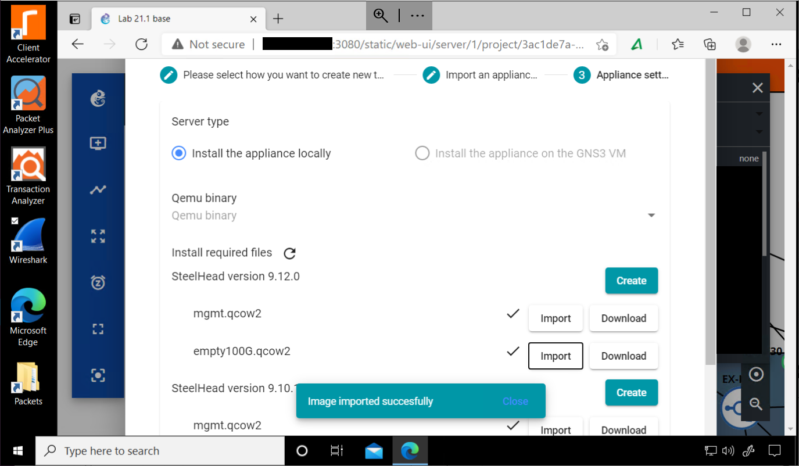

14. Set Qemu binary: /usr/bin/qemu-system-x86_64

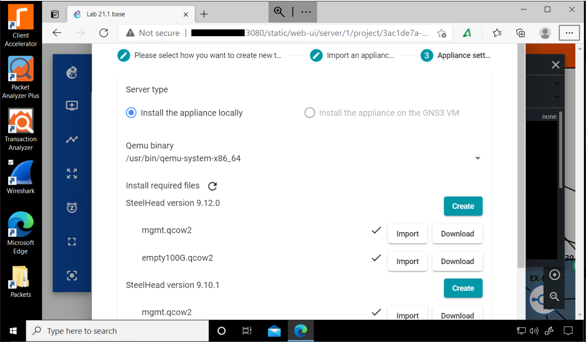

15. Hit **Create**

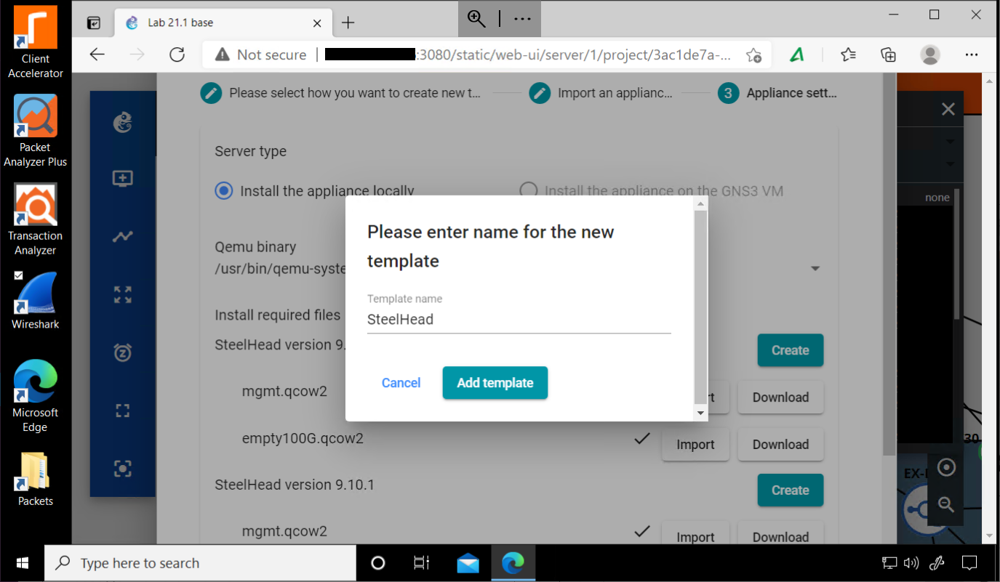

16. Hit **Add Template**

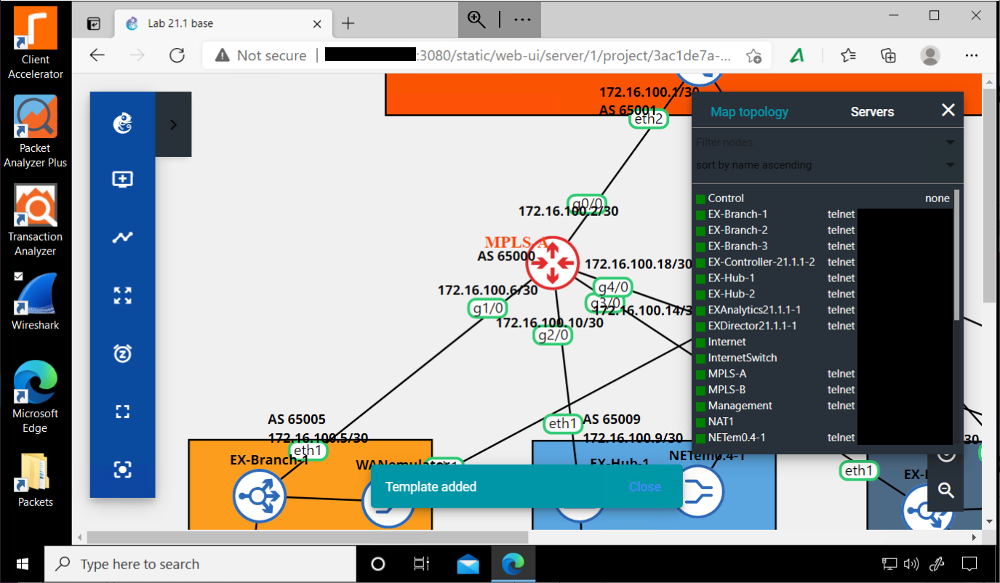

The template should be added and now you should be able to some SteelHead nodes.

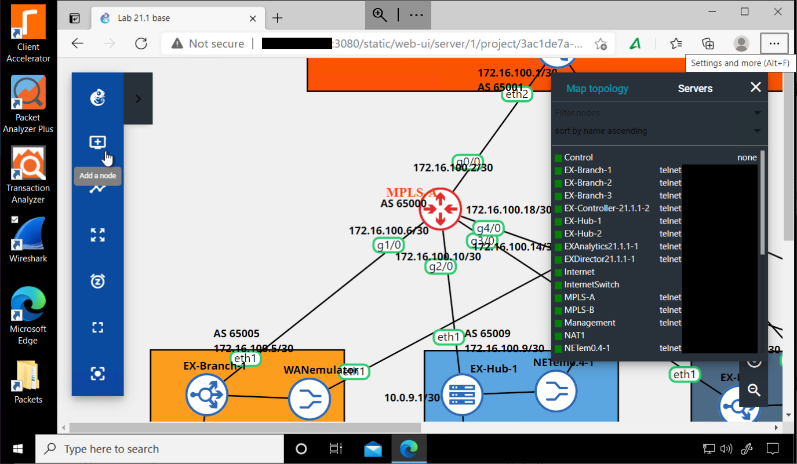 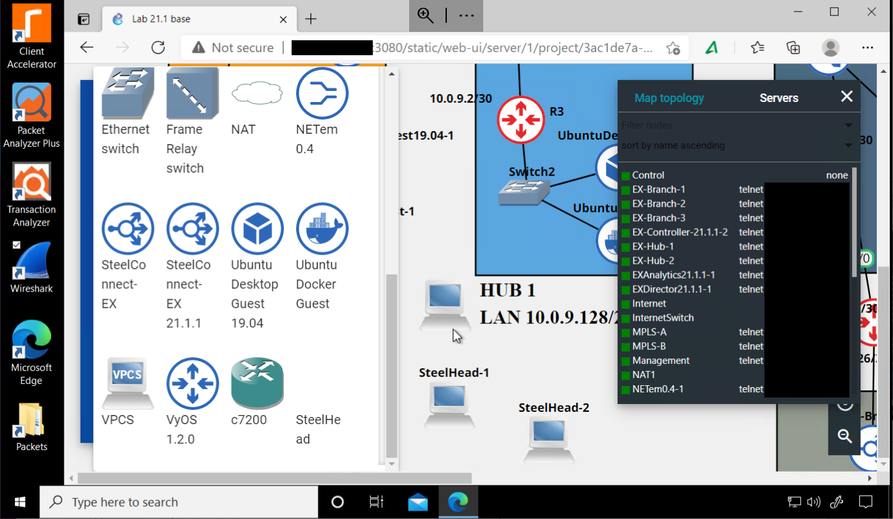

## License

Copyright (c) 2021 Riverbed Technology, Inc.
The scripts provided here are licensed under the terms and conditions of the MIT License accompanying the software ("License"). The scripts are distributed "AS IS" as set forth in the License. The script also include certain third party code. All such third party code is also distributed "AS IS" and is licensed by the respective copyright holders under the applicable terms and conditions (including, without limitation, warranty and liability disclaimers) identified in the license notices accompanying the software.
